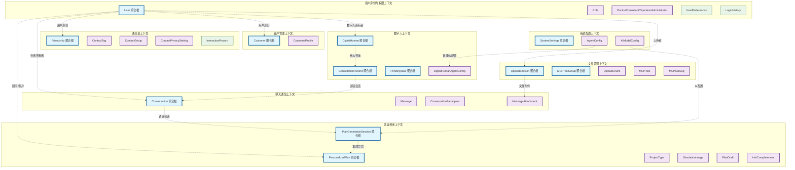

# 医美智能咨询系统 - 限界上下文图

## 限界上下文详细说明

### 1. 用户身份与权限上下文 (Identity & Access Management)
- **核心职责：** 用户身份认证、角色权限管理、登录历史追踪
- **聚合根：** User
- **关键业务规则：** 用户可以有多个角色，角色决定访问权限

### 2. 客户管理上下文 (Customer Management)  
- **核心职责：** 客户信息管理、医疗档案维护
- **聚合根：** Customer
- **关键业务规则：** 客户信息与用户身份分离，支持医疗数据管理

### 3. 通讯录上下文 (Contact Management)
- **核心职责：** 好友关系管理、联系人分组、隐私控制
- **聚合根：** Friendship
- **关键业务规则：** 双向好友关系、分组管理、隐私设置

### 4. 聊天通信上下文 (Chat & Communication)
- **核心职责：** 会话管理、消息传递、文件共享
- **聚合根：** Conversation
- **关键业务规则：** 支持多参与者、消息类型丰富、文件附件

### 5. 医美咨询上下文 (Medical Beauty Consultation)
- **核心职责：** 医美方案生成、项目推荐、客户偏好分析
- **聚合根：** PersonalizedPlan, PlanGenerationSession
- **关键业务规则：** AI辅助方案生成、信息完整性跟踪、版本管理

### 6. 数字人上下文 (Digital Human)
- **核心职责：** 数字人管理、智能体配置、任务调度
- **聚合根：** DigitalHuman, ConsultationRecord, PendingTask
- **关键业务规则：** 数字人可参与咨询、任务自动分配

### 7. 系统配置上下文 (System Configuration)
- **核心职责：** 系统设置、AI模型配置、智能体管理
- **聚合根：** SystemSettings
- **关键业务规则：** 配置加密存储、环境隔离

### 8. 文件管理上下文 (File Management)
- **核心职责：** 文件上传、MCP工具管理、调用日志
- **聚合根：** UploadSession, MCPToolGroup
- **关键业务规则：** 断点续传、工具权限控制、调用监控
