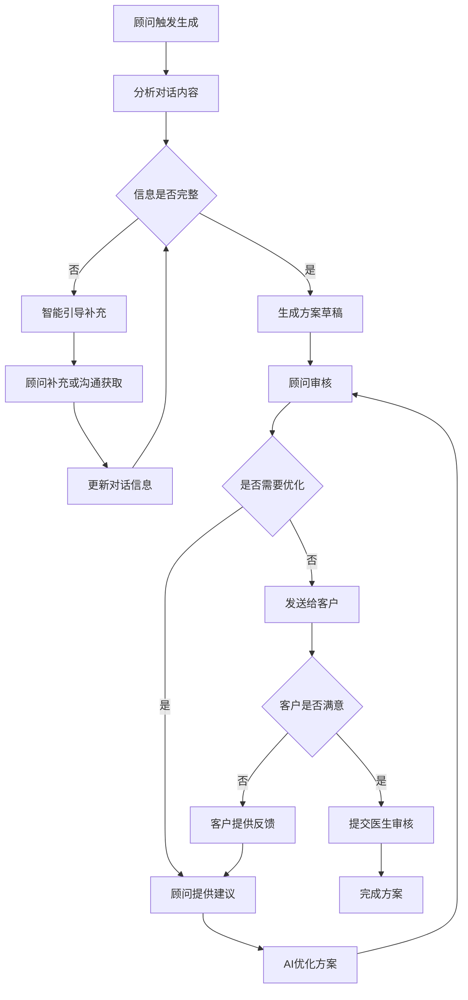
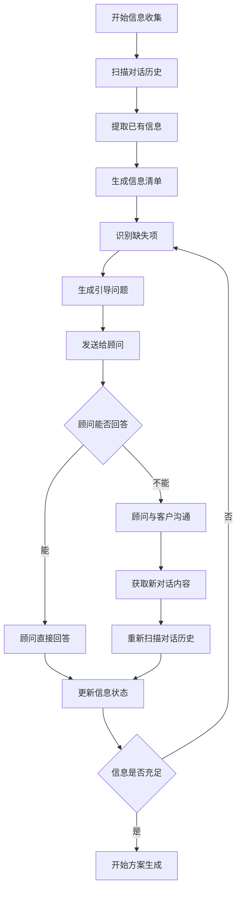
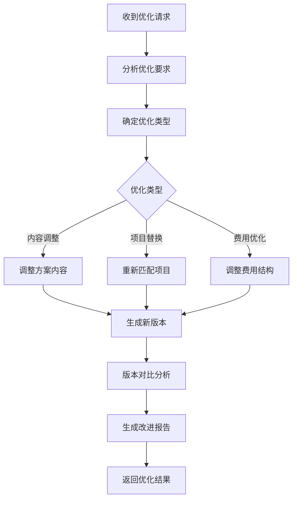

# AI辅助方案生成功能需求分析与实现方案

## 📋 需求概述

### 业务背景

在医美咨询过程中，顾问需要根据与客户的聊天内容和客户信息，为客户制定个性化的医美方案。传统方式依赖顾问的经验和手工整理，效率较低且容易遗漏关键信息。本功能旨在通过AI智能体辅助，实现方案的智能生成、多轮优化和协作确认。

### 核心价值

- **提升效率**：AI自动分析对话内容，快速生成初步方案
- **保证质量**：基于专业知识库和模板，确保方案的专业性和完整性
- **优化体验**：通过人机协作模式，平衡自动化与专业判断
- **标准化流程**：建立可重复、可优化的方案生成工作流

### 功能目标

1. 智能分析聊天记录，提取客户关键信息
2. 基于客户画像生成个性化医美方案草稿
3. 支持顾问对方案进行专业优化和调整
4. 实现客户反馈驱动的方案迭代优化
5. 建立完整的方案版本管理和审核流程

## 🎯 用户故事与场景

### 主要用户角色

- **顾问**：发起方案生成，提供专业优化建议，确认最终方案
- **客户**：提供需求信息，确认或提出修改意见
- **AI智能体**：分析信息，生成方案，响应优化请求
- **医生**：审核确认方案的医学合理性

### 典型使用场景

#### 场景1：信息充分的快速方案生成

```
前置条件：顾问与客户已充分沟通，信息较为完整
触发：顾问在聊天界面选择"生成方案"命令
流程：AI分析 → 生成草稿 → 顾问确认 → 发送客户
结果：3-5分钟完成方案生成和确认
```

#### 场景2：信息不足的引导式方案生成

```
前置条件：客户刚开始咨询，信息不完整
触发：顾问选择"生成方案"
流程：AI检查缺失信息 → 向顾问提供引导问题 → 顾问补充或与客户沟通获取 → 生成草稿 → 多轮优化
结果：通过智能引导和顾问协作完善信息，生成更精准方案
```

#### 场景3：复杂需求的协作优化

```
前置条件：客户需求复杂，涉及多个项目
触发：AI生成初步方案后
流程：顾问专业调整 → AI重新优化 → 客户反馈 → 迭代完善
结果：通过人机协作达成最优方案
```

## 🏗️ 系统架构设计

### 整体架构

基于现有AI Gateway架构扩展，采用微服务模式：

```
┌─────────────────────┐    ┌─────────────────────┐    ┌─────────────────────┐
│    前端交互层       │    │    业务服务层       │    │    AI服务层         │
│                     │    │                     │    │                     │
│  ┌─────────────────┐│    │  ┌─────────────────┐│    │  ┌─────────────────┐│
│  │ 命令面板        ││    │  │ 方案生成服务    ││    │  │ Dify AI Gateway ││
│  │ - 生成触发      ││    │  │ - 流程编排      ││    │  │ - 请求路由      ││
│  │ - 快捷操作      ││    │  │ - 状态管理      ││    │  │ - 负载均衡      ││
│  └─────────────────┘│    │  └─────────────────┘│    │  └─────────────────┘│
│                     │    │           │         │    │           │         │
│  ┌─────────────────┐│    │  ┌─────────────────┐│    │  ┌─────────────────┐│
│  │ 方案生成面板    ││◄──►│  │ 对话分析服务    ││◄──►│  │ 信息提取智能体  ││
│  │ - 信息总览      ││    │  │ - 消息解析      ││    │  │ - 实体识别      ││
│  │ - 进度追踪      ││    │  │ - 情感分析      ││    │  │ - 意图理解      ││
│  │ - 缺失提示      ││    │  │ - 上下文构建    ││    │  │ - 结构化输出    ││
│  └─────────────────┘│    │  └─────────────────┘│    │  └─────────────────┘│
│                     │    │           │         │    │           │         │
│  ┌─────────────────┐│    │  ┌─────────────────┐│    │  ┌─────────────────┐│
│  │ 方案编辑器      ││◄──►│  │ 数据预处理服务  ││◄──►│  │ 方案生成智能体  ││
│  │ - 结构化展示    ││    │  │ - 信息整合      ││    │  │ - 模板匹配      ││
│  │ - 实时编辑      ││    │  │ - 格式转换      ││    │  │ - 个性化定制    ││
│  │ - 版本对比      ││    │  │ - 质量检查      ││    │  │ - 风险评估      ││
│  └─────────────────┘│    │  └─────────────────┘│    │  └─────────────────┘│
│                     │    │           │         │    │           │         │
│  ┌─────────────────┐│    │  ┌─────────────────┐│    │  ┌─────────────────┐│
│  │ 协作界面        ││◄──►│  │ 协作管理服务    ││◄──►│  │ 优化建议智能体  ││
│  │ - 反馈收集      ││    │  │ - 多轮优化      ││    │  │ - 反馈分析      ││
│  │ - 版本管理      ││    │  │ - 变更追踪      ││    │  │ - 优化策略      ││
│  │ - 审核流程      ││    │  │ - 权限控制      ││    │  │ - 质量评估      ││
│  └─────────────────┘│    │  └─────────────────┘│    │  └─────────────────┘│
│                     │    │           │         │    │           │         │
│  ┌─────────────────┐│    │  ┌─────────────────┐│    │  ┌─────────────────┐│
│  │ 状态追踪面板    ││◄──►│  │ 会话管理服务    ││◄──►│  │ AI服务编排器    ││
│  │ - 实时状态      ││    │  │ - 生命周期管理  ││    │  │ - 智能体调度    ││
│  │ - 错误提示      ││    │  │ - 异常处理      ││    │  │ - 结果聚合      ││
│  │ - 性能监控      ││    │  │ - 日志记录      ││    │  │ - 错误恢复      ││
│  └─────────────────┘│    │  └─────────────────┘│    │  └─────────────────┘│
└─────────────────────┘    └─────────────────────┘    └─────────────────────┘
            │                         │                         │
            └─────────────────────────┼─────────────────────────┘
                                      │
                        ┌─────────────────────┐
                        │    数据持久层       │
                        │                     │
                        │  ┌─────────────────┐│
                        │  │ 会话数据管理    ││
                        │  │ - 会话状态      ││
                        │  │ - 交互历史      ││
                        │  │ - 进度追踪      ││
                        │  └─────────────────┘│
                        │                     │
                        │  ┌─────────────────┐│
                        │  │ 方案版本管理    ││
                        │  │ - 版本历史      ││
                        │  │ - 变更记录      ││
                        │  │ - 审核状态      ││
                        │  └─────────────────┘│
                        │                     │
                        │  ┌─────────────────┐│
                        │  │ 对话数据存储    ││
                        │  │ - 原始消息      ││
                        │  │ - 客户画像      ││
                        │  │ - 分析结果      ││
                        │  └─────────────────┘│
                        │                     │
                        │  ┌─────────────────┐│
                        │  │ 知识库管理      ││
                        │  │ - 方案模板      ││
                        │  │ - 业务规则      ││
                        │  │ - 配置参数      ││
                        │  └─────────────────┘│
                        └─────────────────────┘
```

### 数据流转架构

基于API方案的数据流转设计，确保高效的数据处理和AI智能体调用：

```
┌─────────────────┐    ┌─────────────────┐    ┌─────────────────┐
│  触发方案生成   │    │  数据预处理     │    │  AI智能体调用   │
│                 │    │                 │    │                 │
│  1. 用户触发    │───►│  1. 获取对话    │───►│  1. 构建输入    │
│  2. 选择会话    │    │  2. 分析消息    │    │  2. 调用智能体  │
│  3. 确认生成    │    │  3. 提取信息    │    │  3. 处理响应    │
│                 │    │  4. 评估完整性  │    │  4. 结果验证    │
└─────────────────┘    └─────────────────┘    └─────────────────┘
         │                       │                       │
         └───────────────────────┼───────────────────────┘
                                 │
                   ┌─────────────────┐
                   │  结果处理与反馈 │
                   │                 │
                   │  1. 格式化方案  │
                   │  2. 保存版本    │
                   │  3. 通知前端    │
                   │  4. 状态更新    │
                   └─────────────────┘
```

### 架构层级职责说明

#### 🎨 前端交互层

**命令面板**
- **主要职责**：提供方案生成的入口和快捷操作
- **核心功能**：
  - 生成触发：检测用户意图，启动方案生成流程
  - 快捷操作：提供常用操作的快速访问（重新生成、保存草稿、分享方案等）
  - 状态显示：显示当前操作状态和可用操作选项

**方案生成面板**
- **主要职责**：展示方案生成的核心工作区域
- **核心功能**：
  - 信息总览：结构化展示当前收集的客户信息和完整性状态
  - 进度追踪：实时显示方案生成的各个阶段和进度
  - 缺失提示：高亮显示缺失的关键信息，提供补充建议
  - 交互引导：展示AI生成的引导问题和操作建议

**方案编辑器**
- **主要职责**：提供方案的查看、编辑和优化功能
- **核心功能**：
  - 结构化展示：按模块展示方案内容（分析、推荐、时间、费用、风险）
  - 实时编辑：支持内联编辑和批量修改，保持数据一致性
  - 版本对比：并排显示不同版本的差异，支持版本切换
  - 协作标注：支持添加注释、建议和批注

**协作界面**
- **主要职责**：管理多方协作和反馈收集
- **核心功能**：
  - 反馈收集：收集客户、医生、其他顾问的反馈意见
  - 版本管理：管理方案的多个版本，支持版本回退
  - 审核流程：支持方案的审核、批准和拒绝流程
  - 权限控制：根据用户角色控制可见性和操作权限

**状态追踪面板**
- **主要职责**：提供系统运行状态的实时监控
- **核心功能**：
  - 实时状态：显示当前方案生成的详细状态和进度
  - 错误提示：显示错误信息和解决建议
  - 性能监控：监控响应时间、成功率等关键指标
  - 日志查看：提供详细的操作日志和错误日志

#### 🏢 业务服务层

**方案生成服务**
- **主要职责**：统筹整个方案生成流程的编排和管理
- **核心功能**：
  - 流程编排：协调各个服务组件，确保流程顺序执行
  - 状态管理：维护方案生成会话的状态和生命周期
  - 业务规则：应用业务逻辑和规则，确保方案的合规性
  - 异常处理：处理流程中的异常情况，提供恢复机制

**对话分析服务**
- **主要职责**：专门负责对话内容的深度分析和理解
- **核心功能**：
  - 消息解析：解析和处理各种类型的消息内容
  - 情感分析：分析客户的情感状态和态度变化
  - 上下文构建：构建完整的对话上下文和语义理解
  - 关键信息提取：从对话中提取关键的业务信息

**数据预处理服务**
- **主要职责**：为AI智能体提供高质量的结构化数据
- **核心功能**：
  - 信息整合：整合来自不同源的客户信息
  - 格式转换：将非结构化数据转换为AI可理解的格式
  - 质量检查：验证数据的完整性和准确性
  - 智能补全：基于历史数据和规则补全缺失信息

**协作管理服务**
- **主要职责**：管理多方协作的复杂交互过程
- **核心功能**：
  - 多轮优化：支持方案的多轮迭代优化
  - 变更追踪：跟踪每次变更的内容和原因
  - 权限控制：管理不同角色的访问和操作权限
  - 协作协调：协调顾问、客户、医生之间的协作

**会话管理服务**
- **主要职责**：管理方案生成会话的完整生命周期
- **核心功能**：
  - 生命周期管理：管理会话从创建到结束的完整过程
  - 异常处理：处理会话过程中的各种异常情况
  - 日志记录：记录会话的详细操作日志
  - 资源管理：管理会话相关的资源和连接

#### 🤖 AI服务层

**Dify AI Gateway**
- **主要职责**：提供统一的AI服务入口和管理
- **核心功能**：
  - 请求路由：根据请求类型路由到相应的AI智能体
  - 负载均衡：分配请求负载，确保服务稳定性
  - 服务发现：管理可用的AI服务实例
  - 监控告警：监控AI服务的运行状态和性能

**信息提取智能体**
- **主要职责**：从对话中智能提取和结构化客户信息
- **核心功能**：
  - 实体识别：识别和提取客户基本信息、需求、偏好等实体
  - 意图理解：理解客户的真实意图和需求
  - 结构化输出：将提取的信息转换为结构化的数据格式
  - 置信度评估：评估提取信息的可信度和准确性

**方案生成智能体**
- **主要职责**：基于客户信息生成个性化的医美方案
- **核心功能**：
  - 模板匹配：根据客户特征匹配最适合的方案模板
  - 个性化定制：根据客户的具体情况调整方案内容
  - 风险评估：评估方案的风险等级和注意事项
  - 方案验证：验证方案的合理性和可行性

**优化建议智能体**
- **主要职责**：分析反馈并提供专业的优化建议
- **核心功能**：
  - 反馈分析：深度分析客户和专家的反馈意见
  - 优化策略：提供具体的优化建议和改进方案
  - 质量评估：评估方案的整体质量和改进潜力
  - 学习优化：基于历史数据不断优化建议质量

**AI服务编排器**
- **主要职责**：协调多个AI智能体的协作和结果整合
- **核心功能**：
  - 智能体调度：根据需要调度和组合不同的AI智能体
  - 结果聚合：整合多个智能体的输出结果
  - 错误恢复：处理AI服务的错误和异常情况
  - 性能优化：优化AI服务的调用效率和响应时间

#### 💾 数据持久层

**会话数据管理**
- **主要职责**：管理方案生成会话的所有数据
- **核心功能**：
  - 会话状态：存储和管理会话的实时状态
  - 交互历史：记录完整的人机交互历史
  - 进度追踪：跟踪方案生成的详细进度
  - 数据备份：确保关键数据的安全性和可恢复性

**方案版本管理**
- **主要职责**：管理方案的版本历史和变更记录
- **核心功能**：
  - 版本历史：存储方案的所有版本和变更历史
  - 变更记录：记录每次变更的详细信息和原因
  - 审核状态：管理方案的审核状态和批准流程
  - 版本对比：支持不同版本之间的对比和分析

**对话数据存储**
- **主要职责**：存储和管理对话相关的所有数据
- **核心功能**：
  - 原始消息：存储完整的原始对话消息
  - 客户画像：存储结构化的客户信息和画像
  - 分析结果：存储对话分析和信息提取的结果
  - 数据索引：建立高效的数据索引和查询机制

**知识库管理**
- **主要职责**：管理系统的知识库和配置信息
- **核心功能**：
  - 方案模板：存储和管理各类方案模板
  - 业务规则：存储业务规则和约束条件
  - 配置参数：管理系统的各种配置参数
  - 知识更新：支持知识库的动态更新和维护

### 核心组件设计

#### 1. 方案生成会话管理器

- **职责**：管理整个方案生成的生命周期
- **功能**：会话创建、状态跟踪、流程控制
- **接口**：启动会话、更新状态、结束会话

#### 2. 智能信息分析器

- **职责**：从对话中提取和分析客户信息
- **功能**：信息提取、完整性检查、缺失项识别
- **接口**：分析对话、检查完整性、生成补充建议

#### 3. AI方案生成引擎

- **职责**：基于客户信息生成个性化方案
- **功能**：模板匹配、个性化定制、风险评估
- **接口**：生成方案、优化调整、版本管理

#### 4. 协作优化管理器

- **职责**：管理人机协作的优化过程
- **功能**：反馈收集、优化追踪、版本对比
- **接口**：收集反馈、应用优化、生成报告

### 核心设计理念

本方案的核心设计理念是**"AI辅助，人机协作"**：

1. **AI作为智能助手**：AI负责分析对话、提取信息、生成引导问题和方案草稿
2. **顾问保持主导权**：顾问始终掌控整个流程，可以直接提供信息或选择与客户沟通
3. **客户体验优化**：避免AI直接向客户询问，保持人性化的服务体验
4. **效率与质量平衡**：通过智能引导提升效率，通过人工把关保证质量

这种设计确保了：

- 顾问的专业判断得到充分发挥
- 客户感受到的仍然是人性化服务
- AI的效率优势得到最大化利用
- 整个流程的可控性和灵活性

## 🔄 业务流程设计

### 主流程：智能方案生成



### 子流程：信息收集引导



### 子流程：多轮优化协作



## 💾 数据模型设计

### 核心实体关系

```
PlanGenerationSession (方案生成会话)
├── conversation_id (关联对话)
├── customer_id (客户ID)
├── consultant_id (顾问ID)
├── status (会话状态)
├── required_info (必需信息清单)
├── extracted_info (提取的信息)
└── interaction_history (交互历史)

PlanDraft (方案草稿)
├── session_id (关联会话)
├── version (版本号)
├── content (方案内容)
├── status (草稿状态)
├── feedback (反馈意见)
└── improvements (改进记录)

InfoCompleteness (信息完整性)
├── session_id (关联会话)
├── basic_info (基础信息状态)
├── concerns (关注点状态)
├── budget (预算信息状态)
├── timeline (时间安排状态)
├── medical_history (病史状态)
└── completeness_score (完整度评分)
```

### 状态管理

- **会话状态**：collecting(收集中) → generating(生成中) → optimizing(优化中) → reviewing(审核中) → completed(已完成)
- **方案状态**：draft(草稿) → reviewing(审核中) → approved(已确认) → rejected(已拒绝)
- **信息状态**：missing(缺失) → partial(部分) → complete(完整)

## 🎨 用户界面设计

### 界面组件规划

#### 1. 命令面板扩展

- 在现有MessageInput工具栏中增加"生成方案"按钮
- 支持快捷键触发（如Ctrl+P）
- 显示生成状态和进度提示

#### 2. 方案生成主面板

- **信息总览区域**：显示当前收集的客户信息
- **进度指示器**：展示方案生成的当前阶段
- **缺失信息提示**：高亮显示需要补充的信息
- **快速操作按钮**：一键提取、手动输入、跳过选项

#### 3. 方案预览与编辑器

- **结构化展示**：按模块展示方案内容（分析、推荐、时间、费用、风险）
- **实时编辑**：支持内联编辑和批量修改
- **版本对比**：并排显示不同版本的差异
- **协作标注**：支持添加注释和建议

#### 4. 交互流程界面

- **引导问题展示**：清晰展示AI生成的缺失信息引导问题
- **顾问操作选择**："重新收集信息"操作选项
- **快速录入表单**：顾问直接回答时的快速信息录入界面
- **沟通状态追踪**：显示当前信息收集进度和完成状态
- **进度保存**：支持中途暂停和恢复

### 交互设计原则

- **渐进式披露**：按需展示信息，避免界面过载
- **即时反馈**：每个操作都有明确的视觉反馈
- **容错设计**：支持撤销、重做和版本回退
- **移动优先**：确保在移动设备上的可用性

## 🤖 AI智能体设计

### Dify应用配置

#### 1. 信息提取智能体

- **应用类型**：Agent模式
- **主要功能**：从对话中提取结构化客户信息
- **工具集成**：文本分析、实体识别、情感分析
- **输出格式**：标准化的客户画像JSON

#### 2. 方案生成智能体

- **应用类型**：Workflow模式
- **主要功能**：基于客户画像生成个性化方案
- **知识库**：医美项目库、价格体系、风险知识
- **生成策略**：模板匹配 + 个性化调整

#### 3. 优化建议智能体

- **应用类型**：Agent模式
- **主要功能**：分析反馈并提供优化建议
- **工具集成**：方案对比、成本分析、风险评估
- **学习机制**：基于历史优化记录不断改进

### AI能力要求

- **信息理解**：准确理解客户表达的需求和关注点
- **专业知识**：具备医美领域的专业知识和经验
- **个性化生成**：根据个体差异生成定制化方案
- **迭代优化**：基于反馈持续改进方案质量

## 🔧 技术实现方案

### 后端服务架构

- **方案生成服务**：核心业务逻辑，管理整个生成流程
- **信息管理服务**：处理客户信息的提取、验证和管理
- **版本控制服务**：管理方案的版本历史和变更追踪
- **协作管理服务**：处理多方协作和反馈收集

### 前端技术栈

- **React 19 + Next.js 15**：基于现有技术栈
- **状态管理**：使用React Context + Custom Hooks
- **实时通信**：基于现有http + WebSocket 双通信架构
- **UI组件**：基于shadcn/ui组件库

### 数据存储策略

- **关系型数据**：PostgreSQL存储结构化的会话和方案数据
- **JSON文档**：存储非结构化的方案内容和交互历史
- **缓存策略**：Redis缓存频繁访问的模板和配置

### 安全与权限

- **数据加密**：基于现有加密机制保护敏感信息
- **权限控制**：基于角色的访问控制（RBAC）
- **审计日志**：记录所有关键操作和数据变更

## 📈 实施计划

### 阶段一：基础架构搭建（1-2周）

- [ ] 数据模型设计和数据库迁移
- [ ] 基础服务框架搭建
- [ ] AI Gateway扩展和Dify应用配置
- [ ] 前端基础组件开发

### 阶段二：核心功能实现（2-3周）

- [ ] 信息提取和完整性检查功能
- [ ] 方案生成核心逻辑
- [ ] 基础UI界面开发
- [ ] 简单的人机交互流程

### 阶段三：协作优化功能（2周）

- [ ] 多轮优化机制
- [ ] 版本管理和对比功能
- [ ] 协作界面完善
- [ ] 反馈收集和处理

### 阶段四：完善和测试（1-2周）

- [ ] 用户体验优化
- [ ] 性能调优和测试
- [ ] 错误处理和边界情况
