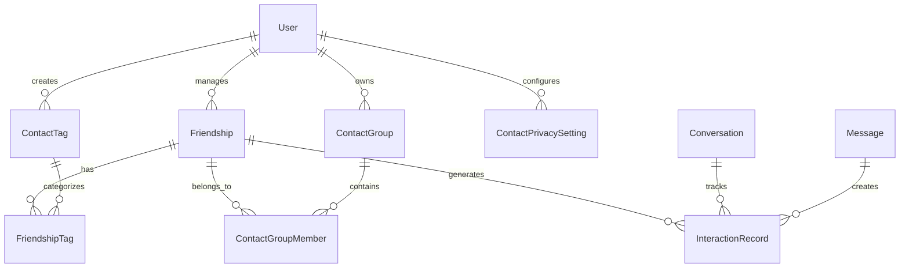
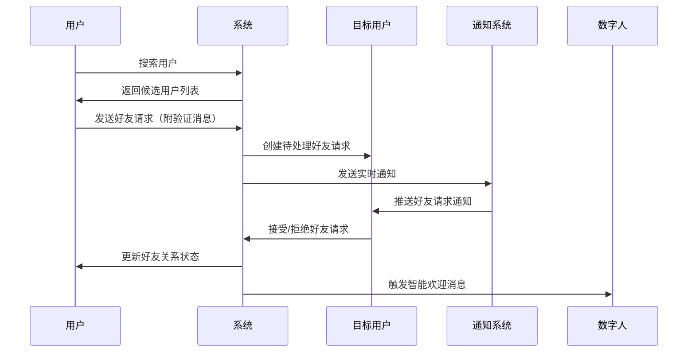

# 通讯录管理系统PRD

## 1. 项目概述

### 1.1 项目背景
基于安美智能咨询系统的数字人智能助手系统，构建专业的通讯录管理模块。该模块旨在为医美行业用户提供智能化的联系人管理服务，支持多角色用户间的高效沟通和关系维护，与现有聊天系统、数字人系统、任务系统深度集成。

### 1.2 业务价值
- **关系网络构建**：帮助用户建立和维护专业社交关系网络，提升业务协作效率
- **精准分类管理**：通过智能标签和分组系统，实现联系人的精确分类和快速检索
- **无缝业务集成**：与聊天、数字人、任务系统深度整合，提供一站式沟通解决方案
- **智能关系维护**：结合AI能力，提供联系人推荐、关系维护提醒等智能服务
- **合规安全保障**：满足医美行业的合规要求，保障用户隐私和数据安全

### 1.3 目标用户
- **医生用户**：管理患者、同行、合作伙伴关系
- **顾问用户**：管理客户、医生、供应商关系  
- **客户用户**：管理医生、顾问、朋友关系
- **管理员**：监督和管理系统内的用户关系网络

## 2. 领域模型设计

### 2.1 核心领域概念

#### 2.1.1 通讯录聚合根 (ContactBook Aggregate)
```
通讯录 (ContactBook)
├── 好友关系管理 (FriendshipManagement)
├── 标签分类系统 (TaggingSystem)
├── 分组管理 (GroupManagement)
├── 隐私控制 (PrivacyControl)
└── 智能推荐 (SmartRecommendation)
```

#### 2.1.2 好友关系聚合根 (Friendship Aggregate)
```
好友关系 (Friendship)
├── 关系状态 (RelationshipStatus)
├── 互动记录 (InteractionHistory)
├── 标签关联 (TagAssociation)
└── 分组归属 (GroupMembership)
```

#### 2.1.3 标签系统聚合根 (TagSystem Aggregate)
```
标签系统 (TagSystem)
├── 系统预设标签 (SystemTags)
├── 用户自定义标签 (CustomTags)
├── 标签分类 (TagCategories)
└── 使用统计 (UsageAnalytics)
```

### 2.2 领域关系图



## 3. 数据库设计

### 3.1 好友关系表 (friendships)

```sql
CREATE TABLE friendships (
    id VARCHAR(36) PRIMARY KEY DEFAULT friendship_id(),
    user_id VARCHAR(36) NOT NULL REFERENCES users(id) ON DELETE CASCADE,
    friend_id VARCHAR(36) NOT NULL REFERENCES users(id) ON DELETE CASCADE,
    
    -- 关系状态
    status friendship_status DEFAULT 'pending' NOT NULL,
    
    -- 关系元数据
    nickname VARCHAR(100),
    remark TEXT,
    source VARCHAR(50), -- 添加来源：search、qr_code、recommendation等
    
    -- 关系设置
    is_starred BOOLEAN DEFAULT FALSE,
    is_muted BOOLEAN DEFAULT FALSE,
    is_pinned BOOLEAN DEFAULT FALSE,
    is_blocked BOOLEAN DEFAULT FALSE,
    
    -- 时间信息
    requested_at TIMESTAMP WITH TIME ZONE DEFAULT NOW(),
    accepted_at TIMESTAMP WITH TIME ZONE,
    last_interaction_at TIMESTAMP WITH TIME ZONE,
    
    -- 统计信息
    interaction_count INTEGER DEFAULT 0,
    
    -- 审计字段
    created_at TIMESTAMP WITH TIME ZONE DEFAULT NOW(),
    updated_at TIMESTAMP WITH TIME ZONE DEFAULT NOW(),
    
    -- 约束
    CONSTRAINT uq_friendship_pair UNIQUE (user_id, friend_id),
    CONSTRAINT chk_not_self_friend CHECK (user_id != friend_id)
);

-- 索引
CREATE INDEX idx_friendship_user_friend ON friendships(user_id, friend_id);
CREATE INDEX idx_friendship_status ON friendships(status);
CREATE INDEX idx_friendship_created_at ON friendships(created_at);
CREATE INDEX idx_friendship_last_interaction ON friendships(last_interaction_at);
```

### 3.2 联系人标签表 (contact_tags)

```sql
CREATE TABLE contact_tags (
    id VARCHAR(36) PRIMARY KEY DEFAULT tag_id(),
    user_id VARCHAR(36) NOT NULL REFERENCES users(id) ON DELETE CASCADE,
    
    -- 标签信息
    name VARCHAR(50) NOT NULL,
    color VARCHAR(7) DEFAULT '#3B82F6', -- HEX颜色值
    icon VARCHAR(50),
    description VARCHAR(200),
    
    -- 标签分类
    category tag_category DEFAULT 'custom',
    
    -- 显示设置
    is_system_tag BOOLEAN DEFAULT FALSE,
    display_order INTEGER DEFAULT 0,
    is_visible BOOLEAN DEFAULT TRUE,
    
    -- 统计信息
    usage_count INTEGER DEFAULT 0,
    
    -- 审计字段
    created_at TIMESTAMP WITH TIME ZONE DEFAULT NOW(),
    updated_at TIMESTAMP WITH TIME ZONE DEFAULT NOW(),
    
    -- 约束
    CONSTRAINT uq_contact_tag_user_name UNIQUE (user_id, name)
);

-- 索引
CREATE INDEX idx_contact_tag_user ON contact_tags(user_id);
CREATE INDEX idx_contact_tag_category ON contact_tags(category);
CREATE INDEX idx_contact_tag_usage ON contact_tags(usage_count DESC);
```

### 3.3 好友标签关联表 (friendship_tags)

```sql
CREATE TABLE friendship_tags (
    id VARCHAR(36) PRIMARY KEY DEFAULT relation_id(),
    friendship_id VARCHAR(36) NOT NULL REFERENCES friendships(id) ON DELETE CASCADE,
    tag_id VARCHAR(36) NOT NULL REFERENCES contact_tags(id) ON DELETE CASCADE,
    
    -- 关联元数据
    assigned_at TIMESTAMP WITH TIME ZONE DEFAULT NOW(),
    assigned_by VARCHAR(36) REFERENCES users(id), -- 支持系统自动分配
    
    -- 约束
    CONSTRAINT uq_friendship_tag_pair UNIQUE (friendship_id, tag_id)
);

-- 索引
CREATE INDEX idx_friendship_tag_friendship ON friendship_tags(friendship_id);
CREATE INDEX idx_friendship_tag_tag ON friendship_tags(tag_id);
```

### 3.4 联系人分组表 (contact_groups)

```sql
CREATE TABLE contact_groups (
    id VARCHAR(36) PRIMARY KEY DEFAULT group_id(),
    user_id VARCHAR(36) NOT NULL REFERENCES users(id) ON DELETE CASCADE,
    
    -- 分组信息
    name VARCHAR(100) NOT NULL,
    description TEXT,
    avatar VARCHAR(1024), -- 分组头像URL
    
    -- 分组类型
    group_type group_type DEFAULT 'personal',
    
    -- 显示设置
    color_theme VARCHAR(7) DEFAULT '#3B82F6',
    display_order INTEGER DEFAULT 0,
    is_collapsed BOOLEAN DEFAULT FALSE,
    
    -- 分组设置
    max_members INTEGER, -- 可选的成员数限制
    is_private BOOLEAN DEFAULT FALSE,
    
    -- 统计信息
    member_count INTEGER DEFAULT 0,
    
    -- 审计字段
    created_at TIMESTAMP WITH TIME ZONE DEFAULT NOW(),
    updated_at TIMESTAMP WITH TIME ZONE DEFAULT NOW(),
    
    -- 约束
    CONSTRAINT uq_contact_group_user_name UNIQUE (user_id, name)
);

-- 索引
CREATE INDEX idx_contact_group_user ON contact_groups(user_id);
CREATE INDEX idx_contact_group_type ON contact_groups(group_type);
```

### 3.5 分组成员表 (contact_group_members)

```sql
CREATE TABLE contact_group_members (
    id VARCHAR(36) PRIMARY KEY DEFAULT relation_id(),
    group_id VARCHAR(36) NOT NULL REFERENCES contact_groups(id) ON DELETE CASCADE,
    friendship_id VARCHAR(36) NOT NULL REFERENCES friendships(id) ON DELETE CASCADE,
    
    -- 成员角色
    role group_member_role DEFAULT 'member',
    
    -- 加入信息
    joined_at TIMESTAMP WITH TIME ZONE DEFAULT NOW(),
    invited_by VARCHAR(36) REFERENCES users(id),
    
    -- 约束
    CONSTRAINT uq_group_member_pair UNIQUE (group_id, friendship_id)
);

-- 索引
CREATE INDEX idx_group_member_group ON contact_group_members(group_id);
CREATE INDEX idx_group_member_friendship ON contact_group_members(friendship_id);
```

### 3.6 联系人隐私设置表 (contact_privacy_settings)

```sql
CREATE TABLE contact_privacy_settings (
    id VARCHAR(36) PRIMARY KEY DEFAULT setting_id(),
    user_id VARCHAR(36) NOT NULL REFERENCES users(id) ON DELETE CASCADE,
    
    -- 可发现性设置
    allow_search_by_phone BOOLEAN DEFAULT TRUE,
    allow_search_by_email BOOLEAN DEFAULT TRUE,
    allow_search_by_username BOOLEAN DEFAULT TRUE,
    
    -- 好友请求设置
    auto_accept_from_contacts BOOLEAN DEFAULT FALSE,
    require_verification_message BOOLEAN DEFAULT TRUE,
    
    -- 信息可见性
    show_online_status BOOLEAN DEFAULT TRUE,
    show_last_seen BOOLEAN DEFAULT FALSE,
    show_profile_to_friends BOOLEAN DEFAULT TRUE,
    
    -- 审计字段
    created_at TIMESTAMP WITH TIME ZONE DEFAULT NOW(),
    updated_at TIMESTAMP WITH TIME ZONE DEFAULT NOW(),
    
    -- 约束
    CONSTRAINT uq_privacy_setting_user UNIQUE (user_id)
);

-- 索引
CREATE INDEX idx_privacy_setting_user ON contact_privacy_settings(user_id);
```

### 3.7 互动记录表 (interaction_records)

```sql
CREATE TABLE interaction_records (
    id VARCHAR(36) PRIMARY KEY DEFAULT record_id(),
    friendship_id VARCHAR(36) NOT NULL REFERENCES friendships(id) ON DELETE CASCADE,
    
    -- 互动类型
    interaction_type interaction_type NOT NULL,
    
    -- 关联对象
    related_object_type VARCHAR(50), -- conversation、message、task等
    related_object_id VARCHAR(36),
    
    -- 互动内容
    interaction_data JSONB,
    
    -- 时间信息
    occurred_at TIMESTAMP WITH TIME ZONE DEFAULT NOW(),
    
    -- 审计字段
    created_at TIMESTAMP WITH TIME ZONE DEFAULT NOW()
);

-- 索引
CREATE INDEX idx_interaction_friendship ON interaction_records(friendship_id);
CREATE INDEX idx_interaction_type ON interaction_records(interaction_type);
CREATE INDEX idx_interaction_occurred_at ON interaction_records(occurred_at DESC);
```

## 4. 核心功能设计

### 4.1 好友管理功能

#### 4.1.1 好友发现和添加

**搜索方式**：
- 手机号精确搜索（基于隐私设置）
- 邮箱精确搜索（基于隐私设置）
- 用户名模糊搜索（支持拼音）
- 二维码扫码添加
- 基于角色的智能推荐

**添加流程**：


#### 4.1.2 好友关系管理

**关系状态**：
- `pending`: 待确认
- `accepted`: 已接受
- `blocked`: 已屏蔽  
- `deleted`: 已删除

**关系设置**：
- 星标好友：重要联系人标记
- 免打扰：屏蔽消息通知
- 置顶显示：列表顶部固定
- 个性昵称：自定义显示名称
- 详细备注：关系描述和备忘

### 4.2 标签分类系统

#### 4.2.1 系统预设标签

```javascript
const SYSTEM_TAG_CATEGORIES = {
  medical: {
    name: "医疗相关",
    tags: [
      { name: "医生", color: "#059669", icon: "stethoscope" },
      { name: "顾问", color: "#0891B2", icon: "user-tie" },
      { name: "护士", color: "#DB2777", icon: "heart" },
      { name: "专家", color: "#DC2626", icon: "award" },
      { name: "同行", color: "#7C3AED", icon: "users" }
    ]
  },
  business: {
    name: "商务关系",
    tags: [
      { name: "客户", color: "#F59E0B", icon: "user-heart" },
      { name: "潜在客户", color: "#F97316", icon: "user-plus" },
      { name: "VIP客户", color: "#DC2626", icon: "star" },
      { name: "供应商", color: "#7C3AED", icon: "truck" },
      { name: "合作伙伴", color: "#10B981", icon: "handshake" }
    ]
  },
  work: {
    name: "工作关系",
    tags: [
      { name: "同事", color: "#3B82F6", icon: "users" },
      { name: "上级", color: "#8B5CF6", icon: "crown" },
      { name: "下属", color: "#06B6D4", icon: "user-check" },
      { name: "HR", color: "#EC4899", icon: "clipboard-list" }
    ]
  },
  personal: {
    name: "个人关系",
    tags: [
      { name: "朋友", color: "#8B5CF6", icon: "user-heart" },
      { name: "家人", color: "#EC4899", icon: "home" },
      { name: "同学", color: "#06B6D4", icon: "graduation-cap" }
    ]
  }
};
```

#### 4.2.2 标签管理功能

**创建和编辑**：
- 自定义标签名称、颜色、图标
- 标签分类归属选择
- 标签描述和用途说明

**智能推荐**：
- 基于聊天内容分析推荐标签
- 根据用户角色推荐常用标签
- 学习用户习惯优化推荐

**使用统计**：
- 标签使用频次统计
- 热门标签排行
- 个人标签使用分析

### 4.3 分组管理系统

#### 4.3.1 分组类型

**个人分组**：
- 家庭成员
- 亲密朋友
- 兴趣爱好群体

**工作分组**：
- 部门同事
- 项目团队
- 工作伙伴

**业务分组**：
- 重要客户
- 潜在客户
- 合作伙伴
- 供应商网络

**临时分组**：
- 活动参与者
- 培训班同学
- 会议成员

#### 4.3.2 分组功能

**成员管理**：
- 拖拽添加/移除成员
- 批量导入成员
- 成员角色设置

**分组操作**：
- 一键创建群聊
- 分组消息广播
- 分组活动统计

### 4.4 隐私和安全控制

#### 4.4.1 隐私设置层级

**全局设置**：
- 搜索可发现性控制
- 好友请求处理规则
- 在线状态显示设置

**好友级设置**：
- 特定好友的可见性控制
- 消息免打扰设置
- 互动记录保留策略

**角色级设置**：
- 基于角色的默认隐私策略
- 跨角色交互限制
- 敏感信息访问控制

#### 4.4.2 合规要求

**医患关系管理**：
- 医患关系的特殊标识
- 医疗信息访问控制
- 诊疗记录关联管理

**数据保护**：
- 个人信息加密存储
- 访问日志记录
- 数据导出和删除权限

## 5. 用户界面设计

### 5.1 整体布局

#### 5.1.1 页面结构
```
个人中心 > 通讯录管理
├── 左侧导航栏 (240px)
│   ├── 快速视图
│   │   ├── 全部好友 (1,234)
│   │   ├── 星标好友 (12)
│   │   ├── 最近联系 (56)
│   │   └── 待处理请求 (3)
│   ├── 自定义分组
│   │   ├── 📋 客户群体 (89)
│   │   ├── 👥 同事朋友 (45)
│   │   ├── 🏥 医疗网络 (67)
│   │   └── ➕ 创建分组
│   ├── 标签筛选
│   │   ├── 🏷️ 客户 (89)
│   │   ├── 🏷️ 医生 (23)
│   │   ├── 🏷️ 顾问 (34)
│   │   └── 🏷️ 管理标签
│   └── 设置选项
│       ├── ⚙️ 隐私设置
│       └── 📊 使用统计
└── 主内容区域 (flex-1)
    ├── 工具栏
    │   ├── 搜索框
    │   ├── 筛选器
    │   ├── 视图切换
    │   └── 操作按钮
    └── 内容展示区
        ├── 列表视图 / 卡片视图
        └── 分页控制
```

#### 5.1.2 响应式适配
- **桌面端**：左右分栏布局，信息展示完整
- **平板端**：可折叠侧边栏，主内容区自适应
- **手机端**：底部导航栏，全屏内容展示

### 5.2 核心组件设计

#### 5.2.1 好友卡片组件

```typescript
interface FriendCardProps {
  friendship: Friendship;
  viewMode: 'list' | 'card';
  onChat: (friendId: string) => void;
  onEdit: (friendshipId: string) => void;
  onRemove: (friendshipId: string) => void;
  onToggleStar: (friendshipId: string) => void;
}

export function FriendCard({ 
  friendship, 
  viewMode, 
  onChat, 
  onEdit, 
  onRemove,
  onToggleStar 
}: FriendCardProps) {
  return (
    <div className={cn(
      "bg-white border border-gray-200 hover:shadow-md transition-all duration-200",
      viewMode === 'card' ? "rounded-lg p-4" : "border-l-0 border-r-0 border-t-0 p-3",
      friendship.is_pinned && "ring-2 ring-blue-100 bg-blue-50"
    )}>
      <div className="flex items-center justify-between">
        {/* 好友信息 */}
        <div className="flex items-center space-x-3">
          <div className="relative">
            <FriendAvatar 
              friend={friendship.friend} 
              size={viewMode === 'card' ? 'lg' : 'md'}
              showOnlineStatus 
            />
            {friendship.is_blocked && (
              <div className="absolute inset-0 bg-gray-900 bg-opacity-50 rounded-full flex items-center justify-center">
                <Ban className="w-4 h-4 text-white" />
              </div>
            )}
          </div>
          
          <div className="flex-1 min-w-0">
            <div className="flex items-center space-x-2">
              <h3 className="text-sm font-medium text-gray-900 truncate">
                {friendship.nickname || friendship.friend.username}
              </h3>
              
              {/* 状态指示器 */}
              <div className="flex items-center space-x-1">
                {friendship.is_starred && (
                  <Star className="w-4 h-4 text-yellow-500 fill-current" />
                )}
                {friendship.is_pinned && (
                  <Pin className="w-4 h-4 text-blue-500" />
                )}
                {friendship.is_muted && (
                  <BellOff className="w-4 h-4 text-gray-400" />
                )}
              </div>
            </div>
            
            <p className="text-xs text-gray-500 truncate">
              {friendship.friend.roles?.map(r => r.name).join('、') || '用户'}
            </p>
            
            {friendship.remark && (
              <p className="text-xs text-gray-400 truncate mt-1">
                {friendship.remark}
              </p>
            )}
            
            {/* 最后互动时间 */}
            {friendship.last_interaction_at && (
              <p className="text-xs text-gray-400 mt-1">
                最后联系：{formatRelativeTime(friendship.last_interaction_at)}
              </p>
            )}
          </div>
        </div>
        
        {/* 标签和操作 */}
        <div className="flex items-center space-x-3">
          {/* 标签显示 */}
          <div className="flex flex-wrap gap-1 max-w-32">
            {friendship.tags.slice(0, 2).map(tag => (
              <Badge 
                key={tag.id} 
                variant="secondary" 
                style={{ 
                  backgroundColor: tag.color + '20', 
                  color: tag.color,
                  borderColor: tag.color + '40'
                }}
                className="text-xs border"
              >
                {tag.name}
              </Badge>
            ))}
            {friendship.tags.length > 2 && (
              <Badge variant="outline" className="text-xs">
                +{friendship.tags.length - 2}
              </Badge>
            )}
          </div>
          
          {/* 快速操作 */}
          <div className="flex items-center space-x-1">
            <Button
              variant="ghost"
              size="sm"
              onClick={() => onChat(friendship.friend_id)}
              className="h-8 w-8 p-0"
            >
              <MessageCircle className="w-4 h-4" />
            </Button>
            
            <Button
              variant="ghost"
              size="sm"
              onClick={() => onToggleStar(friendship.id)}
              className={cn(
                "h-8 w-8 p-0",
                friendship.is_starred && "text-yellow-500"
              )}
            >
              <Star className={cn(
                "w-4 h-4",
                friendship.is_starred && "fill-current"
              )} />
            </Button>
            
            <DropdownMenu>
              <DropdownMenuTrigger asChild>
                <Button variant="ghost" size="sm" className="h-8 w-8 p-0">
                  <MoreHorizontal className="w-4 h-4" />
                </Button>
              </DropdownMenuTrigger>
              <DropdownMenuContent align="end" className="w-48">
                <DropdownMenuItem onClick={() => onEdit(friendship.id)}>
                  <Edit className="w-4 h-4 mr-2" />
                  编辑信息
                </DropdownMenuItem>
                <DropdownMenuItem>
                  <Tag className="w-4 h-4 mr-2" />
                  管理标签
                </DropdownMenuItem>
                <DropdownMenuItem>
                  <Users className="w-4 h-4 mr-2" />
                  添加到分组
                </DropdownMenuItem>
                <DropdownMenuSeparator />
                <DropdownMenuItem>
                  <Bell className="w-4 h-4 mr-2" />
                  {friendship.is_muted ? '取消免打扰' : '设置免打扰'}
                </DropdownMenuItem>
                <DropdownMenuItem>
                  <Pin className="w-4 h-4 mr-2" />
                  {friendship.is_pinned ? '取消置顶' : '置顶显示'}
                </DropdownMenuItem>
                <DropdownMenuSeparator />
                <DropdownMenuItem 
                  onClick={() => onRemove(friendship.id)}
                  className="text-red-600 focus:text-red-600"
                >
                  <UserMinus className="w-4 h-4 mr-2" />
                  删除好友
                </DropdownMenuItem>
              </DropdownMenuContent>
            </DropdownMenu>
          </div>
        </div>
      </div>
    </div>
  );
}
```

#### 5.2.2 搜索和筛选工具栏

```typescript
interface ContactToolbarProps {
  searchQuery: string;
  onSearchChange: (query: string) => void;
  selectedTags: string[];
  onTagsChange: (tags: string[]) => void;
  selectedGroups: string[];
  onGroupsChange: (groups: string[]) => void;
  viewMode: 'list' | 'card';
  onViewModeChange: (mode: 'list' | 'card') => void;
  sortBy: string;
  onSortChange: (sort: string) => void;
}

export function ContactToolbar({
  searchQuery,
  onSearchChange,
  selectedTags,
  onTagsChange,
  selectedGroups,
  onGroupsChange,
  viewMode,
  onViewModeChange,
  sortBy,
  onSortChange
}: ContactToolbarProps) {
  return (
    <div className="bg-white border-b border-gray-200 p-4 space-y-4">
      {/* 第一行：搜索和主要操作 */}
      <div className="flex items-center justify-between">
        <div className="flex items-center space-x-4 flex-1">
          {/* 搜索框 */}
          <div className="relative flex-1 max-w-md">
            <Search className="absolute left-3 top-1/2 transform -translate-y-1/2 text-gray-400 w-4 h-4" />
            <Input
              placeholder="搜索好友姓名、昵称、备注..."
              value={searchQuery}
              onChange={(e) => onSearchChange(e.target.value)}
              className="pl-10"
            />
            {searchQuery && (
              <Button
                variant="ghost"
                size="sm"
                onClick={() => onSearchChange('')}
                className="absolute right-2 top-1/2 transform -translate-y-1/2 h-6 w-6 p-0"
              >
                <X className="w-4 h-4" />
              </Button>
            )}
          </div>
          
          {/* 筛选器 */}
          <div className="flex items-center space-x-2">
            {/* 标签筛选 */}
            <Popover>
              <PopoverTrigger asChild>
                <Button variant="outline" size="sm">
                  <Tag className="w-4 h-4 mr-2" />
                  标签
                  {selectedTags.length > 0 && (
                    <Badge variant="secondary" className="ml-2">
                      {selectedTags.length}
                    </Badge>
                  )}
                </Button>
              </PopoverTrigger>
              <PopoverContent className="w-80">
                <TagSelector
                  selectedTags={selectedTags}
                  onTagsChange={onTagsChange}
                />
              </PopoverContent>
            </Popover>
            
            {/* 分组筛选 */}
            <Popover>
              <PopoverTrigger asChild>
                <Button variant="outline" size="sm">
                  <Users className="w-4 h-4 mr-2" />
                  分组
                  {selectedGroups.length > 0 && (
                    <Badge variant="secondary" className="ml-2">
                      {selectedGroups.length}
                    </Badge>
                  )}
                </Button>
              </PopoverTrigger>
              <PopoverContent className="w-80">
                <GroupSelector
                  selectedGroups={selectedGroups}
                  onGroupsChange={onGroupsChange}
                />
              </PopoverContent>
            </Popover>
            
            {/* 排序 */}
            <Select value={sortBy} onValueChange={onSortChange}>
              <SelectTrigger className="w-32">
                <SelectValue />
              </SelectTrigger>
              <SelectContent>
                <SelectItem value="name">按姓名</SelectItem>
                <SelectItem value="recent">最近联系</SelectItem>
                <SelectItem value="added">添加时间</SelectItem>
                <SelectItem value="interaction">互动频次</SelectItem>
              </SelectContent>
            </Select>
          </div>
        </div>
        
        {/* 右侧操作 */}
        <div className="flex items-center space-x-2">
          {/* 视图切换 */}
          <div className="flex items-center bg-gray-100 rounded-md p-1">
            <Button
              variant={viewMode === 'list' ? 'default' : 'ghost'}
              size="sm"
              onClick={() => onViewModeChange('list')}
              className="h-7"
            >
              <List className="w-4 h-4" />
            </Button>
            <Button
              variant={viewMode === 'card' ? 'default' : 'ghost'}
              size="sm"
              onClick={() => onViewModeChange('card')}
              className="h-7"
            >
              <Grid3X3 className="w-4 h-4" />
            </Button>
          </div>
          
          {/* 添加好友 */}
          <Button>
            <UserPlus className="w-4 h-4 mr-2" />
            添加好友
          </Button>
        </div>
      </div>
      
      {/* 第二行：激活的筛选器显示 */}
      {(selectedTags.length > 0 || selectedGroups.length > 0 || searchQuery) && (
        <div className="flex items-center space-x-2 flex-wrap">
          <span className="text-sm text-gray-500">筛选条件：</span>
          
          {searchQuery && (
            <Badge variant="secondary" className="flex items-center space-x-1">
              <Search className="w-3 h-3" />
              <span>"{searchQuery}"</span>
              <Button
                variant="ghost"
                size="sm"
                onClick={() => onSearchChange('')}
                className="h-4 w-4 p-0 ml-1"
              >
                <X className="w-3 h-3" />
              </Button>
            </Badge>
          )}
          
          {selectedTags.map(tagId => (
            <TagBadge
              key={tagId}
              tagId={tagId}
              onRemove={() => onTagsChange(selectedTags.filter(id => id !== tagId))}
            />
          ))}
          
          {selectedGroups.map(groupId => (
            <GroupBadge
              key={groupId}
              groupId={groupId}
              onRemove={() => onGroupsChange(selectedGroups.filter(id => id !== groupId))}
            />
          ))}
          
          <Button
            variant="ghost"
            size="sm"
            onClick={() => {
              onSearchChange('');
              onTagsChange([]);
              onGroupsChange([]);
            }}
            className="text-gray-500 hover:text-gray-700"
          >
            清除所有筛选
          </Button>
        </div>
      )}
    </div>
  );
}
```

## 6. API接口设计

### 6.1 好友管理API

```python
# 好友关系管理
@router.get("/contacts/friends", response_model=PaginatedResponse[FriendshipResponse])
async def get_friends(
    # 筛选参数
    view: Optional[str] = Query(None, description="视图类型：all/starred/recent/blocked/pending"),
    tags: Optional[List[str]] = Query(None, description="标签ID列表筛选"),
    groups: Optional[List[str]] = Query(None, description="分组ID列表筛选"),
    search: Optional[str] = Query(None, description="搜索关键词"),
    status: Optional[str] = Query(None, description="关系状态筛选"),
    
    # 排序参数
    sort_by: str = Query("name", description="排序字段：name/recent/added/interaction"),
    sort_order: str = Query("asc", description="排序方向：asc/desc"),
    
    # 分页参数
    page: int = Query(1, ge=1),
    size: int = Query(20, ge=1, le=100),
    
    # 依赖注入
    current_user: User = Depends(get_current_user),
    db: Session = Depends(get_db)
):
    """获取好友列表（支持多维度筛选和排序）"""
    pass

@router.post("/contacts/friends/search", response_model=List[UserSearchResult])
async def search_users(
    search_request: UserSearchRequest,
    current_user: User = Depends(get_current_user),
    db: Session = Depends(get_db)
):
    """搜索用户（用于添加好友）"""
    pass

@router.post("/contacts/friends/request", response_model=FriendRequestResponse)
async def send_friend_request(
    request: FriendRequestCreate,
    current_user: User = Depends(get_current_user),
    db: Session = Depends(get_db)
):
    """发送好友请求"""
    pass

@router.get("/contacts/friends/requests", response_model=PaginatedResponse[FriendRequestResponse])
async def get_friend_requests(
    type: str = Query("received", description="请求类型：sent/received"),
    status: Optional[str] = Query(None, description="请求状态筛选"),
    page: int = Query(1, ge=1),
    size: int = Query(20, ge=1, le=100),
    current_user: User = Depends(get_current_user),
    db: Session = Depends(get_db)
):
    """获取好友请求列表"""
    pass

@router.put("/contacts/friends/requests/{request_id}")
async def handle_friend_request(
    request_id: str,
    action: FriendRequestAction,
    current_user: User = Depends(get_current_user),
    db: Session = Depends(get_db)
):
    """处理好友请求（接受/拒绝）"""
    pass

@router.put("/contacts/friends/{friendship_id}", response_model=FriendshipResponse)
async def update_friendship(
    friendship_id: str,
    update_data: UpdateFriendshipRequest,
    current_user: User = Depends(get_current_user),
    db: Session = Depends(get_db)
):
    """更新好友关系信息"""
    pass

@router.delete("/contacts/friends/{friendship_id}")
async def delete_friendship(
    friendship_id: str,
    current_user: User = Depends(get_current_user),
    db: Session = Depends(get_db)
):
    """删除好友关系"""
    pass

@router.post("/contacts/friends/batch", response_model=BatchOperationResponse)
async def batch_friend_operations(
    operations: BatchFriendOperations,
    current_user: User = Depends(get_current_user),
    db: Session = Depends(get_db)
):
    """批量好友操作（添加标签、移动分组等）"""
    pass
```

### 6.2 标签管理API

```python
# 标签管理
@router.get("/contacts/tags", response_model=List[ContactTagResponse])
async def get_contact_tags(
    category: Optional[str] = Query(None, description="标签分类筛选"),
    include_system: bool = Query(True, description="是否包含系统标签"),
    current_user: User = Depends(get_current_user),
    db: Session = Depends(get_db)
):
    """获取用户的联系人标签"""
    pass

@router.post("/contacts/tags", response_model=ContactTagResponse)
async def create_contact_tag(
    tag_data: CreateContactTagRequest,
    current_user: User = Depends(get_current_user),
    db: Session = Depends(get_db)
):
    """创建联系人标签"""
    pass

@router.put("/contacts/tags/{tag_id}", response_model=ContactTagResponse)
async def update_contact_tag(
    tag_id: str,
    update_data: UpdateContactTagRequest,
    current_user: User = Depends(get_current_user),
    db: Session = Depends(get_db)
):
    """更新联系人标签"""
    pass

@router.delete("/contacts/tags/{tag_id}")
async def delete_contact_tag(
    tag_id: str,
    current_user: User = Depends(get_current_user),
    db: Session = Depends(get_db)
):
    """删除联系人标签"""
    pass

@router.put("/contacts/friends/{friendship_id}/tags")
async def update_friend_tags(
    friendship_id: str,
    tag_update: UpdateFriendTagsRequest,
    current_user: User = Depends(get_current_user),
    db: Session = Depends(get_db)
):
    """更新好友标签"""
    pass

@router.get("/contacts/tags/{tag_id}/friends", response_model=PaginatedResponse[FriendshipResponse])
async def get_friends_by_tag(
    tag_id: str,
    page: int = Query(1, ge=1),
    size: int = Query(20, ge=1, le=100),
    current_user: User = Depends(get_current_user),
    db: Session = Depends(get_db)
):
    """获取指定标签的好友列表"""
    pass

@router.get("/contacts/tags/suggestions", response_model=List[TagSuggestionResponse])
async def get_tag_suggestions(
    friendship_id: Optional[str] = Query(None, description="为特定好友推荐标签"),
    current_user: User = Depends(get_current_user),
    db: Session = Depends(get_db)
):
    """获取智能标签推荐"""
    pass
```

### 6.3 分组管理API

```python
# 分组管理
@router.get("/contacts/groups", response_model=List[ContactGroupResponse])
async def get_contact_groups(
    include_members: bool = Query(False, description="是否包含成员信息"),
    current_user: User = Depends(get_current_user),
    db: Session = Depends(get_db)
):
    """获取联系人分组"""
    pass

@router.post("/contacts/groups", response_model=ContactGroupResponse)
async def create_contact_group(
    group_data: CreateContactGroupRequest,
    current_user: User = Depends(get_current_user),
    db: Session = Depends(get_db)
):
    """创建联系人分组"""
    pass

@router.put("/contacts/groups/{group_id}", response_model=ContactGroupResponse)
async def update_contact_group(
    group_id: str,
    update_data: UpdateContactGroupRequest,
    current_user: User = Depends(get_current_user),
    db: Session = Depends(get_db)
):
    """更新联系人分组"""
    pass

@router.delete("/contacts/groups/{group_id}")
async def delete_contact_group(
    group_id: str,
    current_user: User = Depends(get_current_user),
    db: Session = Depends(get_db)
):
    """删除联系人分组"""
    pass

@router.get("/contacts/groups/{group_id}/members", response_model=PaginatedResponse[GroupMemberResponse])
async def get_group_members(
    group_id: str,
    page: int = Query(1, ge=1),
    size: int = Query(50, ge=1, le=100),
    current_user: User = Depends(get_current_user),
    db: Session = Depends(get_db)
):
    """获取分组成员"""
    pass

@router.put("/contacts/groups/{group_id}/members")
async def update_group_members(
    group_id: str,
    member_update: UpdateGroupMembersRequest,
    current_user: User = Depends(get_current_user),
    db: Session = Depends(get_db)
):
    """更新分组成员"""
    pass

@router.post("/contacts/groups/{group_id}/chat", response_model=ConversationResponse)
async def create_group_chat(
    group_id: str,
    chat_config: CreateGroupChatRequest,
    current_user: User = Depends(get_current_user),
    db: Session = Depends(get_db)
):
    """基于分组创建群聊"""
    pass
```

### 6.4 隐私设置API

```python
# 隐私设置管理
@router.get("/contacts/privacy", response_model=ContactPrivacyResponse)
async def get_privacy_settings(
    current_user: User = Depends(get_current_user),
    db: Session = Depends(get_db)
):
    """获取联系人隐私设置"""
    pass

@router.put("/contacts/privacy", response_model=ContactPrivacyResponse)
async def update_privacy_settings(
    settings: UpdatePrivacySettingsRequest,
    current_user: User = Depends(get_current_user),
    db: Session = Depends(get_db)
):
    """更新联系人隐私设置"""
    pass

@router.get("/contacts/analytics", response_model=ContactAnalyticsResponse)
async def get_contact_analytics(
    period: str = Query("month", description="统计周期：week/month/quarter/year"),
    current_user: User = Depends(get_current_user),
    db: Session = Depends(get_db)
):
    """获取联系人使用统计"""
    pass
```

## 7. 系统集成设计

### 7.1 与聊天系统集成

#### 7.1.1 快速发起对话
```python
@router.post("/contacts/friends/{friend_id}/chat", response_model=ConversationResponse)
async def start_conversation_with_friend(
    friend_id: str,
    message: Optional[str] = None,
    current_user: User = Depends(get_current_user),
    db: Session = Depends(get_db)
):
    """与好友发起对话"""
    # 检查好友关系
    friendship = await verify_friendship(current_user.id, friend_id, db)
    if not friendship:
        raise HTTPException(status_code=404, detail="好友关系不存在")
    
    # 查找或创建对话
    conversation = await get_or_create_conversation(
        user_ids=[current_user.id, friend_id],
        db=db
    )
    
    # 发送初始消息（如果提供）
    if message:
        await send_message(
            conversation_id=conversation.id,
            sender_id=current_user.id,
            content=message,
            db=db
        )
    
    # 更新互动记录
    await update_interaction_record(
        friendship_id=friendship.id,
        interaction_type="chat_started",
        db=db
    )
    
    return conversation
```

#### 7.1.2 聊天历史关联
```python
@router.get("/contacts/friends/{friend_id}/conversations", response_model=List[ConversationSummary])
async def get_friend_conversations(
    friend_id: str,
    limit: int = Query(10, le=50),
    current_user: User = Depends(get_current_user),
    db: Session = Depends(get_db)
):
    """获取与好友的聊天历史"""
    # 验证好友关系
    friendship = await verify_friendship(current_user.id, friend_id, db)
    if not friendship:
        raise HTTPException(status_code=404, detail="好友关系不存在")
    
    # 查询共同参与的对话
    conversations = await get_conversations_between_users(
        user1_id=current_user.id,
        user2_id=friend_id,
        limit=limit,
        db=db
    )
    
    return conversations
```

### 7.2 与数字人系统集成

#### 7.2.1 智能推荐服务
```python
class ContactRecommendationService:
    """联系人智能推荐服务"""
    
    def __init__(self, db: Session):
        self.db = db
    
    async def recommend_friends(self, user_id: str) -> List[FriendRecommendation]:
        """推荐潜在好友"""
        # 基于角色推荐
        role_recommendations = await self._recommend_by_role(user_id)
        
        # 基于共同好友推荐
        mutual_recommendations = await self._recommend_by_mutual_friends(user_id)
        
        # 基于聊天历史推荐
        chat_recommendations = await self._recommend_by_chat_history(user_id)
        
        # 合并和排序推荐结果
        all_recommendations = role_recommendations + mutual_recommendations + chat_recommendations
        return self._rank_recommendations(all_recommendations)
    
    async def recommend_tags(self, friendship_id: str) -> List[TagRecommendation]:
        """为好友推荐标签"""
        friendship = await self._get_friendship(friendship_id)
        
        # 基于好友角色推荐
        role_tags = await self._recommend_tags_by_role(friendship.friend)
        
        # 基于聊天内容分析推荐
        chat_tags = await self._recommend_tags_by_chat_analysis(friendship_id)
        
        # 基于用户行为推荐
        behavior_tags = await self._recommend_tags_by_behavior(friendship.user_id)
        
        return self._merge_tag_recommendations(role_tags, chat_tags, behavior_tags)
    
    async def suggest_relationship_maintenance(self, user_id: str) -> List[MaintenanceSuggestion]:
        """关系维护建议"""
        # 分析长期未联系的重要好友
        inactive_friends = await self._find_inactive_important_friends(user_id)
        
        # 生成维护建议
        suggestions = []
        for friend in inactive_friends:
            suggestion = await self._generate_maintenance_suggestion(friend)
            suggestions.append(suggestion)
        
        return suggestions
```

#### 7.2.2 数字人任务集成
```python
@router.post("/contacts/digital-human/tasks", response_model=List[TaskResponse])
async def create_contact_maintenance_tasks(
    user_id: str,
    current_user: User = Depends(get_current_user),
    db: Session = Depends(get_db)
):
    """创建联系人维护任务"""
    # 获取需要维护的联系人
    maintenance_suggestions = await ContactRecommendationService(db).suggest_relationship_maintenance(user_id)
    
    tasks = []
    for suggestion in maintenance_suggestions:
        task = await create_task(
            title=f"联系 {suggestion.friend_name}",
            description=suggestion.suggestion_text,
            task_type="relationship_maintenance",
            assigned_to=user_id,
            related_object_type="friendship",
            related_object_id=suggestion.friendship_id,
            due_date=suggestion.suggested_date,
            db=db
        )
        tasks.append(task)
    
    return tasks
```

### 7.3 与任务系统集成

#### 7.3.1 自动任务创建
```python
class ContactTaskService:
    """联系人相关任务服务"""
    
    async def on_friend_request_accepted(self, friendship_id: str):
        """好友请求被接受时的任务处理"""
        friendship = await self._get_friendship(friendship_id)
        
        # 为用户创建新好友欢迎任务
        await create_task(
            title=f"欢迎新好友：{friendship.friend.username}",
            description="发送欢迎消息，了解新好友的需求和兴趣",
            task_type="friend_welcome",
            assigned_to=friendship.user_id,
            related_object_type="friendship",
            related_object_id=friendship_id,
            priority="medium",
            db=self.db
        )
        
        # 为好友创建相应的欢迎任务
        reverse_friendship = await self._get_reverse_friendship(friendship_id)
        if reverse_friendship:
            await create_task(
                title=f"欢迎新好友：{friendship.user.username}",
                description="发送欢迎消息，介绍自己的服务和专业领域",
                task_type="friend_welcome",
                assigned_to=friendship.friend_id,
                related_object_type="friendship",
                related_object_id=reverse_friendship.id,
                priority="medium",
                db=self.db
            )
    
    async def schedule_maintenance_reminders(self):
        """定期调度关系维护提醒任务"""
        # 查找长期未联系的重要好友
        inactive_friendships = await self._find_inactive_friendships()
        
        for friendship in inactive_friendships:
            await create_task(
                title=f"联系 {friendship.friend.username}",
                description=f"已经 {self._calculate_days_since_last_contact(friendship)} 天没有联系了，建议主动问候",
                task_type="relationship_maintenance",
                assigned_to=friendship.user_id,
                related_object_type="friendship",
                related_object_id=friendship.id,
                priority="low",
                db=self.db
            )
    
    async def create_birthday_reminder_tasks(self):
        """创建生日提醒任务"""
        upcoming_birthdays = await self._find_upcoming_birthdays()
        
        for birthday_info in upcoming_birthdays:
            await create_task(
                title=f"{birthday_info.friend_name} 的生日提醒",
                description=f"{birthday_info.friend_name} 的生日是 {birthday_info.birthday.strftime('%m月%d日')}，准备祝福消息",
                task_type="birthday_reminder",
                assigned_to=birthday_info.user_id,
                related_object_type="friendship",
                related_object_id=birthday_info.friendship_id,
                priority="medium",
                due_date=birthday_info.birthday,
                db=self.db
            )
```

## 8. 安全和合规设计

### 8.1 数据安全

#### 8.1.1 敏感信息加密
```python
class ContactSecurityService:
    """联系人安全服务"""
    
    def __init__(self):
        self.encryption = get_encryption()
    
    def encrypt_sensitive_data(self, data: str) -> str:
        """加密敏感数据"""
        return self.encryption.encrypt(data)
    
    def decrypt_sensitive_data(self, encrypted_data: str) -> str:
        """解密敏感数据"""
        return self.encryption.decrypt(encrypted_data)
    
    def hash_search_key(self, key: str) -> str:
        """哈希搜索键（用于隐私保护的搜索）"""
        return hashlib.sha256(key.encode()).hexdigest()
```

#### 8.1.2 访问控制
```python
class ContactAccessControl:
    """联系人访问控制"""
    
    async def check_friendship_access(
        self, 
        user_id: str, 
        target_user_id: str, 
        action: str,
        db: Session
    ) -> bool:
        """检查好友关系访问权限"""
        # 检查是否为好友关系
        friendship = await self._get_friendship(user_id, target_user_id, db)
        if not friendship or friendship.status != "accepted":
            return False
        
        # 检查是否被屏蔽
        if friendship.is_blocked:
            return False
        
        # 根据操作类型检查权限
        if action == "view_profile":
            return await self._check_profile_visibility(friendship, db)
        elif action == "send_message":
            return await self._check_message_permission(friendship, db)
        
        return True
    
    async def check_search_visibility(
        self, 
        searcher_id: str, 
        target_user_id: str,
        search_method: str,
        db: Session
    ) -> bool:
        """检查搜索可见性"""
        privacy_settings = await self._get_privacy_settings(target_user_id, db)
        
        if search_method == "phone" and not privacy_settings.allow_search_by_phone:
            return False
        elif search_method == "email" and not privacy_settings.allow_search_by_email:
            return False
        elif search_method == "username" and not privacy_settings.allow_search_by_username:
            return False
        
        return True
```

### 8.2 合规要求

#### 8.2.1 医患关系管理
```python
class MedicalComplianceService:
    """医疗合规服务"""
    
    async def validate_medical_relationship(
        self, 
        doctor_id: str, 
        patient_id: str,
        db: Session
    ) -> bool:
        """验证医患关系的合规性"""
        # 检查医生资质
        doctor = await self._get_user_with_role(doctor_id, "doctor", db)
        if not doctor or not doctor.doctor.is_licensed:
            return False
        
        # 检查患者同意
        consent = await self._get_patient_consent(patient_id, doctor_id, db)
        if not consent or not consent.is_active:
            return False
        
        return True
    
    async def create_medical_relationship_audit(
        self,
        doctor_id: str,
        patient_id: str,
        action: str,
        db: Session
    ):
        """创建医患关系审计记录"""
        audit_record = MedicalRelationshipAudit(
            doctor_id=doctor_id,
            patient_id=patient_id,
            action=action,
            timestamp=datetime.now(),
            ip_address=get_client_ip(),
            user_agent=get_user_agent()
        )
        db.add(audit_record)
        await db.commit()
```

## 9. 性能优化

### 9.1 数据库优化

#### 9.1.1 查询优化
```sql
-- 好友列表查询优化（支持复杂筛选）
CREATE INDEX CONCURRENTLY idx_friendships_user_status_interaction 
ON friendships(user_id, status, last_interaction_at DESC);

-- 标签筛选优化
CREATE INDEX CONCURRENTLY idx_friendship_tags_composite 
ON friendship_tags(tag_id, friendship_id);

-- 分组成员查询优化
CREATE INDEX CONCURRENTLY idx_group_members_composite 
ON contact_group_members(group_id, joined_at DESC);

-- 搜索优化（全文搜索）
CREATE INDEX CONCURRENTLY idx_users_search_gin 
ON users USING gin(to_tsvector('chinese', username || ' ' || COALESCE(phone, '') || ' ' || email));
```

#### 9.1.2 缓存策略
```python
class ContactCacheService:
    """联系人缓存服务"""
    
    def __init__(self, redis_client: Redis):
        self.redis = redis_client
        self.cache_ttl = 3600  # 1小时
    
    async def get_friend_list(self, user_id: str, cache_key: str) -> Optional[List[dict]]:
        """获取缓存的好友列表"""
        cached_data = await self.redis.get(f"friends:{user_id}:{cache_key}")
        if cached_data:
            return json.loads(cached_data)
        return None
    
    async def set_friend_list(self, user_id: str, cache_key: str, data: List[dict]):
        """缓存好友列表"""
        await self.redis.setex(
            f"friends:{user_id}:{cache_key}",
            self.cache_ttl,
            json.dumps(data, default=str)
        )
    
    async def invalidate_user_cache(self, user_id: str):
        """清除用户相关缓存"""
        pattern = f"friends:{user_id}:*"
        keys = await self.redis.keys(pattern)
        if keys:
            await self.redis.delete(*keys)
    
    async def get_online_status(self, user_ids: List[str]) -> Dict[str, bool]:
        """批量获取用户在线状态"""
        pipeline = self.redis.pipeline()
        for user_id in user_ids:
            pipeline.get(f"online:{user_id}")
        
        results = await pipeline.execute()
        return {
            user_id: bool(result) 
            for user_id, result in zip(user_ids, results)
        }
```

### 9.2 前端性能优化

#### 9.2.1 虚拟滚动
```typescript
import { FixedSizeList as List } from 'react-window';

interface VirtualizedFriendListProps {
  friends: Friendship[];
  viewMode: 'list' | 'card';
  onFriendAction: (action: string, friendId: string) => void;
}

export function VirtualizedFriendList({ 
  friends, 
  viewMode, 
  onFriendAction 
}: VirtualizedFriendListProps) {
  const itemHeight = viewMode === 'card' ? 120 : 80;
  const itemsPerRow = viewMode === 'card' ? 3 : 1;
  
  const Row = ({ index, style }: { index: number; style: React.CSSProperties }) => {
    const startIndex = index * itemsPerRow;
    const endIndex = Math.min(startIndex + itemsPerRow, friends.length);
    const rowFriends = friends.slice(startIndex, endIndex);
    
    return (
      <div style={style} className="flex space-x-4 p-2">
        {rowFriends.map(friend => (
          <FriendCard
            key={friend.id}
            friendship={friend}
            viewMode={viewMode}
            onChat={(friendId) => onFriendAction('chat', friendId)}
            onEdit={(friendshipId) => onFriendAction('edit', friendshipId)}
            onRemove={(friendshipId) => onFriendAction('remove', friendshipId)}
          />
        ))}
      </div>
    );
  };
  
  return (
    <List
      height={600}
      itemCount={Math.ceil(friends.length / itemsPerRow)}
      itemSize={itemHeight}
      overscanCount={5}
    >
      {Row}
    </List>
  );
}
```

#### 9.2.2 数据预加载和懒加载
```typescript
export function useContactData(userId: string) {
  const [friends, setFriends] = useState<Friendship[]>([]);
  const [tags, setTags] = useState<ContactTag[]>([]);
  const [groups, setGroups] = useState<ContactGroup[]>([]);
  const [loading, setLoading] = useState(true);
  
  // 预加载核心数据
  useEffect(() => {
    const preloadData = async () => {
      try {
        const [friendsData, tagsData, groupsData] = await Promise.all([
          getFriends({ page: 1, size: 50 }), // 预加载前50个好友
          getContactTags(),
          getContactGroups()
        ]);
        
        setFriends(friendsData.items);
        setTags(tagsData);
        setGroups(groupsData);
      } catch (error) {
        console.error('预加载数据失败:', error);
      } finally {
        setLoading(false);
      }
    };
    
    preloadData();
  }, [userId]);
  
  // 懒加载更多好友数据
  const loadMoreFriends = useCallback(async (page: number) => {
    try {
      const moreData = await getFriends({ page, size: 50 });
      setFriends(prev => [...prev, ...moreData.items]);
      return moreData.items.length > 0;
    } catch (error) {
      console.error('加载更多数据失败:', error);
      return false;
    }
  }, []);
  
  return {
    friends,
    tags,
    groups,
    loading,
    loadMoreFriends
  };
}
```

## 10. 开发实施计划

### 10.1 第一阶段：基础功能开发（3-4周）

**Week 1: 数据模型和后端基础**
- [ ] 数据库表结构设计和创建
- [ ] 基础数据模型实现（SQLAlchemy）
- [ ] UUID生成器和加密工具集成
- [ ] 基础API端点实现（CRUD操作）

**Week 2: 好友管理核心功能**
- [ ] 好友搜索和添加功能
- [ ] 好友请求处理流程
- [ ] 好友关系状态管理
- [ ] 基础权限控制实现

**Week 3: 前端核心组件**
- [ ] 通讯录主页面布局
- [ ] 好友列表和卡片组件
- [ ] 搜索和筛选工具栏
- [ ] 添加好友流程界面

**Week 4: 基础集成和测试**
- [ ] 与认证系统集成
- [ ] 与聊天系统基础集成
- [ ] 单元测试和集成测试
- [ ] 基础功能验收测试

### 10.2 第二阶段：高级功能开发（3-4周）

**Week 5: 标签系统**
- [ ] 标签管理后端实现
- [ ] 系统预设标签初始化
- [ ] 标签分配和管理界面
- [ ] 智能标签推荐功能

**Week 6: 分组系统**
- [ ] 分组管理后端实现
- [ ] 分组成员管理功能
- [ ] 分组界面和交互实现
- [ ] 分组聊天集成

**Week 7: 隐私和安全**
- [ ] 隐私设置功能实现
- [ ] 访问控制和权限验证
- [ ] 数据加密和安全措施
- [ ] 合规检查和审计日志

**Week 8: 用户体验优化**
- [ ] 性能优化和缓存实现
- [ ] 响应式设计和移动端适配
- [ ] 交互体验改进
- [ ] 错误处理和用户反馈

### 10.3 第三阶段：智能化和高级功能（2-3周）

**Week 9: 智能推荐**
- [ ] 数字人系统集成
- [ ] 好友推荐算法实现
- [ ] 标签智能推荐
- [ ] 关系维护建议

**Week 10: 任务系统集成**
- [ ] 联系人相关任务创建
- [ ] 自动化任务调度
- [ ] 生日和节日提醒
- [ ] 关系维护任务

**Week 11: 高级分析和报告**
- [ ] 使用统计和分析
- [ ] 社交网络可视化
- [ ] 数据导出和备份
- [ ] 管理员监控功能

### 10.4 第四阶段：测试和发布（1-2周）

**Week 12: 全面测试**
- [ ] 功能完整性测试
- [ ] 性能压力测试
- [ ] 安全渗透测试
- [ ] 用户体验测试

**Week 13: 发布准备**
- [ ] 生产环境部署
- [ ] 数据迁移和初始化
- [ ] 用户培训和文档
- [ ] 监控和日志配置

## 11. 风险评估和缓解

### 11.1 技术风险

**数据迁移风险**
- **风险**：现有用户数据迁移可能导致数据丢失或不一致
- **缓解措施**：
  - 完整的数据备份策略
  - 分批次渐进式迁移
  - 数据一致性验证工具
  - 回滚计划准备

**性能风险**
- **风险**：大量用户和复杂查询可能导致性能问题
- **缓解措施**：
  - 数据库索引优化
  - 缓存策略实施
  - 分页和虚拟滚动
  - 性能监控和预警

**集成风险**
- **风险**：与现有系统集成可能出现兼容性问题
- **缓解措施**：
  - 接口版本控制
  - 向后兼容性保证
  - 集成测试覆盖
  - 灰度发布策略

### 11.2 业务风险

**用户接受度风险**
- **风险**：用户可能不习惯新的通讯录功能
- **缓解措施**：
  - 用户研究和需求验证
  - 渐进式功能发布
  - 用户培训和引导
  - 反馈收集和快速迭代

**隐私合规风险**
- **风险**：可能违反数据保护法规
- **缓解措施**：
  - 法律合规性审查
  - 隐私保护设计
  - 用户同意机制
  - 数据最小化原则

**安全风险**
- **风险**：敏感联系人信息可能泄露
- **缓解措施**：
  - 数据加密存储
  - 访问控制严格化
  - 安全审计定期进行
  - 应急响应计划

### 11.3 项目风险

**进度风险**
- **风险**：开发进度可能延迟
- **缓解措施**：
  - 合理的时间估算
  - 关键路径管理
  - 资源弹性调配
  - 范围优先级管理

**资源风险**
- **风险**：开发资源可能不足
- **缓解措施**：
  - 资源需求提前规划
  - 外部资源备选方案
  - 技能培训和知识转移
  - 工作负载平衡

## 12. 成功指标和监控

### 12.1 业务指标

**用户参与度**
- 通讯录功能使用率 > 80%
- 平均好友数量 > 20
- 标签使用率 > 60%
- 分组创建率 > 40%

**功能效果**
- 好友添加成功率 > 95%
- 搜索查询响应时间 < 500ms
- 用户满意度评分 > 4.0/5.0
- 客户投诉率 < 1%

### 12.2 技术指标

**性能指标**
- 页面加载时间 < 2秒
- API响应时间 < 300ms
- 数据库查询时间 < 100ms
- 系统可用性 > 99.9%

**安全指标**
- 零安全漏洞
- 数据泄露事件 = 0
- 访问控制准确率 = 100%
- 合规检查通过率 = 100%

### 12.3 监控和告警

**实时监控**
```python
class ContactSystemMonitor:
    """通讯录系统监控"""
    
    def __init__(self):
        self.metrics_client = get_metrics_client()
        self.alert_manager = get_alert_manager()
    
    async def track_friend_request(self, success: bool, response_time: float):
        """跟踪好友请求指标"""
        self.metrics_client.increment('friend_requests_total')
        if success:
            self.metrics_client.increment('friend_requests_success')
        self.metrics_client.timing('friend_request_response_time', response_time)
    
    async def track_search_performance(self, query_type: str, response_time: float, result_count: int):
        """跟踪搜索性能"""
        self.metrics_client.timing(f'search_{query_type}_response_time', response_time)
        self.metrics_client.gauge(f'search_{query_type}_results', result_count)
        
        # 性能告警
        if response_time > 1000:  # 1秒
            await self.alert_manager.send_alert(
                'high_search_response_time',
                f'搜索响应时间过长: {response_time}ms',
                severity='warning'
            )
    
    async def track_user_activity(self, user_id: str, action: str):
        """跟踪用户活动"""
        self.metrics_client.increment(f'user_action_{action}')
        
        # 记录用户活动日志
        logger.info(f"用户活动: user_id={user_id}, action={action}")
```

## 13. 总结

通讯录管理系统作为安美智能咨询系统的重要组成部分，将为用户提供专业、智能、安全的联系人管理服务。通过深度集成现有的聊天、数字人、任务系统，形成完整的社交网络管理生态。

### 13.1 核心价值
- **提升沟通效率**：通过智能分类和快速检索，大幅提升用户沟通效率
- **增强关系维护**：结合AI能力，主动提醒和建议，帮助用户维护重要关系
- **保障数据安全**：严格的隐私控制和数据加密，确保用户信息安全
- **支持业务发展**：为医美行业的专业网络建设提供有力支撑

### 13.2 技术亮点
- **领域驱动设计**：清晰的业务模型和技术架构
- **智能化功能**：AI驱动的推荐和维护建议
- **高性能实现**：缓存、索引、虚拟滚动等性能优化
- **安全合规**：完善的权限控制和合规措施

### 13.3 发展展望
- **社交网络分析**：深度分析用户社交网络，提供商业洞察
- **跨平台同步**：支持多设备、多平台的数据同步
- **第三方集成**：与微信、钉钉等外部平台的通讯录集成
- **国际化支持**：多语言和多地区的适配

通过精心设计和实施，通讯录管理系统将成为用户日常工作中不可或缺的重要工具，为构建专业的医美行业生态系统贡献重要力量。
