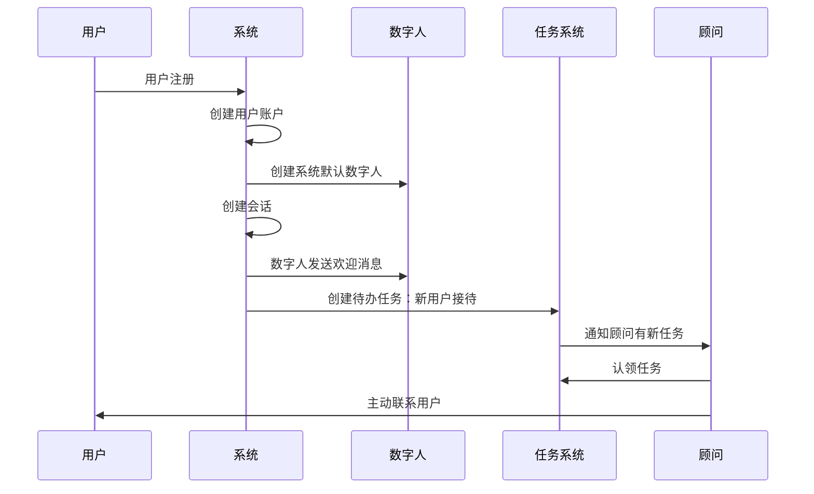

# 数字人智能助手系统PRD

## 1. 项目概述

### 1.1 项目背景
基于智能咨询系统，构建数字人智能助手系统，为用户提供个性化的AI助手服务。系统采用领域驱动设计(DDD)理念，支持多角色数字人创建和管理，实现智能对话、任务处理和业务流程自动化。

### 1.2 业务价值
- **提升用户体验**：24/7智能助手服务，即时响应用户需求
- **降低运营成本**：自动化处理常见咨询，减少人工客服压力
- **个性化服务**：基于角色和场景的定制化数字人助手
- **业务扩展性**：支持多领域智能体集成，满足不同业务需求

## 2. 领域模型设计

### 2.1 核心领域概念

#### 2.1.1 数字人聚合根 (DigitalHuman Aggregate)
```
数字人 (DigitalHuman)
├── 基础信息 (BasicInfo)
├── 个性配置 (PersonalityConfig)  
├── 智能体配置 (AgentConfigs)
└── 统计信息 (Statistics)
```

#### 2.1.2 会话聚合根 (Conversation Aggregate)
```
会话 (Conversation)
├── 会话信息 (ConversationInfo)
├── 参与者列表 (Participants)
├── 消息列表 (Messages)
└── 权限控制 (AccessControl)
```

#### 2.1.3 任务聚合根 (Task Aggregate)
```
待办任务 (PendingTask)
├── 任务信息 (TaskInfo)
├── 执行状态 (ExecutionStatus)
└── 处理结果 (ProcessResult)
```

#### 2.1.4 咨询记录聚合根 (ConsultationRecord Aggregate)
```
咨询记录 (ConsultationRecord)
├── 咨询信息 (ConsultationInfo)
├── 参与人员 (Participants)
├── 咨询内容 (Content)
└── 处理结果 (Result)
```

## 3. 补充设计说明

### 3.1 消息附件系统设计

为支持media类消息的文件管理，新增消息附件关联表：

- **MessageAttachment表**：建立Messages与UploadSession的多对多关系
- **UploadSession重构**：移除conversation_id，使其成为独立的公共上传组件
- **业务解耦**：上传功能独立于具体业务场景，可被重复使用

### 3.2 页面结构调整

#### 3.2.1 数字人管理入口
- **管理员端**：一级菜单"数字人管理"，查看系统所有数字人，可禁用/启用
- **个人中心**：数字人管理提升到与角色管理同级，只显示个人数字人

#### 3.2.2 任务管理入口
- **一级菜单**：各端都有"任务管理"菜单
- **角色权限**：不同角色看到不同的任务项
- **管理员权限**：可查看所有任务并进行人工干预

## 4. 数据库设计模型

### 4.1 消息附件表 (message_attachments)

```python
class MessageAttachment(BaseModel):
    """消息附件关联表 - 建立Messages与UploadSession的多对多关系"""
    __tablename__ = "message_attachments"

    id = Column(String(36), primary_key=True, default=message_id, comment="关联ID")
    message_id = Column(String(36), ForeignKey("messages.id", ondelete="CASCADE"), 
                       nullable=False, comment="消息ID")
    upload_session_id = Column(String(64), ForeignKey("upload_sessions.upload_id", ondelete="CASCADE"), 
                              nullable=False, comment="上传会话ID")
    
    # 附件在消息中的显示顺序和元数据
    display_order = Column(Integer, default=0, comment="在消息中的显示顺序")
    display_name = Column(String(255), nullable=True, comment="显示名称（可自定义）")
    description = Column(Text, nullable=True, comment="附件描述")
    
    # 附件类型和用途
    attachment_type = Column(Enum("image", "video", "audio", "document", "other", name="attachment_type"), 
                            default="other", comment="附件类型")
    usage_context = Column(String(100), nullable=True, comment="使用场景：avatar、consultation_image等")
    
    # 状态和权限
    is_primary = Column(Boolean, default=False, comment="是否为主要附件")
    is_public = Column(Boolean, default=True, comment="是否公开可见")
    
    # 关联关系
    message = relationship("Message", back_populates="attachments")
    upload_session = relationship("UploadSession", back_populates="message_attachments")
```

### 4.2 重构的上传会话表 (upload_sessions)

```python
class UploadSession(BaseModel):
    """上传会话模型 - 独立的文件上传组件"""
    __tablename__ = "upload_sessions"
    
    # 基础字段
    upload_id = Column(String(64), unique=True, index=True, nullable=False, comment="上传ID")
    file_name = Column(String(255), nullable=False, comment="原始文件名")
    file_size = Column(BigInteger, nullable=False, comment="文件总大小（字节）")
    chunk_size = Column(Integer, nullable=False, comment="分片大小（字节）")
    total_chunks = Column(Integer, nullable=False, comment="总分片数")
    
    # 文件信息
    content_type = Column(String(100), nullable=True, comment="文件MIME类型")
    file_extension = Column(String(10), nullable=True, comment="文件扩展名")
    
    # 上传用户
    user_id = Column(String(36), ForeignKey("users.id"), nullable=False, comment="上传用户ID")
    
    # 业务上下文（可选，用于标识上传用途）
    business_type = Column(String(50), nullable=True, comment="业务类型：avatar, message, document等")
    business_id = Column(String(36), nullable=True, comment="关联的业务对象ID")
    
    # 状态字段
    status = Column(String(20), default="uploading", comment="上传状态")
    final_object_name = Column(String(500), nullable=True, comment="合并后的文件对象名")
    
    # 访问控制
    is_public = Column(Boolean, default=False, comment="是否公开访问")
    access_token = Column(String(64), nullable=True, comment="访问令牌（私有文件）")
    
    # 时间字段
    expires_at = Column(DateTime, nullable=True, comment="过期时间（临时文件）")
    
    # 关系
    user = relationship("User", back_populates="upload_sessions")
    chunks = relationship("UploadChunk", back_populates="upload_session", cascade="all, delete-orphan")
    message_attachments = relationship("MessageAttachment", back_populates="upload_session", cascade="all, delete-orphan")
```

### 4.3 数字人表 (digital_humans)

```python
class DigitalHuman(BaseModel):
    """数字人聚合根 - 存储数字人基础信息和配置"""
    __tablename__ = "digital_humans"
    __table_args__ = (
        Index('idx_digital_human_user', 'user_id'),
        Index('idx_digital_human_status', 'status'),
        Index('idx_digital_human_type', 'type'),
        {"comment": "数字人表，存储数字人基础信息和配置"}
    )

    id = Column(String(36), primary_key=True, default=digital_human_id, comment="数字人ID")
    name = Column(String(255), nullable=False, comment="数字人名称")
    avatar = Column(String(1024), nullable=True, comment="数字人头像URL")
    description = Column(Text, nullable=True, comment="数字人描述")
    
    # 数字人类型和状态
    type = Column(Enum("personal", "business", "specialized", "system", name="digital_human_type"), 
                  default="personal", comment="数字人类型：个人、商务、专业、系统")
    status = Column(Enum("active", "inactive", "maintenance", name="digital_human_status"), 
                    default="active", comment="数字人状态")
    is_system_created = Column(Boolean, default=False, comment="是否系统创建（系统创建的不可删除）")
    
    # 个性化配置
    personality = Column(JSON, nullable=True, comment="性格特征配置")
    greeting_message = Column(Text, nullable=True, comment="默认打招呼消息")
    welcome_message = Column(Text, nullable=True, comment="欢迎消息模板")
    
    # 关联用户（数字人属于哪个用户）
    user_id = Column(String(36), ForeignKey("users.id"), nullable=False, comment="所属用户ID")
    
    # 统计信息
    conversation_count = Column(Integer, default=0, comment="会话总数")
    message_count = Column(Integer, default=0, comment="消息总数")
    last_active_at = Column(DateTime(timezone=True), nullable=True, comment="最后活跃时间")
    
    # 关联关系
    user = relationship("User", back_populates="digital_humans")
    agent_configs = relationship("DigitalHumanAgentConfig", back_populates="digital_human", cascade="all, delete-orphan")
    conversations = relationship("Conversation", back_populates="digital_human")
```

### 3.2 数字人-智能体配置关联表 (digital_human_agent_configs)

```python
class DigitalHumanAgentConfig(BaseModel):
    """数字人与智能体配置的多对多关联表"""
    __tablename__ = "digital_human_agent_configs"
    __table_args__ = (
        Index('idx_dh_agent_digital_human', 'digital_human_id'),
        Index('idx_dh_agent_config', 'agent_config_id'),
        Index('idx_dh_agent_priority', 'priority'),
        {"comment": "数字人与智能体配置关联表，支持多对多关系"}
    )

    id = Column(String(36), primary_key=True, default=digital_human_id, comment="关联ID")
    digital_human_id = Column(String(36), ForeignKey("digital_humans.id", ondelete="CASCADE"), 
                             nullable=False, comment="数字人ID")
    agent_config_id = Column(String(36), ForeignKey("agent_configs.id", ondelete="CASCADE"), 
                           nullable=False, comment="智能体配置ID")
    
    # 配置参数
    priority = Column(Integer, default=1, comment="优先级（数字越小优先级越高）")
    is_active = Column(Boolean, default=True, comment="是否启用此配置")
    
    # 使用场景配置
    scenarios = Column(JSON, nullable=True, comment="适用场景配置")
    context_prompt = Column(Text, nullable=True, comment="上下文提示词")
    
    # 关联关系
    digital_human = relationship("DigitalHuman", back_populates="agent_configs")
    agent_config = relationship("AgentConfig")
```

### 3.3 智能体配置表 (agent_configs)

```python
class AgentConfig(BaseModel):
    """智能体配置表（重命名自DifyConfig）"""
    __tablename__ = "agent_configs"
    __table_args__ = (
        Index('idx_agent_config_environment', 'environment'),
        Index('idx_agent_config_enabled', 'enabled'),
        Index('idx_agent_config_env_app', 'environment', 'app_id', unique=True),
        {"comment": "智能体配置表，存储智能体应用配置"}
    )

    id = Column(String(36), primary_key=True, default=generate_agent_id, comment="智能体配置ID")
    environment = Column(String(100), nullable=False, comment="环境名称（dev/test/prod）")
    app_id = Column(String(255), nullable=False, comment="应用ID")
    app_name = Column(String(255), nullable=False, comment="应用名称")
    _encrypted_api_key = Column("api_key", Text, nullable=False, comment="API密钥（加密存储）")
    base_url = Column(String(1024), nullable=False, default="http://localhost/v1", comment="Agent API基础URL")
    timeout_seconds = Column(Integer, default=30, nullable=False, comment="请求超时时间（秒）")
    max_retries = Column(Integer, default=3, nullable=False, comment="最大重试次数")
    enabled = Column(Boolean, default=True, nullable=False, comment="是否启用配置")
    description = Column(Text, nullable=True, comment="配置描述")
    
    # 智能体类型和能力
    agent_type = Column(String(100), nullable=True, comment="智能体类型")
    capabilities = Column(JSON, nullable=True, comment="智能体能力配置")

    @hybrid_property
    def api_key(self) -> Optional[str]:
        """获取解密后的API密钥"""
        if not self._encrypted_api_key:
            return None
        
        from app.core.encryption import safe_decrypt_api_key
        return safe_decrypt_api_key(self._encrypted_api_key)

    @api_key.setter
    def api_key(self, value: Optional[str]) -> None:
        """设置API密钥（自动加密）"""
        if not value:
            self._encrypted_api_key = None
            return
        
        from app.core.encryption import encrypt_api_key
        self._encrypted_api_key = encrypt_api_key(value)
```

### 3.4 会话表 (conversations)

```python
class Conversation(BaseModel):
    """会话聚合根 - 存储会话信息和权限控制"""
    __tablename__ = "conversations"
    __table_args__ = (
        Index('idx_conversation_owner', 'owner_id'),
        Index('idx_conversation_type', 'type'),
        Index('idx_conversation_status', 'is_active'),
        {"comment": "会话表，存储用户会话信息"}
    )

    id = Column(String(36), primary_key=True, default=conversation_id, comment="会话ID")
    title = Column(String, nullable=False, comment="会话标题")
    
    # 会话类型
    type = Column(Enum("single", "group", name="conversation_type"), 
                  default="single", comment="会话类型：单聊、群聊")
    
    # 会话所有者（拥有该会话的所有权限）
    owner_id = Column(String(36), ForeignKey("users.id"), nullable=False, comment="会话所有者用户ID")
    
    # 会话状态
    is_active = Column(Boolean, default=True, comment="会话是否激活")
    is_archived = Column(Boolean, default=False, comment="是否已归档")
    
    # 统计信息
    message_count = Column(Integer, default=0, comment="消息总数")
    unread_count = Column(Integer, default=0, comment="未读消息数")
    last_message_at = Column(DateTime(timezone=True), nullable=True, comment="最后消息时间")
    
    # 关联关系
    owner = relationship("User", back_populates="owned_conversations")
    messages = relationship("Message", back_populates="conversation", cascade="all, delete-orphan")
    participants = relationship("ConversationParticipant", back_populates="conversation", cascade="all, delete-orphan")
```

### 3.5 会话参与者表 (conversation_participants)

```python
class ConversationParticipant(BaseModel):
    """会话参与者实体 - 管理会话参与者和接管状态"""
    __tablename__ = "conversation_participants"
    __table_args__ = (
        Index('idx_conversation_participant_conv', 'conversation_id'),
        Index('idx_conversation_participant_user', 'user_id'),
        Index('idx_conversation_participant_dh', 'digital_human_id'),
        {"comment": "会话参与者表，支持用户和数字人参与"}
    )

    id = Column(String(36), primary_key=True, default=message_id, comment="参与者ID")
    conversation_id = Column(String(36), ForeignKey("conversations.id"), nullable=False, comment="会话ID")
    
    # 参与者信息（用户或数字人）
    user_id = Column(String(36), ForeignKey("users.id"), nullable=True, comment="用户ID")
    digital_human_id = Column(String(36), ForeignKey("digital_humans.id"), nullable=True, comment="数字人ID")
    
    # 参与者角色
    role = Column(Enum("owner", "admin", "member", "guest", name="participant_role"), 
                  default="member", comment="参与者角色")
    
    # 接管状态（核心业务逻辑）
    takeover_status = Column(Enum("full_takeover", "semi_takeover", "no_takeover", name="takeover_status"), 
                            default="no_takeover", comment="接管状态：全接管、半接管、不接管")
    
    # 参与状态
    joined_at = Column(DateTime(timezone=True), server_default=func.now(), comment="加入时间")
    left_at = Column(DateTime(timezone=True), nullable=True, comment="离开时间")
    is_active = Column(Boolean, default=True, comment="是否活跃")
    
    # 个人设置
    is_muted = Column(Boolean, default=False, comment="个人免打扰")
    last_read_at = Column(DateTime(timezone=True), nullable=True, comment="最后阅读时间")
    
    # 关联关系
    conversation = relationship("Conversation", back_populates="participants")
    user = relationship("User")
    digital_human = relationship("DigitalHuman")
```

### 3.6 消息表 (messages)

```python
class Message(BaseModel):
    """消息实体 - 存储会话中的消息内容"""
    __tablename__ = "messages"
    __table_args__ = (
        Index('idx_message_conversation', 'conversation_id'),
        Index('idx_message_sender', 'sender_id'),
        Index('idx_message_sender_dh', 'sender_digital_human_id'),
        Index('idx_message_timestamp', 'timestamp'),
        {"comment": "消息表，存储会话中的消息内容"}
    )

    id = Column(String(36), primary_key=True, default=message_id, comment="消息ID")
    conversation_id = Column(String(36), ForeignKey("conversations.id", ondelete="CASCADE"), 
                            nullable=False, comment="会话ID")
    
    # 消息内容
    content = Column(JSON, nullable=False, comment="结构化的消息内容 (JSON格式)")
    type = Column(Enum("text", "media", "system", "structured", name="message_type"), 
                  nullable=False, comment="消息主类型")
    
    # 发送者信息（支持数字人发送）
    sender_id = Column(String(36), ForeignKey("users.id"), nullable=True, comment="发送者用户ID")
    sender_digital_human_id = Column(String(36), ForeignKey("digital_humans.id"), nullable=True, 
                                    comment="发送者数字人ID")
    sender_type = Column(Enum("customer", "consultant", "doctor", "system", "digital_human", name="sender_type"), 
                         nullable=False, comment="发送者类型")
    
    # 消息状态
    is_read = Column(Boolean, default=False, comment="是否已读")
    is_important = Column(Boolean, default=False, comment="是否重要")
    timestamp = Column(DateTime(timezone=True), server_default=func.now(), comment="消息时间戳")
    
    # 半接管状态下的确认机制
    requires_confirmation = Column(Boolean, default=False, comment="是否需要确认（半接管模式）")
    is_confirmed = Column(Boolean, default=True, comment="是否已确认")
    confirmed_by = Column(String(36), ForeignKey("users.id"), nullable=True, comment="确认人ID")
    confirmed_at = Column(DateTime(timezone=True), nullable=True, comment="确认时间")
    
    # 高级功能
    reply_to_message_id = Column(String(36), ForeignKey("messages.id"), nullable=True, comment="回复的消息ID")
    reactions = Column(JSON, nullable=True, comment="消息回应")
    extra_metadata = Column(JSON, nullable=True, comment="附加元数据")

    # 关联关系
    conversation = relationship("Conversation", back_populates="messages")
    sender = relationship("User", foreign_keys=[sender_id])
    sender_digital_human = relationship("DigitalHuman", foreign_keys=[sender_digital_human_id])
    confirmed_by_user = relationship("User", foreign_keys=[confirmed_by])
    reply_to_message = relationship("Message", remote_side=[id], backref="replies")
```

### 3.7 咨询记录表 (consultation_records)

```python
class ConsultationRecord(BaseModel):
    """咨询记录聚合根 - 独立管理咨询业务"""
    __tablename__ = "consultation_records"
    __table_args__ = (
        Index('idx_consultation_conversation', 'conversation_id'),
        Index('idx_consultation_customer', 'customer_id'),
        Index('idx_consultation_consultant', 'consultant_id'),
        Index('idx_consultation_type', 'consultation_type'),
        {"comment": "咨询记录表，记录每次咨询的详细信息"}
    )

    id = Column(String(36), primary_key=True, default=consultation_id, comment="咨询记录ID")
    conversation_id = Column(String(36), ForeignKey("conversations.id"), nullable=False, comment="关联会话ID")
    
    # 参与人员
    customer_id = Column(String(36), ForeignKey("users.id"), nullable=False, comment="客户ID")
    consultant_id = Column(String(36), ForeignKey("users.id"), nullable=True, comment="顾问ID")
    digital_human_id = Column(String(36), ForeignKey("digital_humans.id"), nullable=True, comment="数字人ID")
    
    # 咨询信息
    consultation_type = Column(Enum("initial", "follow_up", "emergency", "specialized", "other", name="consultation_type"), 
                              nullable=False, comment="咨询类型")
    title = Column(String(500), nullable=False, comment="咨询标题")
    description = Column(Text, nullable=True, comment="咨询描述")
    
    # 咨询状态
    status = Column(Enum("pending", "in_progress", "completed", "cancelled", name="consultation_status"), 
                    default="pending", comment="咨询状态")
    
    # 时间信息
    started_at = Column(DateTime(timezone=True), nullable=True, comment="开始时间")
    ended_at = Column(DateTime(timezone=True), nullable=True, comment="结束时间")
    duration_minutes = Column(Integer, nullable=True, comment="持续时间（分钟）")
    
    # 咨询结果
    consultation_summary = Column(JSON, nullable=True, comment="结构化咨询总结")
    satisfaction_rating = Column(Integer, nullable=True, comment="满意度评分（1-5）")
    follow_up_required = Column(Boolean, default=False, comment="是否需要跟进")
    
    # 关联关系
    conversation = relationship("Conversation")
    customer = relationship("User", foreign_keys=[customer_id])
    consultant = relationship("User", foreign_keys=[consultant_id])
    digital_human = relationship("DigitalHuman", foreign_keys=[digital_human_id])
```

### 3.8 待办任务表 (pending_tasks)

```python
class PendingTask(BaseModel):
    """待办任务聚合根 - 管理系统任务和工作流"""
    __tablename__ = "pending_tasks"
    __table_args__ = (
        Index('idx_pending_task_type', 'task_type'),
        Index('idx_pending_task_status', 'status'),
        Index('idx_pending_task_assignee', 'assigned_to'),
        Index('idx_pending_task_priority', 'priority'),
        {"comment": "待办任务表，记录系统发出的待处理任务"}
    )

    id = Column(String(36), primary_key=True, default=task_id, comment="任务ID")
    
    # 任务基础信息
    title = Column(String(500), nullable=False, comment="任务标题")
    description = Column(Text, nullable=True, comment="任务描述")
    task_type = Column(String(100), nullable=False, comment="任务类型")
    
    # 任务状态和优先级
    status = Column(Enum("pending", "assigned", "in_progress", "completed", "cancelled", name="task_status"), 
                    default="pending", comment="任务状态")
    priority = Column(Enum("low", "medium", "high", "urgent", name="task_priority"), 
                     default="medium", comment="任务优先级")
    
    # 任务分配
    created_by = Column(String(36), ForeignKey("users.id"), nullable=True, comment="创建人ID")
    assigned_to = Column(String(36), ForeignKey("users.id"), nullable=True, comment="分配给用户ID")
    assigned_at = Column(DateTime(timezone=True), nullable=True, comment="分配时间")
    
    # 关联业务对象
    related_object_type = Column(String(100), nullable=True, comment="关联对象类型")
    related_object_id = Column(String(36), nullable=True, comment="关联对象ID")
    
    # 任务数据
    task_data = Column(JSON, nullable=True, comment="任务相关数据")
    
    # 时间信息
    due_date = Column(DateTime(timezone=True), nullable=True, comment="截止时间")
    completed_at = Column(DateTime(timezone=True), nullable=True, comment="完成时间")
    
    # 处理结果
    result = Column(JSON, nullable=True, comment="处理结果")
    notes = Column(Text, nullable=True, comment="处理备注")
    
    # 关联关系
    created_by_user = relationship("User", foreign_keys=[created_by])
    assigned_to_user = relationship("User", foreign_keys=[assigned_to])
```

### 3.9 扩展用户表 (users)

```python
class User(BaseModel):
    """用户聚合根 - 添加数字人和会话关联"""
    __tablename__ = "users"
    
    # ... 现有字段 ...
    
    # 新增关联关系
    digital_humans = relationship("DigitalHuman", back_populates="user", cascade="all, delete-orphan")
    owned_conversations = relationship("Conversation", back_populates="owner")
    created_tasks = relationship("PendingTask", foreign_keys="PendingTask.created_by")
    assigned_tasks = relationship("PendingTask", foreign_keys="PendingTask.assigned_to")
```

## 4. 核心业务流程

### 4.1 用户注册自动化流程



### 4.2 数字人接管机制

#### 4.2.1 全接管模式
- 数字人直接回复用户消息
- 无需人工确认
- 适用于标准化咨询场景

#### 4.2.2 半接管模式
- 数字人生成回复内容
- 需要对应人员确认后发送
- 确保回复质量和准确性

#### 4.2.3 不接管模式（默认）
- 数字人不主动回复
- 完全由人工处理
- 保持传统咨询模式

## 5. 功能模块设计

### 5.1 数字人管理模块

#### 5.1.1 功能概述
- 查看数字人列表
- 创建个人数字人
- 编辑数字人信息
- 配置智能体能力
- 删除数字人（系统创建的除外）

#### 5.1.2 页面结构
```
个人中心 > 角色管理 > 数字人管理
├── 数字人列表
├── 创建数字人
├── 编辑数字人
└── 智能体配置
```

#### 5.1.3 权限控制
- 用户只能管理自己的数字人
- 系统创建的数字人不可删除
- 可修改系统数字人的部分信息

### 5.2 智能体配置模块

#### 5.2.1 多智能体支持
- 支持配置多个智能体
- 按优先级调用
- 场景化配置

#### 5.2.2 配置界面
- 智能体列表管理
- 优先级设置
- 场景适用范围
- 上下文提示词配置

### 5.3 待办任务模块

#### 5.3.1 任务类型
- 新用户接待任务
- 咨询升级任务
- 系统异常任务
- 定期回访任务

#### 5.3.2 任务管理
- 任务列表查看
- 任务认领
- 任务处理
- 任务状态跟踪

## 6. 技术实现规范

### 6.1 数据库迁移脚本

```python
# 创建数字人相关表的迁移脚本
def upgrade():
    # 创建digital_humans表
    op.create_table('digital_humans',
        sa.Column('id', sa.String(36), nullable=False),
        sa.Column('name', sa.String(255), nullable=False),
        sa.Column('avatar', sa.String(1024), nullable=True),
        sa.Column('description', sa.Text(), nullable=True),
        sa.Column('type', sa.Enum('personal', 'business', 'specialized', 'system'), nullable=False),
        sa.Column('status', sa.Enum('active', 'inactive', 'maintenance'), nullable=False),
        sa.Column('is_system_created', sa.Boolean(), nullable=False, default=False),
        sa.Column('personality', sa.JSON(), nullable=True),
        sa.Column('greeting_message', sa.Text(), nullable=True),
        sa.Column('welcome_message', sa.Text(), nullable=True),
        sa.Column('user_id', sa.String(36), nullable=False),
        sa.Column('conversation_count', sa.Integer(), nullable=False, default=0),
        sa.Column('message_count', sa.Integer(), nullable=False, default=0),
        sa.Column('last_active_at', sa.DateTime(timezone=True), nullable=True),
        sa.Column('created_at', sa.DateTime(timezone=True), server_default=sa.text('now()'), nullable=False),
        sa.Column('updated_at', sa.DateTime(timezone=True), server_default=sa.text('now()'), nullable=False),
        sa.ForeignKeyConstraint(['user_id'], ['users.id']),
        sa.PrimaryKeyConstraint('id')
    )
    
    # 创建索引
    op.create_index('idx_digital_human_user', 'digital_humans', ['user_id'])
    op.create_index('idx_digital_human_status', 'digital_humans', ['status'])
    op.create_index('idx_digital_human_type', 'digital_humans', ['type'])
    
    # ... 其他表的创建脚本
```

### 6.2 API设计规范

#### 6.2.1 数字人管理API

```python
# 数字人CRUD操作
@router.get("/digital-humans", response_model=List[DigitalHumanResponse])
async def get_digital_humans(current_user: User = Depends(get_current_user)):
    """获取当前用户的数字人列表"""
    pass

@router.post("/digital-humans", response_model=DigitalHumanResponse)
async def create_digital_human(
    digital_human_data: CreateDigitalHumanRequest,
    current_user: User = Depends(get_current_user)
):
    """创建数字人"""
    pass

@router.put("/digital-humans/{digital_human_id}", response_model=DigitalHumanResponse)
async def update_digital_human(
    digital_human_id: str,
    update_data: UpdateDigitalHumanRequest,
    current_user: User = Depends(get_current_user)
):
    """更新数字人信息"""
    pass

@router.delete("/digital-humans/{digital_human_id}")
async def delete_digital_human(
    digital_human_id: str,
    current_user: User = Depends(get_current_user)
):
    """删除数字人（系统创建的不可删除）"""
    pass
```

#### 6.2.2 智能体配置API

```python
@router.post("/digital-humans/{digital_human_id}/agents")
async def add_agent_to_digital_human(
    digital_human_id: str,
    agent_config: AddAgentConfigRequest,
    current_user: User = Depends(get_current_user)
):
    """为数字人添加智能体配置"""
    pass

@router.get("/digital-humans/{digital_human_id}/agents")
async def get_digital_human_agents(
    digital_human_id: str,
    current_user: User = Depends(get_current_user)
):
    """获取数字人的智能体配置列表"""
    pass
```

### 6.3 前端组件设计

#### 6.3.1 数字人管理组件结构

```typescript
// 数字人管理主页面
interface DigitalHumanManagementProps {
  userId: string;
}

export function DigitalHumanManagement({ userId }: DigitalHumanManagementProps) {
  // 组件实现
}

// 数字人列表组件
interface DigitalHumanListProps {
  digitalHumans: DigitalHuman[];
  onEdit: (id: string) => void;
  onDelete: (id: string) => void;
}

export function DigitalHumanList({ digitalHumans, onEdit, onDelete }: DigitalHumanListProps) {
  // 组件实现
}

// 数字人表单组件
interface DigitalHumanFormProps {
  digitalHuman?: DigitalHuman;
  onSubmit: (data: DigitalHumanFormData) => void;
  onCancel: () => void;
}

export function DigitalHumanForm({ digitalHuman, onSubmit, onCancel }: DigitalHumanFormProps) {
  // 组件实现
}
```

## 7. 部署和运维

### 7.1 数据库初始化

```python
# 系统启动时创建默认智能体配置
async def initialize_system_agents():
    """初始化系统默认智能体配置"""
    default_agents = [
        {
            "app_name": "咨询助手",
            "app_id": "medical_beauty_consultant",
            "agent_type": "consultant",
            "capabilities": ["consultation", "appointment", "recommendation"]
        },
        {
            "app_name": "处方安全检查",
            "app_id": "prescription_safety_checker", 
            "agent_type": "medical_checker",
            "capabilities": ["safety_check", "drug_interaction", "dosage_validation"]
        }
    ]
    
    for agent_data in default_agents:
        # 创建默认智能体配置
        pass
```

### 7.2 监控和日志

```python
# 数字人活动监控
class DigitalHumanMonitor:
    def log_conversation_start(self, digital_human_id: str, conversation_id: str):
        """记录会话开始"""
        pass
    
    def log_message_sent(self, digital_human_id: str, message_id: str):
        """记录消息发送"""
        pass
    
    def log_agent_call(self, digital_human_id: str, agent_id: str, response_time: float):
        """记录智能体调用"""
        pass
```

## 8. 测试策略

### 8.1 单元测试

```python
# 数字人业务逻辑测试
class TestDigitalHumanService:
    def test_create_digital_human(self):
        """测试创建数字人"""
        pass
    
    def test_system_digital_human_cannot_be_deleted(self):
        """测试系统数字人不可删除"""
        pass
    
    def test_takeover_mode_logic(self):
        """测试接管模式逻辑"""
        pass
```

### 8.2 集成测试

```python
# 端到端业务流程测试
class TestUserRegistrationFlow:
    def test_user_registration_creates_digital_human(self):
        """测试用户注册创建数字人流程"""
        pass
    
    def test_pending_task_creation(self):
        """测试待办任务创建"""
        pass
```

## 9. 发布计划

### 9.1 第一阶段（MVP）
- 基础数字人CRUD功能
- 系统自动创建数字人
- 简单的智能体配置
- 待办任务基础功能

### 9.2 第二阶段
- 接管模式完整实现
- 高级智能体配置
- 任务工作流优化
- 数字人性能监控

### 9.3 第三阶段
- 多场景智能体切换
- 高级分析和报告
- 移动端适配
- 第三方集成

## 10. 风险评估

### 10.1 技术风险
- 智能体API稳定性
- 数据库性能优化
- 消息并发处理

### 10.2 业务风险
- 用户接受度
- 数字人回复质量
- 隐私和安全

### 10.3 缓解措施
- 完善的测试覆盖
- 渐进式功能发布
- 用户反馈收集机制
- 安全审计和合规检查
