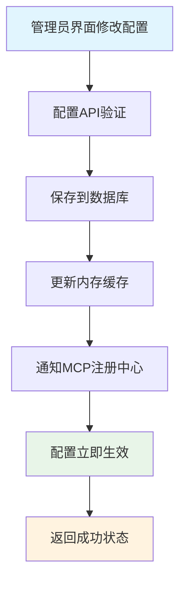

# MCP PRD文档

## 1. 产品概述

### 1.1 背景描述

搭建多MCP Server，为分组分权管理MCP tool工具，为agent提供工具 。

### 1.2 核心价值

- 为agent提供工具：提供agent访问业务系统数据的能力
- 工具分组管理：为了减少数据访问的权限，给agent指定分组内的工具
- 工具：提供业务系统的数据

### 1.3 技术说明

本系统采用**自研MCP服务架构**实现AI Agent与外部工具的标准化通信，遵循Model Context Protocol开放协议标准。系统基于现有技术栈进行深度集成，确保稳定性和可维护性。

**技术选型**：

- **自研实现**：基于FastAPI框架自研MCP协议实现，完全控制系统架构
- **集成方案**：与现有FastAPI项目原生集成，复用认证、权限、数据库等基础设施
- **传输模式**：主要支持HTTP/JSON-RPC协议，兼容SSE长连接
- **工具定义**：通过自定义装饰器（`@mcp_tool`）实现工具注册和管理

## 2. 需求分析

### 2.1 业务需求

| 需求ID | 需求描述              | 优先级 | 验收标准                                                                                                                               |
| ------ | --------------------- | ------ | -------------------------------------------------------------------------------------------------------------------------------------- |
| R001   | 用户信息服务          | P0     | * 可以通过用户ID/用户名查询用户基本信息                                                                                                |
| R002   | 客户档案/客户画像服务 | P0     | * 可以通过用户ID/用户名查询用户档案/客户画像                                                                                           |
| R003   | 会话分析服务          | P1     | * 可以通过用户ID，会话ID，消息ID查询相关指定数量的历史消息                                                                             |
| R004   | 任务管理服务          | P1     | * 可以通过用户ID，任务ID查询任务详情<br />* 可以通过用户ID，任务消息通知业务系统创建任务记录<br />* 可以通过用户ID，任务ID更新任务状态 |

### 2.2 性能需求

| 指标     | 目标值        | 说明                       |
| -------- | ------------- | -------------------------- |
| 响应时间 | ≤ 1秒        | 请求的响应总时间           |
| 成功率   | ≥ 99%        | 包含重试机制，确保最终成功 |
| 并发支持 | 100 用户/分钟 | 支持高并访问场景           |

### 2.3 技术需求

- **异步架构**：基于FastAPI后台任务和事件驱动架构
- **可靠性保证**：具备重试机制和错误恢复能力
- **监控与日志**：完整的执行日志和性能监控
- **扩展性设计**：支持未来功能扩展

## 3. 系统设计

### 3.1 技术架构

### 3.2 Model Context Protocol实现规范

#### 3.2.1 多MCP Server架构

基于运维简化和资源优化的考虑，采用多MCP Server支持多分组权限控制的架构：

- **统一服务**：多MCP Server进程，监听固定端口（8000）
- **分组路由**：通过不同server code访问不同工具分组，每组都有独立的API Key
- **权限隔离**：应用层权限控制，根据Server Code动态返回工具集
- **运维友好**：单一进程、相同端口、统一监控和日志

#### 3.2.2 分组权限策略

基于数据库的MCP工具分组管理，支持动态配置和权限控制：

```python
# 数据库模型：MCPToolGroup表
class MCPToolGroup:
    id: str                    # 分组ID
    name: str                  # 分组名称
    description: str           # 分组描述
    api_key: str              # 加密存储的API密钥
    hashed_api_key: str       # API密钥哈希值（用于快速验证）
    server_code: str          # 服务器代码（用于路由）
    user_tier_access: List[str]  # 用户层级访问权限
    allowed_roles: List[str]     # 允许的角色列表
    enabled: bool             # 是否启用
    created_by: str          # 创建者
    created_at: datetime     # 创建时间
    updated_at: datetime     # 更新时间

# 数据库模型：MCPTool表
class MCPTool:
    id: str                  # 工具ID
    tool_name: str          # 工具名称
    group_id: str           # 所属分组ID
    version: str            # 工具版本
    description: str        # 工具描述
    enabled: bool          # 是否启用
    timeout_seconds: int   # 超时时间
    config_data: dict      # 工具配置数据
```

#### 3.2.4 实际MCP服务架构

基于现有代码的实际MCP服务实现：

```python
# app/mcp/services.py - 实际的MCP服务层
class MCPToolDiscoveryService:
    """MCP工具发现服务"""
  
    def __init__(self, db: Session):
        self.db = db
  
    def get_tools_by_server_code(self, server_code: str) -> List[Tool]:
        """根据server_code获取工具列表"""
        # 查询工具分组
        group = self.db.query(MCPToolGroup).filter(
            MCPToolGroup.server_code == server_code,
            MCPToolGroup.enabled == True
        ).first()
  
        if not group:
            return []
  
        # 查询该分组下的启用工具
        mcp_tools = self.db.query(MCPTool).filter(
            MCPTool.group_id == group.id,
            MCPTool.enabled == True
        ).all()
  
        tools = []
        for mcp_tool in mcp_tools:
            tool = Tool(
                name=mcp_tool.tool_name,
                description=mcp_tool.description or f"{mcp_tool.tool_name} 工具",
                inputSchema=self._generate_input_schema(mcp_tool)
            )
            tools.append(tool)
  
        return tools

class MCPToolExecutionService:
    """MCP工具执行服务"""
  
    def __init__(self, db: Session):
        self.db = db
  
    async def execute_tool(
        self, 
        server_code: str, 
        tool_name: str, 
        arguments: Dict[str, Any],
        caller_app_id: Optional[str] = None
    ) -> Dict[str, Any]:
        """执行MCP工具"""
        # 查询工具分组和具体工具
        group = self.db.query(MCPToolGroup).filter(
            MCPToolGroup.server_code == server_code,
            MCPToolGroup.enabled == True
        ).first()
  
        if not group:
            raise ValueError(f"未找到启用的工具分组: {server_code}")
  
        tool = self.db.query(MCPTool).filter(
            MCPTool.group_id == group.id,
            MCPTool.tool_name == tool_name,
            MCPTool.enabled == True
        ).first()
  
        if not tool:
            raise ValueError(f"未找到启用的工具: {tool_name}")
  
        # 执行工具逻辑
        result = await self._execute_tool_logic(tool, arguments)
        return result
```

### 3.3 核心组件设计

#### 3.3.3 智能体配置管理

- **智能体配置存储**：系统内维护智能体的appId和apiKey映射关系
- **MCP集成机制**：智能体通过标准MCP协议调用本系统工具
- **版本管理**：支持Agent的版本控制和A/B测试
- **故障转移**：Agent不可用时的自动降级和回退机制

## 4. 技术实现方案

### 4.1 代码架构

#### 4.1.1 实际目录结构

基于实际代码的目录结构： （待更新）

```

```

#### 4.1.2 实际MCP工具注册实现

基于实际代码的MCP工具注册机制：

```python
# app/mcp/registry/tool_registry.py - 实际的工具注册中心
from typing import Dict, List, Optional, Any, Callable
from dataclasses import dataclass
import inspect

@dataclass
class MCPToolMetadata:
    """MCP工具元数据"""
    name: str
    description: str
    category: str
    func: Callable
    signature: inspect.Signature
    module: str
    registered_at: datetime

class MCPToolRegistry:
    """MCP工具注册中心 - 负责工具的注册和管理"""
  
    def __init__(self):
        self.tools: Dict[str, MCPToolMetadata] = {}
        self.categories: Dict[str, List[str]] = {}
  
    def register_tool(
        self, 
        name: str, 
        func: Callable, 
        description: str = "",
        category: str = "general"
    ) -> None:
        """注册工具函数"""
        metadata = MCPToolMetadata(
            name=name,
            description=description or func.__doc__ or f"工具: {name}",
            category=category,
            func=func,
            signature=inspect.signature(func),
            module=func.__module__,
            registered_at=datetime.now()
        )
  
        self.tools[name] = metadata
  
        # 更新分类
        if category not in self.categories:
            self.categories[category] = []
        if name not in self.categories[category]:
            self.categories[category].append(name)

# 全局工具注册中心实例
_global_registry = MCPToolRegistry()

def mcp_tool(name: str = None, description: str = "", category: str = "general"):
    """
    MCP工具装饰器
  
    Example:
        @mcp_tool(name="get_user_info", description="获取用户信息", category="user")
        async def get_user_profile(user_id: str) -> dict:
            return {"user_id": user_id}
    """
    def decorator(func: Callable) -> Callable:
        tool_name = name or func.__name__
        tool_description = description or func.__doc__ or f"工具: {tool_name}"
  
        # 在函数上添加元数据标记
        func._mcp_tool_metadata = {
            'name': tool_name,
            'description': tool_description,
            'category': category
        }
  
        # 立即注册到全局注册中心
        _global_registry.register_tool(tool_name, func, tool_description, category)
  
        return func
  
    return decorator
```

### 4.3 实际MCP工具定义

#### 4.3.1 用户信息工具（实际实现）

```python
# app/mcp/tools/user/profile.py - 实际的用户信息工具
from app.mcp.registry import mcp_tool

@mcp_tool(
    name="get_user_profile",
    description="获取用户基本信息和档案，用于生成个性化内容",
    category="user"
)
async def get_user_profile(user_id: str, include_details: bool = False) -> dict:
    """
    获取用户基本信息
  
    Args:
        user_id: 用户ID
        include_details: 是否包含详细信息（头像、电话等）
  
    Returns:
        Dict: 用户信息字典，包含用户名、邮箱、角色等信息
    """
    # TODO: 从数据库获取真实用户信息
    # 这里使用模拟数据，实际实现时应该：
    # 1. 通过user_service.get获取用户信息
    # 2. 检查用户是否存在
    # 3. 根据include_details参数返回不同级别的信息
  
    return {
        "user_id": user_id,
        "username": f"用户_{user_id[-4:]}",
        "roles": ["customer"],
        "is_active": True,
        "registration_time": "2025-01-01T00:00:00Z",
        "details_included": include_details,
        # 如果include_details为True，可以包含更多信息
        **({"phone": "138****8888", "avatar": "/default-avatar.png"} if include_details else {})
    }
```

#### 4.3.2 客户分析工具（实际实现）

```python
# app/mcp/tools/customer/analysis.py - 实际的客户分析工具
from app.mcp.registry import mcp_tool

@mcp_tool(
    name="analyze_customer",
    description="分析客户画像和行为模式，提供个性化推荐",
    category="customer"
)
async def analyze_customer(user_id: str, analysis_type: str = "basic") -> dict:
    """
    分析客户画像
  
    Args:
        user_id: 用户ID
        analysis_type: 分析类型 (basic/detailed/predictive)
  
    Returns:
        Dict: 客户分析结果
    """
    # TODO: 实现真实的客户分析逻辑
    # 实际实现时应该：
    # 1. 从数据库获取用户的历史行为数据
    # 2. 使用机器学习模型进行客户细分
    # 3. 分析用户的偏好和行为模式
    # 4. 生成个性化推荐策略
  
    base_analysis = {
        "customer_segment": "新用户",
        "behavior_pattern": "探索期",
        "engagement_level": "中等",
        "recommendations": ["个性化欢迎", "基础咨询服务"],
        "analysis_type": analysis_type
    }
  
    if analysis_type in ["detailed", "predictive"]:
        base_analysis.update({
            "risk_profile": "低风险",
            "lifetime_value_prediction": "中等价值客户",
            "churn_probability": 0.15
        })
  
    if analysis_type == "predictive":
        base_analysis.update({
            "next_best_action": "提供基础咨询服务",
            "optimal_contact_time": "工作日下午",
            "personalization_strategy": "温和推进型"
        })
  
    return base_analysis
```

#### 4.3.3 MCP服务器主入口

```python

```

#### 4.3.4 管理员面板集成与监控 (未实现)

```python
# app/mcp/v1/middleware/monitoring.py

class MCPMonitoringMiddleware:
    """MCP监控中间件，记录调用统计"""

    def__init__(self):
        self.call_stats = {}
        self.error_stats = {}

    async def process_request(self, params: dict) -> dict:
        """记录请求开始"""
        tool_name = params.get('_tool_name')
        if tool_name:
            self.call_stats[tool_name] = self.call_stats.get(tool_name, 0) + 1
        return params

    async def process_response(self, result: dict) -> dict:
        """记录响应结果"""
        if "error" in result:
            tool_name = result.get('_tool_name')
            if tool_name:
                self.error_stats[tool_name] = self.error_stats.get(tool_name, 0) + 1
        return result

    def get_metrics(self) -> dict:
        """获取监控指标"""
        return {
            "total_calls": sum(self.call_stats.values()),
            "tool_calls": self.call_stats,
            "error_rates": {
                tool: self.error_stats.get(tool, 0) / self.call_stats.get(tool, 1)
                for tool in self.call_stats.keys()
            },
            "success_rate": 1 - sum(self.error_stats.values()) / max(sum(self.call_stats.values()), 1)
        }


```

#### 4.3.5 MCP分组服务与认证管理

基于分组的MCP工具管理，提供安全的API Key权限控制：

```python
# app/services/mcp_group_service.py
import secrets
import hashlib
from datetime import datetime

class MCPGroupService:
    """MCP工具分组服务"""
  
    @staticmethod
    async def create_group(db: Session, group_create: MCPGroupCreate, created_by: str) -> dict:
        """创建MCP工具分组并生成API Key"""
        # 生成安全的API Key
        api_key = f"mcp_key_{secrets.token_urlsafe(32)}"
  
        group_data = {
            "id": str(uuid4()),
            "name": group_create.name,
            "description": group_create.description,
            "api_key": api_key,  # 实际实现中应加密存储
            "enabled": True,
            "created_by": created_by,
            "created_at": datetime.utcnow(),
            "updated_at": datetime.utcnow()
        }
  
        # 保存到数据库（具体实现依据ORM）
        # group = MCPToolGroup(**group_data)
        # db.add(group)
        # db.commit()
  
        logger.info(f"创建MCP分组: {group_create.name}, 创建者: {created_by}")
        return group_data
  
    @staticmethod
    async def get_group_api_key(db: Session, group_id: str) -> str:
        """获取分组API Key（仅管理员可查看）"""
        # 从数据库查询API Key
        # group = db.query(MCPToolGroup).filter(MCPToolGroup.id == group_id).first()
        # return group.api_key if group else None
        pass
  
    @staticmethod
    async def regenerate_api_key(db: Session, group_id: str, admin_user_id: str) -> str:
        """重新生成分组API Key（安全操作）"""
        new_api_key = f"mcp_key_{secrets.token_urlsafe(32)}"
  
        # 更新数据库中的API Key
        # group = db.query(MCPToolGroup).filter(MCPToolGroup.id == group_id).first()
        # group.api_key = new_api_key
        # group.updated_at = datetime.utcnow()
        # db.commit()
  
        logger.warning(f"重新生成API Key: 分组={group_id}, 操作员={admin_user_id}")
        return new_api_key

# app/mcp/v1/middleware/mcp_auth.py
class MCPAuthMiddleware:
    """MCP调用认证中间件"""
  
    def __init__(self, db: Session):
        self.db = db
  
    async def authenticate_request(self, api_key: str, tool_name: str) -> dict:
        """验证MCP调用请求"""
        try:
            # 查找API Key对应的分组
            group = await self._find_group_by_api_key(api_key)
            if not group:
                return {"valid": False, "error": "Invalid API Key"}
  
            if not group.get("enabled"):
                return {"valid": False, "error": "Group disabled"}
  
            # 检查工具是否属于该分组且已启用
            tool = await self._find_tool_in_group(tool_name, group["id"])
            if not tool:
                return {"valid": False, "error": "Tool not found in group"}
  
            if not tool.get("enabled"):
                return {"valid": False, "error": "Tool disabled"}
  
            return {
                "valid": True,
                "group_id": group["id"],
                "group_name": group["name"],
                "tool_config": tool
            }
  
        except Exception as e:
            logger.error(f"MCP认证失败: {e}")
            return {"valid": False, "error": "Authentication failed"}
  
    async def _find_group_by_api_key(self, api_key: str) -> dict:
        """根据API Key查找分组"""
        # 从数据库查询分组信息
        # group = db.query(MCPToolGroup).filter(MCPToolGroup.api_key == api_key).first()
        # return group.to_dict() if group else None
        pass
  
    async def _find_tool_in_group(self, tool_name: str, group_id: str) -> dict:
        """查找分组内的工具"""
        # tool = db.query(MCPTool).filter(
        #     MCPTool.tool_name == tool_name,
        #     MCPTool.group_id == group_id
        # ).first()
        # return tool.to_dict() if tool else None
        pass

# 说明：
# 1. 基于分组的API Key管理，提供细粒度权限控制
# 2. 安全的API Key生成和验证机制
# 3. 完整的认证中间件，验证Dify调用的合法性
# 4. 操作审计日志，记录所有安全相关操作
```

## 5. 数据库设计

### 5.3 MCP分组管理配置架构

基于分组的MCP工具管理，支持 server code 权限控制和动态配置：

#### 5.3.1 MCP工具分组管理API

```python

```

## 6. 监控与日志

### 6.1 关键指标监控与管理员面板

```python

```

### 6.2 日志标准

```python
# 成功日志示例
logger.info(f"默认会话创建成功: user_id={user_id}, conversation_id={conversation_id}")
logger.info(f"MCP服务调用成功: user_id={user_id}, 获取用户信息完成")

# 错误日志示例
logger.error(f"MCP服务调用失败: user_id={user_id}, error={error_message}")
```

## 8. 部署方案

### 8.1 实际部署配置

#### 8.1.2 实际MCP服务配置

基于现有代码的MCP服务配置：

```python
# app/mcp/services.py - 实际的MCP服务配置
class MCPSessionManager:
    """MCP会话管理器"""
  
    def __init__(self):
        self.sessions: Dict[str, MCPSession] = {}
        self.session_queues: Dict[str, asyncio.Queue] = {}
  
    def get_server_capabilities(self) -> ServerCapabilities:
        """获取服务器能力"""
        return ServerCapabilities(
            tools=ToolsCapability(listChanged=True),
            experimental={"anmei_smart": {"version": "1.0.0"}}
        )
  
    def get_server_info(self) -> Implementation:
        """获取服务器信息"""
        return Implementation(
            name="AnmeiSmart MCP Server",
            version="1.0.0"
        )

# app/core/config.py - 配置项
class Settings:
    # MCP相关配置
    MCP_SERVER_BASE_URL: str = "http://localhost:8000"
    MCP_OAUTH_ENABLED: bool = True
    MCP_SESSION_TIMEOUT: int = 3600  # 1小时
    MCP_MAX_SESSIONS: int = 1000
```

### 8.2 管理员界面配置管理

基于官方MCP库的管理界面，简化配置复杂度：

#### 8.2.1 MCP服务器管理界面

```

```

### 8.2 配置生效机制与功能开关

通过MCP服务注册与发现机制实现动态功能控制：

#### 8.2.1 配置实时生效流程



#### 8.2.2 智能功能开关实现

```python
@router.post("/register")
async def register(...):
    userResponse = await user_service.create(db, obj_in=user_in)
  
    # 通过MCP服务注册中心检查功能状态
    mcp_registry = get_mcp_registry()
    if await mcp_registry.is_service_enabled("registration_automation"):
        # 检查具体的MCP工具是否可用
        if await mcp_registry.is_tool_available("get_user_profile"):
            background_tasks.add_task(
                handle_registration_automation,
                user_id=str(userResponse.id),
                user_info=userResponse.dict()
            )
        else:
            logger.warning("用户信息MCP工具不可用，跳过注册自动化")
  
    return userResponse

class MCPServiceRegistry:
    """MCP服务注册中心，提供动态功能开关"""
  
    async def is_service_enabled(self, service_name: str) -> bool:
        """检查服务是否启用（基于管理员配置）"""
        config = await self._get_service_config(service_name)
        return config.get("enabled", False)
  
    async def is_tool_available(self, tool_name: str) -> bool:
        """检查工具是否可用且启用"""
        if tool_name not in self.tools:
            return False
        return self.status.get(tool_name) == "enabled"
```

## 10. 成功指标

## 12. 架构设计总结

### 12.1 核心设计理念

基于**自研MCP服务架构**的现代化实现，提供原生的AI调用工具的能力。

### 12.2 关键技术决策

1. **自研MCP实现**：基于FastAPI框架自研MCP协议实现，完全控制系统架构和扩展能力
2. **装饰器工具注册**：通过自定义 `@mcp_tool`装饰器简化工具定义，支持分类管理
3. **数据库驱动配置**：支持动态配置管理，基于数据库的分组权限控制
4. **原生FastAPI集成**：与现有FastAPI项目无缝集成，复用所有基础设施
5. **现有架构复用**：充分利用现有认证、权限、数据库、日志等基础设施
6. **简化开发流程**：装饰器模式简化工具开发，自动注册和元数据管理
7. **企业级权限控制**：基于分组的API Key管理，支持细粒度权限控制

### 12.3 技术优势

- **完全控制**：自研实现提供完全的技术控制权，便于定制化开发
- **数据库集成**：工具配置存储在数据库中，支持动态管理和权限控制
- **分组权限**：基于MCPToolGroup和MCPTool表的细粒度权限管理
- **OAuth2支持**：内置OAuth2认证流程，支持标准化的客户端授权
- **扩展灵活**：基于现有技术栈，便于功能扩展和维护

### 12.5 实际实现状态

- **MCP服务层**：已实现MCPToolDiscoveryService和MCPToolExecutionService
- **工具注册**：已实现@mcp_tool装饰器和MCPToolRegistry
- **权限管理**：已实现MCPGroupService和基于数据库的权限控制
- **OAuth2认证**：已实现OAuth2Manager和标准化认证流程
- **管理界面**：已实现mcp_config.py的完整管理API
- **注册自动化**：已实现完整的注册自动化流程和AI Gateway集成

---

**文档版本**：V4.0
**更新时间**：2025年1月
