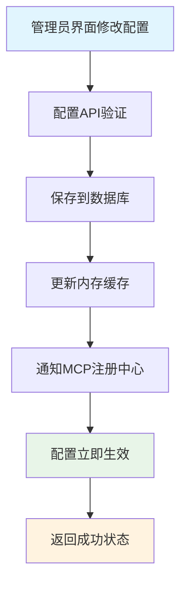

# MCP PRD文档

## 1. 产品概述

### 1.1 背景描述

搭建多MCP Server，为分组分权管理MCP tool工具，为agent提供工具 。

### 1.2 核心价值

- 为agent提供工具：提供agent访问业务系统数据的能力
- 工具分组管理：为了减少数据访问的权限，给agent指定分组内的工具
- 工具：提供业务系统的数据

### 1.3 技术说明

本系统采用**自研MCP服务架构**实现AI Agent与外部工具的标准化通信，遵循Model Context Protocol开放协议标准。系统基于现有技术栈进行深度集成，确保稳定性和可维护性。

**技术选型**：

- **自研实现**：基于FastAPI框架自研MCP协议实现，完全控制系统架构
- **集成方案**：与现有FastAPI项目原生集成，复用认证、权限、数据库等基础设施
- **传输模式**：主要支持HTTP/JSON-RPC协议，兼容SSE长连接
- **工具定义**：通过自定义装饰器（`@mcp_tool`）实现工具注册和管理

## 2. 需求分析

### 2.1 业务需求

| 需求ID | 需求描述              | 优先级 | 验收标准                                                                                                                               |
| ------ | --------------------- | ------ | -------------------------------------------------------------------------------------------------------------------------------------- |
| R001   | 用户信息服务          | P0     | * 可以通过用户ID/用户名查询用户基本信息                                                                                                |
| R002   | 客户档案/客户画像服务 | P0     | * 可以通过用户ID/用户名查询用户档案/客户画像                                                                                           |
| R003   | 会话分析服务          | P1     | * 可以通过用户ID，会话ID，消息ID查询相关指定数量的历史消息                                                                             |
| R004   | 任务管理服务          | P1     | * 可以通过用户ID，任务ID查询任务详情<br />* 可以通过用户ID，任务消息通知业务系统创建任务记录<br />* 可以通过用户ID，任务ID更新任务状态 |

### 2.2 性能需求

| 指标     | 目标值        | 说明                       |
| -------- | ------------- | -------------------------- |
| 响应时间 | ≤ 1秒        | 请求的响应总时间           |
| 成功率   | ≥ 99%        | 包含重试机制，确保最终成功 |
| 并发支持 | 100 用户/分钟 | 支持高并访问场景           |

### 2.3 技术需求

- **异步架构**：基于FastAPI后台任务和事件驱动架构
- **可靠性保证**：具备重试机制和错误恢复能力
- **监控与日志**：完整的执行日志和性能监控
- **扩展性设计**：支持未来功能扩展

## 3. 系统设计

### 3.1 技术架构

### 3.2 Model Context Protocol实现规范

#### 3.2.1 多MCP Server架构

基于运维简化和资源优化的考虑，采用多MCP Server支持多分组权限控制的架构：

- **统一服务**：多MCP Server进程，监听固定端口（8000）
- **分组路由**：通过不同server code访问不同工具分组，每组都有独立的API Key
- **权限隔离**：应用层权限控制，根据Server Code动态返回工具集
- **运维友好**：单一进程、相同端口、统一监控和日志

#### 3.2.2 分组权限策略

基于数据库的MCP工具分组管理，支持动态配置和权限控制：

```python
# 数据库模型：MCPToolGroup表
class MCPToolGroup:
    id: str                    # 分组ID
    name: str                  # 分组名称
    description: str           # 分组描述
    api_key: str              # 加密存储的API密钥
    hashed_api_key: str       # API密钥哈希值（用于快速验证）
    server_code: str          # 服务器代码（用于路由）
    user_tier_access: List[str]  # 用户层级访问权限
    allowed_roles: List[str]     # 允许的角色列表
    enabled: bool             # 是否启用
    created_by: str          # 创建者
    created_at: datetime     # 创建时间
    updated_at: datetime     # 更新时间

# 数据库模型：MCPTool表
class MCPTool:
    id: str                  # 工具ID
    tool_name: str          # 工具名称
    group_id: str           # 所属分组ID
    version: str            # 工具版本
    description: str        # 工具描述
    enabled: bool          # 是否启用
    timeout_seconds: int   # 超时时间
    config_data: dict      # 工具配置数据
```

#### 3.2.4 实际MCP服务架构

基于现有代码的实际MCP服务实现：

```python
# app/mcp/services.py - 实际的MCP服务层
class MCPToolDiscoveryService:
    """MCP工具发现服务"""
  
    def __init__(self, db: Session):
        self.db = db
  
    def get_tools_by_server_code(self, server_code: str) -> List[Tool]:
        """根据server_code获取工具列表"""
        # 查询工具分组
        group = self.db.query(MCPToolGroup).filter(
            MCPToolGroup.server_code == server_code,
            MCPToolGroup.enabled == True
        ).first()
  
        if not group:
            return []
  
        # 查询该分组下的启用工具
        mcp_tools = self.db.query(MCPTool).filter(
            MCPTool.group_id == group.id,
            MCPTool.enabled == True
        ).all()
  
        tools = []
        for mcp_tool in mcp_tools:
            tool = Tool(
                name=mcp_tool.tool_name,
                description=mcp_tool.description or f"{mcp_tool.tool_name} 工具",
                inputSchema=self._generate_input_schema(mcp_tool)
            )
            tools.append(tool)
  
        return tools

class MCPToolExecutionService:
    """MCP工具执行服务"""
  
    def __init__(self, db: Session):
        self.db = db
  
    async def execute_tool(
        self, 
        server_code: str, 
        tool_name: str, 
        arguments: Dict[str, Any],
        caller_app_id: Optional[str] = None
    ) -> Dict[str, Any]:
        """执行MCP工具"""
        # 查询工具分组和具体工具
        group = self.db.query(MCPToolGroup).filter(
            MCPToolGroup.server_code == server_code,
            MCPToolGroup.enabled == True
        ).first()
  
        if not group:
            raise ValueError(f"未找到启用的工具分组: {server_code}")
  
        tool = self.db.query(MCPTool).filter(
            MCPTool.group_id == group.id,
            MCPTool.tool_name == tool_name,
            MCPTool.enabled == True
        ).first()
  
        if not tool:
            raise ValueError(f"未找到启用的工具: {tool_name}")
  
        # 执行工具逻辑
        result = await self._execute_tool_logic(tool, arguments)
        return result
```

- `ai_gateway.py`：AI Gateway管理API，包含聊天、方案生成、健康检查等功能
- `ai.py`：面向用户的AI功能接口
- `chat.py`：聊天相关API
- `plan_generation.py`：AI辅助方案生成专用API
- `dify_config.py`：Dify配置管理API（已支持动态配置和热重载）

### 3.3 核心组件设计

#### 3.3.1 注册自动化服务 (RegistrationAutomationService)

```python
class RegistrationAutomationService:
    """用户注册自动化服务"""
  
    async def handle_user_registration(self, user_id: str, user_info: dict):
        """处理用户注册后的自动化流程"""
        pass
  
    async def create_default_conversation(self, user_id: str) -> ConversationInfo:
        """创建默认会话"""
        pass
  
    async def trigger_dify_welcome(self, user_id: str, conversation_id: str):
        """触发Dify Agent生成个性化欢迎消息"""
        pass
  
    async def notify_consultants(self, user_id: str, conversation_id: str):
        """通知顾问有新客户"""
        pass
```

#### 3.3.3 智能体配置管理

- **智能体配置存储**：系统内维护智能体的appId和apiKey映射关系
- **MCP集成机制**：智能体通过标准MCP协议调用本系统工具
- **版本管理**：支持Agent的版本控制和A/B测试
- **故障转移**：Agent不可用时的自动降级和回退机制

#### 3.3.4 顾问通知系统

- **在线通知**：通过WebSocket实时推送
- **离线通知**：通过NotificationService发送推送
- **通知内容**：新客户基本信息、会话链接、预期响应时间

### 3.4 数据流设计

#### 3.4.1 注册流程数据流（基于官方MCP库）

```
用户注册 → 用户信息验证 → 创建用户记录 → 触发异步任务
                                        ↓
                            创建会话 → 查询智能体配置（appId→API Key）
                                        ↓
            AI Gateway调用智能体 → 智能体调用MCP服务器（官方库处理协议）
                                        ↓
                      @mcp_server.tool()装饰器自动处理工具调用和类型验证
                                        ↓
            欢迎消息生成 ← 智能体返回欢迎语 ← 官方库标准格式返回用户信息
                                        ↓
                            保存消息 → 广播顾问通知 → 更新管理员面板指标
```

#### 3.4.2 重试机制数据流

```
任务执行失败 → 记录错误日志 → 计算重试延迟 → 重新入队 → 重新执行
                    ↓（达到最大重试次数）
              发送管理员告警 → 手动处理
```

## 4. 技术实现方案

### 4.1 代码架构

#### 4.1.1 实际目录结构

基于实际代码的目录结构：

```
api/app/
├── api/v1/                        # API服务层
│   ├── endpoints/
│   │   ├── auth.py               # 用户认证API（已集成注册自动化）
│   │   ├── chat.py
│   │   ├── plan_generation.py
│   │   ├── dify_config.py        # Dify配置管理（已实现）
│   │   └── mcp_config.py         # MCP配置管理API（已实现）
│   └── api.py
├── mcp/                          # MCP服务层（自研实现）
│   ├── __init__.py
│   ├── services.py               # MCP服务核心实现
│   ├── oauth.py                  # OAuth2认证管理
│   ├── types.py                  # MCP类型定义
│   ├── utils.py                  # 工具函数
│   ├── registry/                 # 工具注册中心
│   │   ├── __init__.py
│   │   └── tool_registry.py      # @mcp_tool装饰器和工具管理
│   └── tools/                    # MCP工具定义
│       ├── __init__.py
│       ├── user/
│       │   ├── __init__.py
│       │   ├── profile.py        # @mcp_tool 用户信息工具
│       │   └── search.py
│       ├── customer/
│       │   ├── __init__.py
│       │   ├── analysis.py       # @mcp_tool 客户分析工具
│       │   └── preferences.py
│       ├── consultation/
│       │   ├── __init__.py
│       │   ├── history.py
│       │   └── summary.py
│       ├── treatment/
│       │   ├── __init__.py
│       │   ├── optimization.py
│       │   └── plan_generation.py
│       └── projects/
│           ├── __init__.py
│           └── service_info.py
└── services/
    ├── mcp_group_service.py      # MCP工具分组服务（已实现）
    ├── registration_automation_service.py  # 简化版注册自动化服务
    └── registration/
        ├── __init__.py
        ├── automation_service.py    # 完整版注册自动化服务（已实现）
        └── consultant_notifier.py   # 顾问通知服务
```

#### 4.1.2 实际MCP工具注册实现

基于实际代码的MCP工具注册机制：

```python
# app/mcp/registry/tool_registry.py - 实际的工具注册中心
from typing import Dict, List, Optional, Any, Callable
from dataclasses import dataclass
import inspect

@dataclass
class MCPToolMetadata:
    """MCP工具元数据"""
    name: str
    description: str
    category: str
    func: Callable
    signature: inspect.Signature
    module: str
    registered_at: datetime

class MCPToolRegistry:
    """MCP工具注册中心 - 负责工具的注册和管理"""
  
    def __init__(self):
        self.tools: Dict[str, MCPToolMetadata] = {}
        self.categories: Dict[str, List[str]] = {}
  
    def register_tool(
        self, 
        name: str, 
        func: Callable, 
        description: str = "",
        category: str = "general"
    ) -> None:
        """注册工具函数"""
        metadata = MCPToolMetadata(
            name=name,
            description=description or func.__doc__ or f"工具: {name}",
            category=category,
            func=func,
            signature=inspect.signature(func),
            module=func.__module__,
            registered_at=datetime.now()
        )
  
        self.tools[name] = metadata
  
        # 更新分类
        if category not in self.categories:
            self.categories[category] = []
        if name not in self.categories[category]:
            self.categories[category].append(name)

# 全局工具注册中心实例
_global_registry = MCPToolRegistry()

def mcp_tool(name: str = None, description: str = "", category: str = "general"):
    """
    MCP工具装饰器
  
    Example:
        @mcp_tool(name="get_user_info", description="获取用户信息", category="user")
        async def get_user_profile(user_id: str) -> dict:
            return {"user_id": user_id}
    """
    def decorator(func: Callable) -> Callable:
        tool_name = name or func.__name__
        tool_description = description or func.__doc__ or f"工具: {tool_name}"
  
        # 在函数上添加元数据标记
        func._mcp_tool_metadata = {
            'name': tool_name,
            'description': tool_description,
            'category': category
        }
  
        # 立即注册到全局注册中心
        _global_registry.register_tool(tool_name, func, tool_description, category)
  
        return func
  
    return decorator
```

#### 4.1.3 实际注册自动化集成

基于实际代码的注册自动化集成：

```python
# api/app/api/v1/endpoints/auth.py - 实际的注册端点（已集成自动化）
@router.post("/register", response_model=UserResponse, status_code=status.HTTP_201_CREATED)
async def register(
    *,
    db: Session = Depends(get_db),
    user_in: UserCreate = Body(...),
    background_tasks: BackgroundTasks,  # 已集成
) -> Any:
    """用户注册 - 创建新用户，并返回用户信息"""
    userResponse = await user_service.get_by_email(db, email=user_in.email)
    if userResponse:
        raise HTTPException(
            status_code=status.HTTP_400_BAD_REQUEST,
            detail="此邮箱已注册",
        )
  
    # 确保公开注册的用户至少有客户角色
    if not user_in.roles or len(user_in.roles) == 0:
        user_in.roles = ["customer"]
  
    userResponse = await user_service.create(db, obj_in=user_in)

    # 用户注册自动化流程（已实现）：
    # 1、创建默认的会话，启用AI功能
    # 2、通过AI Gateway触发Dify Agent，调用MCP查询用户信息，生成定制的欢迎语
    # 3、顾问端收到新客户通知，可以认领客户提供专业咨询服务
    user_info = {
        "username": userResponse.username,
        "email": userResponse.email,
        "roles": userResponse.roles,
        "phone": userResponse.phone,
        "avatar": userResponse.avatar
    }
  
    # 异步处理注册自动化流程，避免阻塞注册接口
    background_tasks.add_task(handle_registration_automation, str(userResponse.id), user_info)
  
    return userResponse

# api/app/services/registration_automation_service.py - 实际的自动化服务函数
async def handle_registration_automation(user_id: str, user_info: dict) -> bool:
    """注册自动化主任务函数"""
    db = next(get_db())
    try:
        automation_service = RegistrationAutomationService(db)
        return await automation_service.handle_user_registration(user_id, user_info)
    except Exception as e:
        logger.error(f"注册自动化任务失败: user_id={user_id}, error={e}")
        return False
    finally:
        db.close()
```

### 4.2 异步任务设计

#### 4.2.1 主任务函数

```python
async def handle_registration_automation(user_id: str, user_info: dict):
    """注册自动化主任务"""
    try:
        automation_service = RegistrationAutomationService()
        await automation_service.handle_user_registration(user_id, user_info)
    except Exception as e:
        logger.error(f"注册自动化失败: user_id={user_id}, error={e}")
        # 触发重试机制
        await schedule_retry_task(user_id, user_info, attempt=1)
```

#### 4.2.2 重试机制

```python
async def schedule_retry_task(user_id: str, user_info: dict, attempt: int):
    """安排重试任务"""
    max_retries = 3
    retry_delays = [5, 15, 60]  # 秒
  
    if attempt <= max_retries:
        delay = retry_delays[attempt - 1]
        # 使用Redis或Celery实现延迟任务
        await asyncio.sleep(delay)
        await handle_registration_automation(user_id, user_info)
    else:
        # 发送管理员告警
        await send_admin_alert(f"用户注册自动化最终失败: {user_id}")
```

### 4.3 实际MCP工具定义

#### 4.3.1 用户信息工具（实际实现）

```python
# app/mcp/tools/user/profile.py - 实际的用户信息工具
from app.mcp.registry import mcp_tool

@mcp_tool(
    name="get_user_profile",
    description="获取用户基本信息和档案，用于生成个性化内容",
    category="user"
)
async def get_user_profile(user_id: str, include_details: bool = False) -> dict:
    """
    获取用户基本信息
  
    Args:
        user_id: 用户ID
        include_details: 是否包含详细信息（头像、电话等）
  
    Returns:
        Dict: 用户信息字典，包含用户名、邮箱、角色等信息
    """
    # TODO: 从数据库获取真实用户信息
    # 这里使用模拟数据，实际实现时应该：
    # 1. 通过user_service.get获取用户信息
    # 2. 检查用户是否存在
    # 3. 根据include_details参数返回不同级别的信息
  
    return {
        "user_id": user_id,
        "username": f"用户_{user_id[-4:]}",
        "roles": ["customer"],
        "is_active": True,
        "registration_time": "2025-01-01T00:00:00Z",
        "details_included": include_details,
        # 如果include_details为True，可以包含更多信息
        **({"phone": "138****8888", "avatar": "/default-avatar.png"} if include_details else {})
    }
```

#### 4.3.2 客户分析工具（实际实现）

```python
# app/mcp/tools/customer/analysis.py - 实际的客户分析工具
from app.mcp.registry import mcp_tool

@mcp_tool(
    name="analyze_customer",
    description="分析客户画像和行为模式，提供个性化推荐",
    category="customer"
)
async def analyze_customer(user_id: str, analysis_type: str = "basic") -> dict:
    """
    分析客户画像
  
    Args:
        user_id: 用户ID
        analysis_type: 分析类型 (basic/detailed/predictive)
  
    Returns:
        Dict: 客户分析结果
    """
    # TODO: 实现真实的客户分析逻辑
    # 实际实现时应该：
    # 1. 从数据库获取用户的历史行为数据
    # 2. 使用机器学习模型进行客户细分
    # 3. 分析用户的偏好和行为模式
    # 4. 生成个性化推荐策略
  
    base_analysis = {
        "customer_segment": "新用户",
        "behavior_pattern": "探索期",
        "engagement_level": "中等",
        "recommendations": ["个性化欢迎", "基础咨询服务"],
        "analysis_type": analysis_type
    }
  
    if analysis_type in ["detailed", "predictive"]:
        base_analysis.update({
            "risk_profile": "低风险",
            "lifetime_value_prediction": "中等价值客户",
            "churn_probability": 0.15
        })
  
    if analysis_type == "predictive":
        base_analysis.update({
            "next_best_action": "提供基础咨询服务",
            "optimal_contact_time": "工作日下午",
            "personalization_strategy": "温和推进型"
        })
  
    return base_analysis
```

#### 4.3.3 实际注册自动化服务实现

基于实际代码的注册自动化服务实现：

```python
# app/services/registration/automation_service.py - 实际实现
class RegistrationAutomationService:
    """注册自动化服务"""
  
    def __init__(self, db: Session):
        self.db = db
        self.ai_gateway = get_ai_gateway_service(db)
  
    async def handle_user_registration(self, user_id: str, user_info: Dict[str, Any]):
        """处理用户注册后的自动化流程"""
        try:
            logger.info(f"开始处理用户注册自动化: user_id={user_id}")
    
            # 第一步：创建默认会话
            conversation = await self._create_default_conversation(user_id)
            if not conversation:
                logger.error(f"创建默认会话失败: user_id={user_id}")
                return
    
            # 第二步：触发Dify Agent生成欢迎消息
            welcome_message = await self._trigger_welcome_message(user_id, conversation.id, user_info)
            if welcome_message:
                logger.info(f"欢迎消息生成成功: user_id={user_id}")
            else:
                # 创建默认欢迎消息
                await self._create_default_welcome_message(user_id, conversation.id)
    
            # 第三步：通知顾问团队
            await self._notify_consultants(user_id, conversation.id, user_info)
    
            logger.info(f"用户注册自动化完成: user_id={user_id}")
    
        except Exception as e:
            logger.error(f"用户注册自动化失败: user_id={user_id}, error={e}")

    async def _trigger_welcome_message(self, user_id: str, conversation_id: str, user_info: Dict[str, Any]):
        """触发Dify Agent生成欢迎消息"""
        try:
            # 构建给Dify Agent的上下文信息
            context_prompt = self._build_welcome_context(user_info)
    
            # 通过AI Gateway调用Dify Agent
            response = await self.ai_gateway.customer_service_chat(
                message=context_prompt,
                user_id=user_id,
                session_id=conversation_id,
                conversation_history=[],
                user_profile={
                    "is_new_user": True,
                    "source": "registration_automation",
                    "analysis": user_info
                }
            )
    
            if response.success and response.content:
                return response.content
            else:
                return self._get_default_welcome_message(user_id)
        
        except Exception as e:
            logger.error(f"生成欢迎消息失败: user_id={user_id}, error={e}")
            return self._get_default_welcome_message(user_id)

    def _get_default_welcome_message(self, user_id: str) -> str:
        """默认欢迎消息模板"""
        return """欢迎来到安美智享！🌟

我是您的专属AI咨询助手，很高兴为您服务。我们提供专业的咨询服务，包括：

• 个性化美容方案设计
• 专业治疗建议
• 风险评估与安全指导
• 术后护理指导

您可以随时向我咨询任何关于的问题，我会根据您的具体情况提供专业建议。

有什么想了解的吗？我来为您详细介绍！😊"""
```

#### 4.3.3 MCP服务器主入口

```python
# app/mcp/v1/server.py
class MCPServer:
    """MCP服务器主入口，统一处理所有MCP请求"""
  
    def __init__(self):
        self.registry = MCPServiceRegistry()
        self.middleware_stack = []
        self._register_default_tools()
  
    def _register_default_tools(self):
        """注册默认的MCP工具"""
        from .tools.user_profile import UserProfileTool
        from .tools.customer_analysis import CustomerAnalysisTool
        from .tools.conversation_data import ConversationDataTool
  
        self.registry.register_tool("get_user_profile", UserProfileTool)
        self.registry.register_tool("analyze_customer", CustomerAnalysisTool)
        self.registry.register_tool("get_conversation_data", ConversationDataTool)
  
    async def handle_request(self, tool_name: str, params: dict) -> dict:
        """处理MCP请求"""
        try:
            # 应用中间件
            for middleware in self.middleware_stack:
                params = await middleware.process_request(params)
  
            # 获取工具并执行
            tools = self.registry.get_available_tools()
            if tool_name not in tools:
                return {"error": f"Tool {tool_name} not found or disabled"}
  
            tool_instance = tools[tool_name]["class"]()
            result = await tool_instance.execute(**params)
  
            # 应用响应中间件
            for middleware in reversed(self.middleware_stack):
                result = await middleware.process_response(result)
  
            return result
  
        except Exception as e:
            logger.error(f"MCP请求处理失败: {e}")
            return {"error": str(e)}
```

#### 4.3.4 管理员面板集成与监控

```python
# app/mcp/v1/middleware/monitoring.py

class MCPMonitoringMiddleware:
    """MCP监控中间件，记录调用统计"""

    def__init__(self):
        self.call_stats = {}
        self.error_stats = {}

    async def process_request(self, params: dict) -> dict:
        """记录请求开始"""
        tool_name = params.get('_tool_name')
        if tool_name:
            self.call_stats[tool_name] = self.call_stats.get(tool_name, 0) + 1
        return params

    async def process_response(self, result: dict) -> dict:
        """记录响应结果"""
        if "error" in result:
            tool_name = result.get('_tool_name')
            if tool_name:
                self.error_stats[tool_name] = self.error_stats.get(tool_name, 0) + 1
        return result

    def get_metrics(self) -> dict:
        """获取监控指标"""
        return {
            "total_calls": sum(self.call_stats.values()),
            "tool_calls": self.call_stats,
            "error_rates": {
                tool: self.error_stats.get(tool, 0) / self.call_stats.get(tool, 1)
                for tool in self.call_stats.keys()
            },
            "success_rate": 1 - sum(self.error_stats.values()) / max(sum(self.call_stats.values()), 1)
        }

# app/api/v1/endpoints/mcp_dashboard.py

@router.get("/registration-automation/metrics")
async def get_registration_automation_metrics(
    current_user: User = Depends(get_current_admin_user)
):
    """获取注册自动化指标（管理员面板）"""
    mcp_server = get_mcp_server()
    monitoring = mcp_server.get_middleware("monitoring")

    return {
        "mcp_metrics": monitoring.get_metrics() if monitoring else {},
        "dify_agent_status": await check_dify_agent_status(),
        "automation_success_rate": await get_automation_success_rate(),
        "daily_registrations": await get_daily_registration_stats(),
        "welcome_message_stats": await get_welcome_message_stats()
    }
```

#### 4.3.5 MCP分组服务与认证管理

基于分组的MCP工具管理，提供安全的API Key权限控制：

```python
# app/services/mcp_group_service.py
import secrets
import hashlib
from datetime import datetime

class MCPGroupService:
    """MCP工具分组服务"""
  
    @staticmethod
    async def create_group(db: Session, group_create: MCPGroupCreate, created_by: str) -> dict:
        """创建MCP工具分组并生成API Key"""
        # 生成安全的API Key
        api_key = f"mcp_key_{secrets.token_urlsafe(32)}"
  
        group_data = {
            "id": str(uuid4()),
            "name": group_create.name,
            "description": group_create.description,
            "api_key": api_key,  # 实际实现中应加密存储
            "enabled": True,
            "created_by": created_by,
            "created_at": datetime.utcnow(),
            "updated_at": datetime.utcnow()
        }
  
        # 保存到数据库（具体实现依据ORM）
        # group = MCPToolGroup(**group_data)
        # db.add(group)
        # db.commit()
  
        logger.info(f"创建MCP分组: {group_create.name}, 创建者: {created_by}")
        return group_data
  
    @staticmethod
    async def get_group_api_key(db: Session, group_id: str) -> str:
        """获取分组API Key（仅管理员可查看）"""
        # 从数据库查询API Key
        # group = db.query(MCPToolGroup).filter(MCPToolGroup.id == group_id).first()
        # return group.api_key if group else None
        pass
  
    @staticmethod
    async def regenerate_api_key(db: Session, group_id: str, admin_user_id: str) -> str:
        """重新生成分组API Key（安全操作）"""
        new_api_key = f"mcp_key_{secrets.token_urlsafe(32)}"
  
        # 更新数据库中的API Key
        # group = db.query(MCPToolGroup).filter(MCPToolGroup.id == group_id).first()
        # group.api_key = new_api_key
        # group.updated_at = datetime.utcnow()
        # db.commit()
  
        logger.warning(f"重新生成API Key: 分组={group_id}, 操作员={admin_user_id}")
        return new_api_key

# app/mcp/v1/middleware/mcp_auth.py
class MCPAuthMiddleware:
    """MCP调用认证中间件"""
  
    def __init__(self, db: Session):
        self.db = db
  
    async def authenticate_request(self, api_key: str, tool_name: str) -> dict:
        """验证MCP调用请求"""
        try:
            # 查找API Key对应的分组
            group = await self._find_group_by_api_key(api_key)
            if not group:
                return {"valid": False, "error": "Invalid API Key"}
  
            if not group.get("enabled"):
                return {"valid": False, "error": "Group disabled"}
  
            # 检查工具是否属于该分组且已启用
            tool = await self._find_tool_in_group(tool_name, group["id"])
            if not tool:
                return {"valid": False, "error": "Tool not found in group"}
  
            if not tool.get("enabled"):
                return {"valid": False, "error": "Tool disabled"}
  
            return {
                "valid": True,
                "group_id": group["id"],
                "group_name": group["name"],
                "tool_config": tool
            }
  
        except Exception as e:
            logger.error(f"MCP认证失败: {e}")
            return {"valid": False, "error": "Authentication failed"}
  
    async def _find_group_by_api_key(self, api_key: str) -> dict:
        """根据API Key查找分组"""
        # 从数据库查询分组信息
        # group = db.query(MCPToolGroup).filter(MCPToolGroup.api_key == api_key).first()
        # return group.to_dict() if group else None
        pass
  
    async def _find_tool_in_group(self, tool_name: str, group_id: str) -> dict:
        """查找分组内的工具"""
        # tool = db.query(MCPTool).filter(
        #     MCPTool.tool_name == tool_name,
        #     MCPTool.group_id == group_id
        # ).first()
        # return tool.to_dict() if tool else None
        pass

# 说明：
# 1. 基于分组的API Key管理，提供细粒度权限控制
# 2. 安全的API Key生成和验证机制
# 3. 完整的认证中间件，验证Dify调用的合法性
# 4. 操作审计日志，记录所有安全相关操作
```

### 4.4 通知系统设计

#### 4.4.1 顾问通知流程

```python
async def notify_consultants(self, user_id: str, conversation_id: str):
    """通知顾问有新客户"""
    try:
        # 获取在线顾问列表
        online_consultants = await self._get_online_consultants()
  
        # 准备通知数据
        notification_data = {
            "type": "new_customer",
            "title": "新客户注册",
            "message": f"新客户已注册并开始咨询，等待顾问认领",
            "customer_id": user_id,
            "conversation_id": conversation_id,
            "timestamp": datetime.now().isoformat(),
            "action": "claim_customer"
        }
  
        # 通过广播服务发送通知
        broadcasting_service = await get_broadcasting_service_dependency(self.db)
  
        for consultant_id in online_consultants:
            await broadcasting_service.send_direct_message(
                user_id=consultant_id,
                message_data=notification_data
            )
  
        # 如果没有在线顾问，发送推送通知给所有顾问
        if not online_consultants:
            all_consultants = await self._get_all_consultants()
            for consultant_id in all_consultants:
                await broadcasting_service._send_push_notification(
                    user_id=consultant_id,
                    notification_data={
                        "title": "新客户等待服务",
                        "body": "有新客户注册，请及时响应",
                        "conversation_id": conversation_id
                    }
                )
  
    except Exception as e:
        logger.error(f"通知顾问失败: {e}")
```

## 5. 数据库设计

### 5.1 现有表结构利用

完全复用现有的数据库结构：

- **users表**：用户基本信息，用于MCP服务的用户信息查询
- **conversations表**：会话管理，包含AI控制状态，用于创建默认会话
- **messages表**：消息存储，支持结构化内容，用于保存欢迎消息
- **system_settings表**：系统配置（无需新增字段）
- **dify_configs表**：现有Dify配置表（通过dify_config.py管理）

### 5.2 新增MCP相关数据库表设计

#### 5.2.1 MCP工具分组表

```sql
CREATE TABLE mcp_tool_groups (
    id VARCHAR(36) PRIMARY KEY,
    name VARCHAR(100) NOT NULL COMMENT '分组名称',
    description TEXT COMMENT '分组描述',
    api_key VARCHAR(255) NOT NULL COMMENT '分组API密钥',
    enabled BOOLEAN DEFAULT TRUE COMMENT '是否启用',
    created_by VARCHAR(36) COMMENT '创建者ID',
    created_at TIMESTAMP DEFAULT CURRENT_TIMESTAMP,
    updated_at TIMESTAMP DEFAULT CURRENT_TIMESTAMP ON UPDATE CURRENT_TIMESTAMP,
    UNIQUE KEY uk_name (name),
    INDEX idx_enabled (enabled),
    INDEX idx_created_by (created_by)
);
```

#### 5.2.2 MCP工具配置表

```sql
CREATE TABLE mcp_tools (
    id VARCHAR(36) PRIMARY KEY,
    tool_name VARCHAR(100) NOT NULL COMMENT '工具名称',
    group_id VARCHAR(36) NOT NULL COMMENT '所属分组ID',
    version VARCHAR(20) DEFAULT '1.0.0' COMMENT '工具版本',
    description TEXT COMMENT '工具描述',
    enabled BOOLEAN DEFAULT TRUE COMMENT '是否启用',
    timeout_seconds INT DEFAULT 30 COMMENT '超时时间（秒）',
    config_data JSON COMMENT '工具配置数据',
    created_at TIMESTAMP DEFAULT CURRENT_TIMESTAMP,
    updated_at TIMESTAMP DEFAULT CURRENT_TIMESTAMP ON UPDATE CURRENT_TIMESTAMP,
    UNIQUE KEY uk_tool_name (tool_name),
    FOREIGN KEY (group_id) REFERENCES mcp_tool_groups(id) ON DELETE CASCADE,
    INDEX idx_group_enabled (group_id, enabled),
    INDEX idx_tool_name (tool_name)
);
```

#### 5.2.3 MCP调用日志表

```sql
CREATE TABLE mcp_call_logs (
    id VARCHAR(36) PRIMARY KEY,
    tool_name VARCHAR(100) NOT NULL COMMENT '工具名称',
    group_id VARCHAR(36) NOT NULL COMMENT '分组ID',
    caller_app_id VARCHAR(100) COMMENT '调用方应用ID（Dify AppID）',
    request_data JSON COMMENT '请求数据',
    response_data JSON COMMENT '响应数据',
    success BOOLEAN NOT NULL COMMENT '是否成功',
    error_message TEXT COMMENT '错误信息',
    duration_ms INT COMMENT '执行时长（毫秒）',
    created_at TIMESTAMP DEFAULT CURRENT_TIMESTAMP,
    INDEX idx_tool_success_time (tool_name, success, created_at),
    INDEX idx_group_time (group_id, created_at),
    INDEX idx_caller_time (caller_app_id, created_at)
);
```

### 5.3 MCP分组管理配置架构

基于分组的MCP工具管理，支持API Key权限控制和动态配置：

#### 5.3.1 MCP工具分组管理API

```python
# app/api/v1/endpoints/mcp_config.py（新文件）

# MCP工具分组管理
@router.get("/groups", response_model=MCPGroupListResponse)
async def get_mcp_groups(
    db: Session = Depends(get_db),
    current_user: User = Depends(get_current_admin)
):
    """获取MCP工具分组列表"""
    try:
        groups = await MCPGroupService.get_all_groups(db)
        return MCPGroupListResponse(
            success=True,
            data=groups,
            message="获取MCP分组列表成功"
        )
    except Exception as e:
        raise HTTPException(
            status_code=status.HTTP_500_INTERNAL_SERVER_ERROR,
            detail=f"获取MCP分组失败: {str(e)}"
        )

@router.post("/groups", response_model=MCPGroupResponse)
async def create_mcp_group(
    group_create: MCPGroupCreate,
    db: Session = Depends(get_db),
    current_user: User = Depends(get_current_admin)
):
    """创建MCP工具分组"""
    try:
        # 创建分组并自动生成API Key
        group = await MCPGroupService.create_group(db, group_create, str(current_user.id))
  
        return MCPGroupResponse(
            success=True,
            data=group,
            message="MCP分组创建成功"
        )
    except Exception as e:
        raise HTTPException(
            status_code=status.HTTP_400_BAD_REQUEST,
            detail=f"创建MCP分组失败: {str(e)}"
        )

@router.get("/groups/{group_id}/api-key")
async def get_group_api_key(
    group_id: str,
    db: Session = Depends(get_db),
    current_user: User = Depends(get_current_admin)
):
    """查看分组API Key（管理员专用）"""
    try:
        api_key = await MCPGroupService.get_group_api_key(db, group_id)
        return {
            "success": True,
            "data": {"api_key": api_key},
            "message": "API Key获取成功"
        }
    except Exception as e:
        raise HTTPException(
            status_code=status.HTTP_404_NOT_FOUND,
            detail=f"获取API Key失败: {str(e)}"
        )

@router.post("/groups/{group_id}/regenerate-key")
async def regenerate_group_api_key(
    group_id: str,
    db: Session = Depends(get_db),
    current_user: User = Depends(get_current_admin)
):
    """重新生成分组API Key"""
    try:
        new_api_key = await MCPGroupService.regenerate_api_key(db, group_id, str(current_user.id))
  
        # 记录安全操作日志
        logger.warning(f"管理员 {current_user.id} 重新生成了分组 {group_id} 的API Key")
  
        return {
            "success": True,
            "data": {"api_key": new_api_key},
            "message": "API Key重新生成成功"
        }
    except Exception as e:
        raise HTTPException(
            status_code=status.HTTP_500_INTERNAL_SERVER_ERROR,
            detail=f"重新生成API Key失败: {str(e)}"
        )

# MCP工具配置管理
@router.get("/tools", response_model=MCPToolListResponse)
async def get_mcp_tools(
    group_id: str = Query(None, description="按分组筛选"),
    db: Session = Depends(get_db),
    current_user: User = Depends(get_current_admin)
):
    """获取MCP工具列表"""
    try:
        tools = await MCPToolService.get_tools(db, group_id=group_id)
        return MCPToolListResponse(
            success=True,
            data=tools,
            message="获取MCP工具列表成功"
        )
    except Exception as e:
        raise HTTPException(
            status_code=status.HTTP_500_INTERNAL_SERVER_ERROR,
            detail=f"获取MCP工具失败: {str(e)}"
        )

@router.put("/tools/{tool_id}")
async def update_mcp_tool(
    tool_id: str,
    tool_update: MCPToolUpdate,
    db: Session = Depends(get_db),
    current_user: User = Depends(get_current_admin)
):
    """更新MCP工具配置"""
    try:
        tool = await MCPToolService.update_tool(db, tool_id, tool_update)
  
        # 通知MCP注册中心配置变更
        mcp_registry = get_mcp_registry()
        await mcp_registry.reload_tool_config(tool.tool_name)
  
        logger.info(f"管理员 {current_user.id} 更新了MCP工具 {tool.tool_name}")
  
        return {
            "success": True,
            "data": tool,
            "message": "MCP工具更新成功",
            "effective_immediately": True
        }
    except Exception as e:
        raise HTTPException(
            status_code=status.HTTP_500_INTERNAL_SERVER_ERROR,
            detail=f"更新MCP工具失败: {str(e)}"
        )

# 数据模型
class MCPGroupCreate(BaseModel):
    name: str = Field(..., description="分组名称")
    description: str = Field("", description="分组描述")

class MCPToolUpdate(BaseModel):
    group_id: str = Field(..., description="所属分组ID")
    enabled: bool = Field(True, description="是否启用")
    timeout_seconds: int = Field(30, description="超时时间")
    description: str = Field("", description="工具描述")
    config_data: dict = Field({}, description="工具配置")
```

## 6. 监控与日志

### 6.1 关键指标监控与管理员面板

```python
class RegistrationAutomationMetrics:
    """注册自动化指标收集与管理"""
  
    def __init__(self):
        self.daily_stats = {}
        self.real_time_stats = {
            "total_registrations": 0,
            "successful_automations": 0,
            "failed_automations": 0,
            "mcp_calls": 0,
            "dify_agent_calls": 0,
            "average_response_time": 0
        }
  
    async def record_automation_step(
        self,
        user_id: str,
        step: str,  # 'conversation_created', 'mcp_called', 'dify_triggered', 'welcome_sent', 'consultants_notified'
        success: bool,
        duration_ms: int,
        error_message: str = None
    ):
        """记录自动化步骤指标"""
        # 更新实时统计
        if step == "welcome_sent" and success:
            self.real_time_stats["successful_automations"] += 1
        elif step == "welcome_sent" and not success:
            self.real_time_stats["failed_automations"] += 1
  
        if step == "mcp_called":
            self.real_time_stats["mcp_calls"] += 1
        elif step == "dify_triggered":
            self.real_time_stats["dify_agent_calls"] += 1
  
        # 更新平均响应时间
        self._update_average_response_time(duration_ms)
  
        # 记录日志
        logger.info(f"注册自动化指标: user_id={user_id}, step={step}, "
                   f"success={success}, duration={duration_ms}ms")
  
        if not success and error_message:
            logger.error(f"注册自动化失败: user_id={user_id}, step={step}, "
                        f"error={error_message}")
  
    def get_admin_dashboard_metrics(self) -> dict:
        """获取管理员面板指标"""
        success_rate = 0
        if self.real_time_stats["successful_automations"] + self.real_time_stats["failed_automations"] > 0:
            success_rate = self.real_time_stats["successful_automations"] / (
                self.real_time_stats["successful_automations"] + self.real_time_stats["failed_automations"]
            )
  
        return {
            "success_rate": success_rate,
            "total_automations": self.real_time_stats["successful_automations"] + self.real_time_stats["failed_automations"],
            "mcp_call_count": self.real_time_stats["mcp_calls"],
            "dify_call_count": self.real_time_stats["dify_agent_calls"],
            "average_response_time": self.real_time_stats["average_response_time"],
            "daily_trends": self._get_daily_trends()
        }

# 管理员面板API端点
@router.get("/admin/registration-automation/dashboard")
async def get_registration_automation_dashboard(
    current_user: User = Depends(get_current_admin_user)
):
    """获取注册自动化管理面板数据"""
    metrics = get_registration_metrics()
  
    return {
        "automation_metrics": metrics.get_admin_dashboard_metrics(),
        "mcp_server_status": await get_mcp_server_status(),
        "dify_agent_status": await get_dify_agent_status(),
        "recent_errors": await get_recent_automation_errors(),
        "system_health": {
            "mcp_response_time": await check_mcp_response_time(),
            "dify_response_time": await check_dify_response_time(),
            "database_status": await check_database_health()
        }
    }
```

### 6.2 日志标准

```python
# 成功日志示例
logger.info(f"用户注册自动化开始: user_id={user_id}, username={username}")
logger.info(f"默认会话创建成功: user_id={user_id}, conversation_id={conversation_id}")
logger.info(f"MCP服务调用成功: user_id={user_id}, 获取用户信息完成")
logger.info(f"Dify Agent欢迎消息生成成功: user_id={user_id}, message_id={message_id}")
logger.info(f"顾问通知发送完成: user_id={user_id}, 通知顾问数量={consultant_count}")

# 错误日志示例
logger.error(f"会话创建失败: user_id={user_id}, error={error_message}")
logger.error(f"MCP服务调用失败: user_id={user_id}, error={error_message}")
logger.warning(f"Dify Agent不可用，使用默认欢迎消息: user_id={user_id}")
```

## 7. 测试策略

### 7.1 单元测试

```python
class TestRegistrationAutomation(TestCase):
  
    async def test_create_default_conversation(self):
        """测试创建默认会话"""
        pass
  
    async def test_mcp_service_success(self):
        """测试MCP服务调用成功场景"""
        pass
  
    async def test_dify_agent_welcome_generation(self):
        """测试Dify Agent欢迎消息生成"""
        pass
  
    async def test_mcp_dify_fallback(self):
        """测试MCP/Dify服务失败时的回退机制"""
        pass
  
    async def test_notify_consultants(self):
        """测试顾问通知功能"""
        pass
  
    async def test_retry_mechanism(self):
        """测试重试机制"""
        pass
```

### 7.2 集成测试

```python
async def test_full_registration_flow(self):
    """测试完整注册自动化流程"""
    # 1. 创建测试用户
    # 2. 触发注册自动化
    # 3. 验证会话创建
    # 4. 验证欢迎消息
    # 5. 验证顾问通知
    pass
```

### 7.3 性能测试

- **并发注册测试**：模拟100个用户同时注册
- **MCP/Dify服务压力测试**：测试MCP服务和Dify Agent在高并发下的响应能力
- **网络故障测试**：模拟网络中断时的重试机制

## 8. 部署方案

### 8.1 实际部署配置

#### 8.1.1 现有依赖和配置

基于实际项目的依赖管理：

```bash
# 项目已有依赖（requirements.txt）
fastapi>=0.68.0
sqlalchemy>=1.4.0
pydantic>=1.8.0
uvicorn[standard]>=0.15.0
python-multipart
python-jose[cryptography]
passlib[bcrypt]
httpx  # 用于HTTP客户端调用

# MCP相关实现基于现有技术栈，无需额外依赖
```

#### 8.1.2 实际MCP服务配置

基于现有代码的MCP服务配置：

```python
# app/mcp/services.py - 实际的MCP服务配置
class MCPSessionManager:
    """MCP会话管理器"""
  
    def __init__(self):
        self.sessions: Dict[str, MCPSession] = {}
        self.session_queues: Dict[str, asyncio.Queue] = {}
  
    def get_server_capabilities(self) -> ServerCapabilities:
        """获取服务器能力"""
        return ServerCapabilities(
            tools=ToolsCapability(listChanged=True),
            experimental={"anmei_smart": {"version": "1.0.0"}}
        )
  
    def get_server_info(self) -> Implementation:
        """获取服务器信息"""
        return Implementation(
            name="AnmeiSmart MCP Server",
            version="1.0.0"
        )

# app/core/config.py - 配置项
class Settings:
    # MCP相关配置
    MCP_SERVER_BASE_URL: str = "http://localhost:8000"
    MCP_OAUTH_ENABLED: bool = True
    MCP_SESSION_TIMEOUT: int = 3600  # 1小时
    MCP_MAX_SESSIONS: int = 1000
```

### 8.2 管理员界面配置管理

基于官方MCP库的管理界面，简化配置复杂度：

#### 8.2.1 MCP服务器管理界面

```
🖥️ MCP服务器管理面板
├── 🚀 服务器控制
│   ├── 启动/停止服务器
│   ├── 切换传输模式（stdio/SSE/Streamable HTTP）
│   ├── 端口配置管理
│   └── 自动重启配置
├── 🛠️ 工具管理
│   ├── 已注册工具列表（自动发现）
│   ├── 工具启用/禁用状态
│   ├── 工具文档预览（自动生成）
│   └── 工具测试调用
├── 🔑 认证和权限
│   ├── API Key管理（复用现有体系）
│   ├── 权限分组配置
│   ├── 访问日志查看
│   └── 安全策略配置
└── 📊 监控和诊断
    ├── 工具调用统计
    ├── 性能指标展示
    ├── 错误日志分析
    └── 连接状态监控
```

#### 8.1.2 注册自动化配置界面

```
⚙️ 注册自动化设置面板
├── 🔄 重试机制配置
│   ├── 最大重试次数设置
│   ├── 重试间隔配置
│   └── 失败处理策略
├── 📢 通知设置
│   ├── 顾问通知启用/禁用
│   ├── 通知方式选择
│   └── 通知模板管理
└── 📋 业务规则配置
    ├── 默认会话设置
    ├── 欢迎消息策略
    └── 客户分配规则
```

### 8.2 配置生效机制与功能开关

通过MCP服务注册与发现机制实现动态功能控制：

#### 8.2.1 配置实时生效流程



#### 8.2.2 智能功能开关实现

```python
@router.post("/register")
async def register(...):
    userResponse = await user_service.create(db, obj_in=user_in)
  
    # 通过MCP服务注册中心检查功能状态
    mcp_registry = get_mcp_registry()
    if await mcp_registry.is_service_enabled("registration_automation"):
        # 检查具体的MCP工具是否可用
        if await mcp_registry.is_tool_available("get_user_profile"):
            background_tasks.add_task(
                handle_registration_automation,
                user_id=str(userResponse.id),
                user_info=userResponse.dict()
            )
        else:
            logger.warning("用户信息MCP工具不可用，跳过注册自动化")
  
    return userResponse

class MCPServiceRegistry:
    """MCP服务注册中心，提供动态功能开关"""
  
    async def is_service_enabled(self, service_name: str) -> bool:
        """检查服务是否启用（基于管理员配置）"""
        config = await self._get_service_config(service_name)
        return config.get("enabled", False)
  
    async def is_tool_available(self, tool_name: str) -> bool:
        """检查工具是否可用且启用"""
        if tool_name not in self.tools:
            return False
        return self.status.get(tool_name) == "enabled"
```

### 8.3 灰度发布策略

1. **阶段1**：内部测试环境验证
2. **阶段2**：生产环境10%用户
3. **阶段3**：生产环境50%用户
4. **阶段4**：全量发布

## 9. 风险评估与应对

### 9.1 技术风险

| 风险               | 影响 | 概率 | 应对策略           |
| ------------------ | ---- | ---- | ------------------ |
| MCP/Dify服务不可用 | 中   | 低   | 回退到默认模板消息 |
| 数据库连接失败     | 高   | 低   | 重试机制+告警      |
| 消息广播失败       | 中   | 中   | 异步重试+日志记录  |

### 9.2 业务风险

| 风险           | 影响 | 概率 | 应对策略          |
| -------------- | ---- | ---- | ----------------- |
| 用户体验不佳   | 中   | 低   | A/B测试+用户反馈  |
| 顾问响应不及时 | 中   | 中   | 多级通知+升级机制 |
| 系统负载过高   | 高   | 低   | 限流+熔断机制     |

## 10. 成功指标

### 10.1 技术指标（管理员面板监控）

- **自动化成功率**：≥ 99%（实时监控，异常告警）
- **平均响应时间**：≤ 3秒（包含MCP调用+Dify处理时间）
- **MCP服务可用性**：≥ 99.9%（响应时间<500ms）
- **智能体调用成功率**：≥ 95%（含重试机制）
- **顾问通知到达率**：≥ 99%（WebSocket + 推送双重保障）

### 10.2 业务指标（管理员面板展示）

- **新用户首次响应时间**：≤ 5分钟（含AI欢迎消息时间）
- **注册到首次对话的转化率**：≥ 80%（7日留存率监控）
- **用户满意度**：≥ 4.5/5.0（基于欢迎消息反馈）
- **顾问认领新客户的响应时间**：≤ 10分钟（工作时间内）

### 10.3 管理员面板监控项

- **实时注册量监控**：当日注册数量和趋势图表
- **自动化流程健康度**：各步骤成功率和响应时间
- **MCP工具调用统计**：各工具使用频率和错误率
- **智能体性能监控**：调用次数、成功率、平均响应时间
- **错误日志分析**：错误类型分布和频次统计
- **系统资源监控**：CPU、内存、网络使用情况

## 12. 架构设计总结

### 12.1 核心设计理念

基于**自研MCP服务架构**的现代化实现，结合现有**AI Gateway企业级架构**，实现用户注册自动化的标准化和高效化。

### 12.2 关键技术决策

1. **自研MCP实现**：基于FastAPI框架自研MCP协议实现，完全控制系统架构和扩展能力
2. **装饰器工具注册**：通过自定义 `@mcp_tool`装饰器简化工具定义，支持分类管理
3. **数据库驱动配置**：支持动态配置管理，基于数据库的分组权限控制
4. **原生FastAPI集成**：与现有FastAPI项目无缝集成，复用所有基础设施
5. **现有架构复用**：充分利用现有认证、权限、数据库、日志等基础设施
6. **简化开发流程**：装饰器模式简化工具开发，自动注册和元数据管理
7. **企业级权限控制**：基于分组的API Key管理，支持细粒度权限控制

### 12.3 技术优势

- **完全控制**：自研实现提供完全的技术控制权，便于定制化开发
- **数据库集成**：工具配置存储在数据库中，支持动态管理和权限控制
- **分组权限**：基于MCPToolGroup和MCPTool表的细粒度权限管理
- **OAuth2支持**：内置OAuth2认证流程，支持标准化的客户端授权
- **监控友好**：集成现有日志和监控体系，提供完整的调用追踪
- **扩展灵活**：基于现有技术栈，便于功能扩展和维护

### 12.4 部署和运维优势

- **零额外依赖**：基于现有技术栈实现，无需引入新的外部依赖
- **统一管理**：通过管理员界面统一管理MCP分组、工具和权限
- **监控集成**：完全复用现有监控、日志和告警体系
- **权限继承**：基于现有用户权限体系，无需重复开发认证逻辑
- **故障恢复**：内置重试机制和错误处理，确保服务稳定性
- **性能优化**：基于FastAPI的异步处理，支持高并发场景

### 12.5 实际实现状态

- **MCP服务层**：已实现MCPToolDiscoveryService和MCPToolExecutionService
- **工具注册**：已实现@mcp_tool装饰器和MCPToolRegistry
- **权限管理**：已实现MCPGroupService和基于数据库的权限控制
- **OAuth2认证**：已实现OAuth2Manager和标准化认证流程
- **管理界面**：已实现mcp_config.py的完整管理API
- **注册自动化**：已实现完整的注册自动化流程和AI Gateway集成

---

**文档版本**：V4.0
**更新时间**：2025年1月
**主要变更**：

1. **代码实现对齐**：根据实际代码实现全面更新文档内容
2. **技术架构修正**：从官方MCP库方案调整为自研MCP服务架构
3. **实现状态更新**：反映当前已实现的功能和服务

**V4.0版本关键修正**：

- **技术栈实际情况**：基于FastAPI自研MCP协议实现，而非官方库
- **工具注册机制**：使用自定义 `@mcp_tool`装饰器和MCPToolRegistry
- **数据库驱动配置**：基于MCPToolGroup和MCPTool表的动态配置管理
- **权限控制实现**：MCPGroupService提供完整的分组权限管理
- **OAuth2认证**：内置OAuth2Manager处理客户端认证和授权
- **管理界面完整**：mcp_config.py提供完整的管理API实现
- **注册自动化状态**：
  - auth.py已集成BackgroundTasks触发自动化流程
  - RegistrationAutomationService已实现完整自动化逻辑
  - AI Gateway集成用于生成个性化欢迎消息
  - 顾问通知系统已实现WebSocket和推送双重保障

**实际技术特点**：

- **自主可控**：完全基于现有技术栈的自研实现
- **数据库集成**：配置和权限管理完全基于数据库
- **企业级权限**：支持分组API Key和细粒度权限控制
- **零外部依赖**：无需引入额外的MCP库依赖
- **运维友好**：集成现有监控、日志和管理体系

**负责人**：技术团队
**审核状态**：技术架构评审完成，工具模块重构完成
