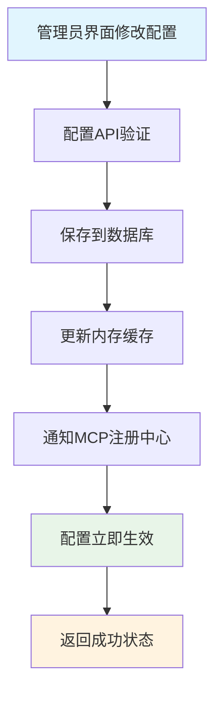

# MCP PRD文档

## 1. 产品概述

### 1.1 背景描述

搭建多MCP Server，为分组分权管理MCP tool工具，为agent提供工具 。

### 1.2 核心价值

- 为agent提供工具：提供agent访问业务系统数据的能力
- 工具分组管理：为了减少数据访问的权限，给agent指定分组内的工具
- 工具：提供业务系统的数据

### 1.3 技术说明

本系统采用**自研MCP服务架构**实现AI Agent与外部工具的标准化通信，遵循Model Context Protocol开放协议标准。系统基于现有技术栈进行深度集成，确保稳定性和可维护性。

**技术选型**：

- **自研实现**：基于FastAPI框架自研MCP协议实现，完全控制系统架构
- **集成方案**：与现有FastAPI项目原生集成，复用认证、权限、数据库等基础设施
- **传输模式**：主要支持HTTP/JSON-RPC协议，兼容SSE长连接
- **工具定义**：通过自定义装饰器（`@mcp_tool`）实现工具注册和管理

## 2. 需求分析

### 2.1 业务需求

| 需求ID | 需求描述              | 优先级 | 验收标准                                                                                                                               |
| ------ | --------------------- | ------ | -------------------------------------------------------------------------------------------------------------------------------------- |
| R001   | 用户信息服务          | P0     | * 可以通过用户ID/用户名查询用户基本信息                                                                                                |
| R002   | 客户档案/客户画像服务 | P0     | * 可以通过用户ID/用户名查询用户档案/客户画像                                                                                           |
| R003   | 会话分析服务          | P1     | * 可以通过用户ID，会话ID，消息ID查询相关指定数量的历史消息                                                                             |
| R004   | 任务管理服务          | P1     | * 可以通过用户ID，任务ID查询任务详情 * 可以通过用户ID，任务消息通知业务系统创建任务记录 * 可以通过用户ID，任务ID更新任务状态 |

### 2.2 性能需求

| 指标     | 目标值        | 说明                       |
| -------- | ------------- | -------------------------- |
| 响应时间 | ≤ 1秒        | 请求的响应总时间           |
| 成功率   | ≥ 99%        | 包含重试机制，确保最终成功 |
| 并发支持 | 100 用户/分钟 | 支持高并访问场景           |

### 2.3 技术需求

- **异步架构**：基于FastAPI后台任务和事件驱动架构
- **可靠性保证**：具备重试机制和错误恢复能力
- **监控与日志**：完整的执行日志和性能监控
- **扩展性设计**：支持未来功能扩展

## 3. 系统设计

### 3.1 技术架构

### 3.2 Model Context Protocol实现规范

#### 3.2.1 多MCP Server架构

基于运维简化和资源优化的考虑，采用多MCP Server支持多分组权限控制的架构：

- **统一服务**：多MCP Server进程，监听固定端口（8000）
- **分组路由**：通过不同server code访问不同工具分组，每组都有独立的API Key
  - 每个分组自动生成唯一 `server_code`（16字符URL安全字符串）
  - 完整MCP Server URL格式：`http://[domain]/mcp/server/[server_code]/mcp`
- **权限隔离**：应用层权限控制，根据Server Code动态返回工具集
- **运维友好**：单一进程、相同端口、统一监控和日志

#### 3.2.2 分组权限策略

基于数据库的MCP工具分组管理，支持动态配置和权限控制：

- **数据库模型**：`api/app/mcp/models/mcp.py`（`MCPToolGroup` / `MCPTool` / `MCPCallLog`）
- **管理端 DTO**：`api/app/mcp/schemas/mcp.py`
- **分组服务**：`api/app/mcp/services/mcp_group_service.py`
- **管理 API**：`api/app/mcp/controllers/mcp_config.py`

#### 3.2.4 实际MCP服务架构

基于现有代码的实际MCP服务实现：

- **工具发现/工具执行/会话管理**：`api/app/mcp/services/mcp_service.py`
- **MCP JSON-RPC/SSE 端点**：`api/app/mcp/controllers/mcp_server.py`

### 3.3 核心组件设计

#### 3.3.3 智能体配置管理

- **智能体配置存储**：系统内维护智能体的appId和apiKey映射关系
- **MCP集成机制**：智能体通过标准MCP协议调用本系统工具
- **版本管理**：支持Agent的版本控制和A/B测试
- **故障转移**：Agent不可用时的自动降级和回退机制

## 4. 技术实现方案

### 4.1 代码架构

#### 4.1.1 实际目录结构

目录结构以 `api/app/mcp/` 为准，核心子目录/文件如下：

- `api/app/mcp/controllers/`：HTTP API（管理端、OAuth、MCP JSON-RPC/SSE）
- `api/app/mcp/services/`：分组服务、工具发现/执行、会话管理
- `api/app/mcp/models/`：数据库模型
- `api/app/mcp/schemas/`：管理端 DTO（Pydantic）
- `api/app/mcp/registry/`：工具注册中心（装饰器注册/自动发现）
- `api/app/mcp/tools/`：按领域拆分的工具实现
- `api/app/mcp/oauth.py`：OAuth2 管理器（注册/授权/令牌）
- `api/app/mcp/types.py`：MCP 协议 Pydantic 模型
- `api/app/mcp/utils.py`：MCP 辅助函数（JSON-RPC success/error、PKCE 等）

#### 4.1.2 实际MCP工具注册实现

基于实际代码的MCP工具注册机制：

实现以代码为准（文档仅保留引用）：

- **工具注册中心与装饰器**：`api/app/mcp/registry/tool_registry.py`（`MCPToolRegistry` / `mcp_tool`）
- **工具模块导入（触发装饰器注册）**：`api/app/mcp/tools/__init__.py`

### 4.3 实际MCP工具定义

#### 4.3.1 用户信息工具（实际实现）

用户档案工具：`api/app/mcp/tools/user/profile.py`

- 用户搜索工具：`api/app/mcp/tools/user/search.py`

#### 4.3.2 客户分析工具（实际实现）

- 客户画像分析：`api/app/mcp/tools/customer/analysis.py`
- 客户偏好查询：`api/app/mcp/tools/customer/preferences.py`

#### 4.3.3 MCP服务器主入口

- MCP JSON-RPC/SSE 入口：`api/app/mcp/controllers/mcp_server.py`
- OAuth2 入口：`api/app/mcp/controllers/mcp_oauth.py`、`api/app/mcp/oauth.py`
- 模块导出与路由导出：`api/app/mcp/__init__.py`、`api/app/mcp/controllers/__init__.py`

#### 4.3.4 管理员面板集成与监控 (未实现)

当前未实现独立监控中间件代码。调用日志落库实现参考：

- 调用日志模型：`api/app/mcp/models/mcp.py`（`MCPCallLog`）
- 写入日志：`api/app/mcp/services/mcp_service.py`（`_log_tool_call`）

#### 4.3.5 MCP分组服务与认证管理

基于分组的MCP工具管理，提供安全的API Key权限控制：

- 分组管理/密钥生成/同步工具：`api/app/mcp/services/mcp_group_service.py`
- OAuth2 注册/授权/令牌：`api/app/mcp/oauth.py`、`api/app/mcp/controllers/mcp_oauth.py`
- MCP 调用入口与 token 校验：`api/app/mcp/controllers/mcp_server.py`

## 5. 数据库设计

### 5.3 MCP分组管理配置架构

基于分组的MCP工具管理，支持 server code 权限控制和动态配置：

#### 5.3.1 MCP工具分组管理API

- 管理 API：`api/app/mcp/controllers/mcp_config.py`
- 分组服务：`api/app/mcp/services/mcp_group_service.py`
- **获取MCP Server URL API**：
  - 端点：`GET /mcp/admin/groups/{group_id}/server-url`
  - 功能：获取包含 `server_code` 的完整接入URL

#### 5.3.2 数据库变更说明
- **表名**：`mcp_tool_groups`
- **新增字段**：`server_code` (VARCHAR(32), Unique, Index)
- **约束**：唯一性约束 `uq_mcp_groups_server_code`
- **生成规则**：新建分组自动生成，现有分组懒加载生成

## 6. 监控与日志

### 6.1 关键指标监控与管理员面板

- 管理端 API：`api/app/mcp/controllers/mcp_config.py`
- 调用日志模型：`api/app/mcp/models/mcp.py`（`MCPCallLog`）

### 6.2 日志标准

- MCP 入口日志：`api/app/mcp/controllers/mcp_server.py`、`api/app/mcp/controllers/mcp_config.py`、`api/app/mcp/controllers/mcp_oauth.py`
- 服务层日志：`api/app/mcp/services/mcp_service.py`、`api/app/mcp/services/mcp_group_service.py`

## 8. 部署方案

### 8.1 实际部署配置

#### 8.1.2 实际MCP服务配置

基于现有代码的MCP服务配置：

- 会话/服务器信息：`api/app/mcp/services/mcp_service.py`（`MCPSessionManager`）
- MCP 配置项：`api/app/core/config.py`（`MCP_SERVER_BASE_URL` 等）

### 8.2 管理员界面配置管理

基于官方MCP库的管理界面，简化配置复杂度：

#### 8.2.1 MCP服务器管理界面

当前暂无单独的“服务器管理界面”实现。现有管理能力以管理 API 形式提供，参考：

- 管理 API：`api/app/mcp/controllers/mcp_config.py`
- **MCP分组列表功能增强**：
  - 显示 `server_code` 路径预览
  - 提供完整 MCP Server URL 复制按钮（仅启用状态可见）
  - 点击复制后显示成功提示
  - 禁用分组显示灰色状态，不可复制 URL

### 8.2 配置生效机制与功能开关

通过MCP服务注册与发现机制实现动态功能控制：

#### 8.2.1 配置实时生效流程

#### 8.2.2 智能功能开关实现

该段为“未来能力设想”，当前代码中尚无完整的“服务级功能开关”实现。若后续落地，建议以以下现有模块为集成点：

- 管理端配置入口：`api/app/mcp/controllers/mcp_config.py`
- 工具注册中心：`api/app/mcp/registry/tool_registry.py`
- MCP 运行时入口：`api/app/mcp/controllers/mcp_server.py`

## 10. 成功指标

## 12. 架构设计总结

### 12.1 核心设计理念

基于**自研MCP服务架构**的现代化实现，提供原生的AI调用工具的能力。

### 12.2 关键技术决策

1. **自研MCP实现**：基于FastAPI框架自研MCP协议实现，完全控制系统架构和扩展能力
2. **装饰器工具注册**：通过自定义 `@mcp_tool`装饰器简化工具定义，支持分类管理
3. **数据库驱动配置**：支持动态配置管理，基于数据库的分组权限控制
4. **原生FastAPI集成**：与现有FastAPI项目无缝集成，复用所有基础设施
5. **现有架构复用**：充分利用现有认证、权限、数据库、日志等基础设施
6. **简化开发流程**：装饰器模式简化工具开发，自动注册和元数据管理
7. **企业级权限控制**：基于分组的API Key管理，支持细粒度权限控制

### 12.3 技术优势

- **完全控制**：自研实现提供完全的技术控制权，便于定制化开发
- **数据库集成**：工具配置存储在数据库中，支持动态管理和权限控制
- **分组权限**：基于MCPToolGroup和MCPTool表的细粒度权限管理
- **OAuth2支持**：内置OAuth2认证流程，支持标准化的客户端授权
- **扩展灵活**：基于现有技术栈，便于功能扩展和维护

### 12.5 实际实现状态

- **MCP服务层**：已实现MCPToolDiscoveryService和MCPToolExecutionService
- **工具注册**：已实现@mcp_tool装饰器和MCPToolRegistry
- **权限管理**：已实现MCPGroupService和基于数据库的权限控制
- **OAuth2认证**：已实现OAuth2Manager和标准化认证流程
- **管理界面**：已实现mcp_config.py的完整管理API
- **注册自动化**：已实现完整的注册自动化流程和AI Gateway集成

---

**文档版本**：V4.0
**更新时间**：2025年1月
