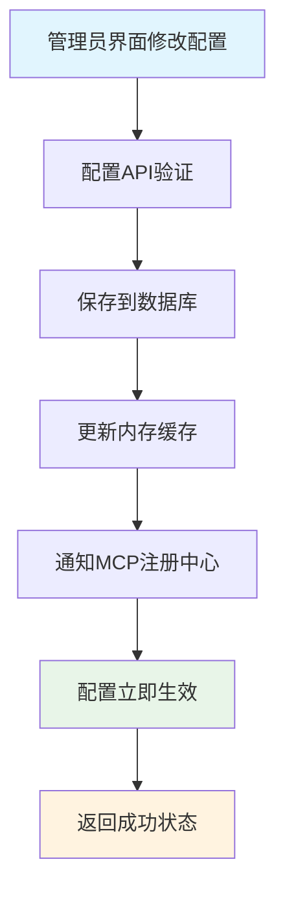

# 用户注册自动化流程 PRD文档

## 1. 产品概述

### 1.1 背景描述

安美智享医美咨询系统需要实现用户注册后的自动化流程，为新用户提供无缝的初始体验。当用户完成注册后，系统应自动创建会话、发送个性化欢迎消息，并通知顾问团队有新客户需要服务。

### 1.2 核心价值

- **用户体验提升**：新用户注册后立即获得专业AI响应和服务
- **业务转化优化**：确保新客户能快速接入咨询服务
- **运营效率提升**：自动化流程减少人工介入，提高服务响应速度

## 2. 需求分析

### 2.1 业务需求

| 需求ID | 需求描述                            | 优先级 | 验收标准                                                              |
| ------ | ----------------------------------- | ------ | --------------------------------------------------------------------- |
| R001   | 用户注册成功后自动创建默认会话      | P0     | 新用户在注册成功后2秒内自动创建会话，指定通用AI机器人                 |
| R002   | Dify Agent通过MCP生成个性化欢迎消息 | P0     | Dify Agent通过MCP获取用户信息，生成定制化欢迎语，AI Gateway转发给客户 |
| R003   | 顾问端接收新客户通知                | P1     | 系统向在线顾问推送新客户消息，离线顾问接收推送通知                    |

### 2.2 性能需求

| 指标     | 目标值        | 说明                             |
| -------- | ------------- | -------------------------------- |
| 响应时间 | ≤ 3秒        | 用户注册到收到欢迎消息的总时间   |
| 异步处理 | 100%          | 所有流程异步执行，不阻塞注册响应 |
| 成功率   | ≥ 99%        | 包含重试机制，确保最终成功       |
| 并发支持 | 100 用户/分钟 | 支持高并发注册场景               |

### 2.3 技术需求

- **异步架构**：基于FastAPI后台任务和事件驱动架构
- **可靠性保证**：具备重试机制和错误恢复能力
- **监控与日志**：完整的执行日志和性能监控
- **扩展性设计**：支持未来功能扩展

## 3. 系统设计

### 3.1 技术架构

基于现有的AI Gateway企业级架构，结合MCP服务体系的完整设计：


**📋 架构说明**：
✅ **与现有代码一致**：经过代码分析，当前系统确实有独立的API端点

- `ai_gateway.py`：AI Gateway管理API，包含聊天、方案生成、健康检查等功能
- `ai.py`：面向用户的AI功能接口
- `chat.py`：聊天相关API
- `plan_generation.py`：AI辅助方案生成专用API
- `dify_config.py`：Dify配置管理API（已支持动态配置和热重载）

### 3.2 核心组件设计

#### 3.2.1 注册自动化服务 (RegistrationAutomationService)

```python
class RegistrationAutomationService:
    """用户注册自动化服务"""
  
    async def handle_user_registration(self, user_id: str, user_info: dict):
        """处理用户注册后的自动化流程"""
        pass
  
    async def create_default_conversation(self, user_id: str) -> ConversationInfo:
        """创建默认会话"""
        pass
  
    async def trigger_dify_welcome(self, user_id: str, conversation_id: str):
        """触发Dify Agent生成个性化欢迎消息"""
        pass
  
    async def notify_consultants(self, user_id: str, conversation_id: str):
        """通知顾问有新客户"""
        pass
```

#### 3.2.2 MCP服务体系设计

- **MCP Server架构**：与API同级的独立服务层，专门对外提供MCP协议服务
- **服务注册与发现**：统一的MCP服务注册、版本管理、启用/禁用机制
- **工具集合管理**：模块化的MCP工具集，支持按功能分组和权限控制
- **配置管理**：支持MCP服务的动态配置、热更新和灰度发布
- **监控与日志**：完整的MCP调用监控、性能统计和错误追踪

#### 3.2.3 Dify Agent配置管理

- **Agent配置存储**：系统内维护Dify Agent的appId和difyKey映射关系
- **触发机制**：通过AI Gateway查询配置，使用对应的difyKey调用指定Agent
- **版本管理**：支持Agent的版本控制和A/B测试
- **故障转移**：Agent不可用时的自动降级和回退机制

#### 3.2.4 顾问通知系统

- **在线通知**：通过WebSocket实时推送
- **离线通知**：通过NotificationService发送推送
- **通知内容**：新客户基本信息、会话链接、预期响应时间

### 3.3 数据流设计

#### 3.3.1 注册流程数据流

```
用户注册 → 用户信息验证 → 创建用户记录 → 触发异步任务
                                        ↓
                            创建会话 → 查询Dify Agent配置（appId→difyKey）
                                        ↓
                            AI Gateway调用Dify Agent → Dify Agent调用MCP获取用户信息
                                        ↓
                            欢迎消息生成 ← Dify Agent返回欢迎语 ← MCP返回用户画像
                                        ↓
                            保存消息 → 广播顾问通知 → 更新管理员面板指标
```

#### 3.3.2 重试机制数据流

```
任务执行失败 → 记录错误日志 → 计算重试延迟 → 重新入队 → 重新执行
                    ↓（达到最大重试次数）
              发送管理员告警 → 手动处理
```

## 4. 技术实现方案

### 4.1 代码架构

#### 4.1.1 目录结构

```
api/app/
├── api/v1/                        # 现有API服务层
│   ├── endpoints/
│   │   ├── auth.py
│   │   ├── chat.py
│   │   ├── plan_generation.py
│   │   ├── dify_config.py        # 现有Dify配置管理（已实现）
│   │   └── mcp_config.py         # 新增MCP配置管理API
│   └── api.py
├── mcp/v1/                        # 新增MCP服务层（与API同级）
│   ├── __init__.py
│   ├── server.py                  # MCP服务器主入口
│   ├── registry.py               # MCP服务注册中心
│   ├── tools/                    # MCP工具集合
│   │   ├── __init__.py
│   │   ├── user_profile.py       # 用户信息工具
│   │   ├── customer_analysis.py  # 客户分析工具
│   │   ├── conversation_data.py  # 会话数据工具
│   │   └── business_metrics.py   # 业务指标工具
│   ├── middleware/               # MCP中间件
│   │   ├── __init__.py
│   │   ├── mcp_auth.py          # MCP调用认证中间件（验证Dify提供的appKey）
│   │   ├── logging.py           # 日志中间件
│   │   └── monitoring.py        # 监控中间件
│   └── config/                  # MCP配置管理
│       ├── __init__.py
│       ├── tool_config.py       # 工具配置
│       └── version_manager.py   # 版本管理
└── services/
    ├── mcp_group_service.py         # MCP工具分组服务（新增）
    └── registration/
        ├── __init__.py
        ├── automation_service.py    # 核心自动化服务（复用现有dify_service）
        └── consultant_notifier.py   # 顾问通知服务
```

#### 4.1.2 服务集成点

```python
# 在 auth.py 注册端点中集成
@router.post("/register", response_model=UserResponse)
async def register(
    *,
    background_tasks: BackgroundTasks,  # 新增
    db: Session = Depends(get_db),
    user_in: UserCreate = Body(...),
) -> Any:
    # 现有注册逻辑...
    userResponse = await user_service.create(db, obj_in=user_in)
  
    # 新增：触发自动化流程
    background_tasks.add_task(
        handle_registration_automation,
        user_id=str(userResponse.id),
        user_info=userResponse.dict()
    )
  
    return userResponse
```

### 4.2 异步任务设计

#### 4.2.1 主任务函数

```python
async def handle_registration_automation(user_id: str, user_info: dict):
    """注册自动化主任务"""
    try:
        automation_service = RegistrationAutomationService()
        await automation_service.handle_user_registration(user_id, user_info)
    except Exception as e:
        logger.error(f"注册自动化失败: user_id={user_id}, error={e}")
        # 触发重试机制
        await schedule_retry_task(user_id, user_info, attempt=1)
```

#### 4.2.2 重试机制

```python
async def schedule_retry_task(user_id: str, user_info: dict, attempt: int):
    """安排重试任务"""
    max_retries = 3
    retry_delays = [5, 15, 60]  # 秒
  
    if attempt <= max_retries:
        delay = retry_delays[attempt - 1]
        # 使用Redis或Celery实现延迟任务
        await asyncio.sleep(delay)
        await handle_registration_automation(user_id, user_info)
    else:
        # 发送管理员告警
        await send_admin_alert(f"用户注册自动化最终失败: {user_id}")
```

### 4.3 MCP服务体系与AI Gateway集成方案

#### 4.3.1 MCP服务注册与管理

```python
# app/mcp/v1/registry.py
class MCPServiceRegistry:
    """MCP服务注册中心，管理所有MCP工具的生命周期"""
  
    def __init__(self):
        self.tools = {}
        self.versions = {}
        self.status = {}  # enabled/disabled
      
    def register_tool(self, name: str, tool_class, version: str = "1.0.0"):
        """注册MCP工具"""
        self.tools[name] = tool_class
        self.versions[name] = version
        self.status[name] = "enabled"
      
    def get_available_tools(self) -> dict:
        """获取可用的MCP工具列表"""
        return {
            name: {
                "class": tool_class,
                "version": self.versions[name],
                "status": self.status[name]
            }
            for name, tool_class in self.tools.items()
            if self.status[name] == "enabled"
        }
  
    def enable_tool(self, name: str):
        """启用MCP工具"""
        self.status[name] = "enabled"
      
    def disable_tool(self, name: str):
        """禁用MCP工具"""
        self.status[name] = "disabled"

# app/mcp/v1/tools/user_profile.py
class UserProfileTool:
    """用户信息MCP工具"""
  
    name = "get_user_profile"
    version = "1.0.0"
    description = "获取用户基本信息，用于生成个性化内容"
  
    async def execute(self, user_id: str) -> dict:
        """执行用户信息获取"""
        try:
            user = await user_service.get(self.db, id=user_id)
            return {
                "user_id": user.id,
                "username": user.username,
                "email": user.email,
                "registration_time": user.created_at.isoformat(),
                "roles": user.roles,
                "is_new_user": True,
                "source": "registration_automation"
            }
        except Exception as e:
            logger.error(f"MCP获取用户信息失败: {e}")
            return {"error": str(e)}
```

#### 4.3.2 复用现有Dify服务架构

基于项目代码整洁和易维护原则，复用现有的Dify服务而非创建新的管理器：

```python
# app/services/registration/automation_service.py
class RegistrationAutomationService:
    """注册自动化服务，复用现有Dify架构"""
  
    def __init__(self, db: Session):
        self.db = db
        # 复用现有的AI Gateway服务
        self.ai_gateway = get_ai_gateway_service(db)
      
    async def trigger_welcome_message(self, user_id: str, conversation_id: str):
        """触发欢迎消息生成（复用现有AI Gateway）"""
        try:
            # 直接使用AI Gateway的customer_service_chat功能
            # AI Gateway内部会根据dify_config.py的配置选择合适的Agent
            response = await self.ai_gateway.customer_service_chat(
                message=f"新用户 {user_id} 刚刚注册，请生成个性化欢迎消息",
                user_id=user_id,
                session_id=conversation_id,
                conversation_history=[],
                user_profile={"is_new_user": True, "source": "registration"}
            )
          
            if response.success:
                return response.content
            else:
                logger.warning(f"AI Gateway调用失败: {response.error_message}")
                return self._get_default_welcome_message(user_id)
              
        except Exception as e:
            logger.error(f"触发欢迎消息失败: {e}")
            return self._get_default_welcome_message(user_id)
  
    def _get_default_welcome_message(self, user_id: str) -> str:
        """默认欢迎消息模板"""
        return """
        欢迎来到安美智享！🌟
      
        我是您的专属AI咨询助手，很高兴为您服务。
        您可以随时向我咨询医美相关问题，获得个性化的美容建议。
        """

# 说明：
# 1. 复用现有的AI Gateway Service（已在ai_gateway.py中实现）
# 2. 复用现有的Dify配置管理（已在dify_config.py中实现）
# 3. 复用现有的DifyService（已在dify_service.py中实现）
# 4. 无需额外的DifyAgentManager，保持代码简洁
```

#### 4.3.3 MCP服务器主入口

```python
# app/mcp/v1/server.py
class MCPServer:
    """MCP服务器主入口，统一处理所有MCP请求"""
  
    def __init__(self):
        self.registry = MCPServiceRegistry()
        self.middleware_stack = []
        self._register_default_tools()
      
    def _register_default_tools(self):
        """注册默认的MCP工具"""
        from .tools.user_profile import UserProfileTool
        from .tools.customer_analysis import CustomerAnalysisTool
        from .tools.conversation_data import ConversationDataTool
      
        self.registry.register_tool("get_user_profile", UserProfileTool)
        self.registry.register_tool("analyze_customer", CustomerAnalysisTool)
        self.registry.register_tool("get_conversation_data", ConversationDataTool)
      
    async def handle_request(self, tool_name: str, params: dict) -> dict:
        """处理MCP请求"""
        try:
            # 应用中间件
            for middleware in self.middleware_stack:
                params = await middleware.process_request(params)
          
            # 获取工具并执行
            tools = self.registry.get_available_tools()
            if tool_name not in tools:
                return {"error": f"Tool {tool_name} not found or disabled"}
          
            tool_instance = tools[tool_name]["class"]()
            result = await tool_instance.execute(**params)
          
            # 应用响应中间件
            for middleware in reversed(self.middleware_stack):
                result = await middleware.process_response(result)
              
            return result
          
        except Exception as e:
            logger.error(f"MCP请求处理失败: {e}")
            return {"error": str(e)}
```

#### 4.3.4 管理员面板集成与监控

# app/mcp/v1/middleware/monitoring.py

class MCPMonitoringMiddleware:
    """MCP监控中间件，记录调用统计"""

    def__init__(self):
        self.call_stats = {}
        self.error_stats = {}

    async def process_request(self, params: dict) -> dict:
        """记录请求开始"""
        tool_name = params.get('_tool_name')
        if tool_name:
            self.call_stats[tool_name] = self.call_stats.get(tool_name, 0) + 1
        return params

    async def process_response(self, result: dict) -> dict:
        """记录响应结果"""
        if "error" in result:
            tool_name = result.get('_tool_name')
            if tool_name:
                self.error_stats[tool_name] = self.error_stats.get(tool_name, 0) + 1
        return result

    def get_metrics(self) -> dict:
        """获取监控指标"""
        return {
            "total_calls": sum(self.call_stats.values()),
            "tool_calls": self.call_stats,
            "error_rates": {
                tool: self.error_stats.get(tool, 0) / self.call_stats.get(tool, 1)
                for tool in self.call_stats.keys()
            },
            "success_rate": 1 - sum(self.error_stats.values()) / max(sum(self.call_stats.values()), 1)
        }

# app/api/v1/endpoints/mcp_dashboard.py

@router.get("/registration-automation/metrics")
async def get_registration_automation_metrics(
    current_user: User = Depends(get_current_admin_user)
):
    """获取注册自动化指标（管理员面板）"""
    mcp_server = get_mcp_server()
    monitoring = mcp_server.get_middleware("monitoring")

    return {
        "mcp_metrics": monitoring.get_metrics() if monitoring else {},
        "dify_agent_status": await check_dify_agent_status(),
        "automation_success_rate": await get_automation_success_rate(),
        "daily_registrations": await get_daily_registration_stats(),
        "welcome_message_stats": await get_welcome_message_stats()
    }

#### 4.3.3 MCP分组服务与认证管理

基于分组的MCP工具管理，提供安全的API Key权限控制：

```python
# app/services/mcp_group_service.py
import secrets
import hashlib
from datetime import datetime

class MCPGroupService:
    """MCP工具分组服务"""
  
    @staticmethod
    async def create_group(db: Session, group_create: MCPGroupCreate, created_by: str) -> dict:
        """创建MCP工具分组并生成API Key"""
        # 生成安全的API Key
        api_key = f"mcp_key_{secrets.token_urlsafe(32)}"
  
        group_data = {
            "id": str(uuid4()),
            "name": group_create.name,
            "description": group_create.description,
            "api_key": api_key,  # 实际实现中应加密存储
            "enabled": True,
            "created_by": created_by,
            "created_at": datetime.utcnow(),
            "updated_at": datetime.utcnow()
        }
  
        # 保存到数据库（具体实现依据ORM）
        # group = MCPToolGroup(**group_data)
        # db.add(group)
        # db.commit()
  
        logger.info(f"创建MCP分组: {group_create.name}, 创建者: {created_by}")
        return group_data
  
    @staticmethod
    async def get_group_api_key(db: Session, group_id: str) -> str:
        """获取分组API Key（仅管理员可查看）"""
        # 从数据库查询API Key
        # group = db.query(MCPToolGroup).filter(MCPToolGroup.id == group_id).first()
        # return group.api_key if group else None
        pass
  
    @staticmethod
    async def regenerate_api_key(db: Session, group_id: str, admin_user_id: str) -> str:
        """重新生成分组API Key（安全操作）"""
        new_api_key = f"mcp_key_{secrets.token_urlsafe(32)}"
  
        # 更新数据库中的API Key
        # group = db.query(MCPToolGroup).filter(MCPToolGroup.id == group_id).first()
        # group.api_key = new_api_key
        # group.updated_at = datetime.utcnow()
        # db.commit()
  
        logger.warning(f"重新生成API Key: 分组={group_id}, 操作员={admin_user_id}")
        return new_api_key

# app/mcp/v1/middleware/mcp_auth.py
class MCPAuthMiddleware:
    """MCP调用认证中间件"""
  
    def __init__(self, db: Session):
        self.db = db
  
    async def authenticate_request(self, api_key: str, tool_name: str) -> dict:
        """验证MCP调用请求"""
        try:
            # 查找API Key对应的分组
            group = await self._find_group_by_api_key(api_key)
            if not group:
                return {"valid": False, "error": "Invalid API Key"}
  
            if not group.get("enabled"):
                return {"valid": False, "error": "Group disabled"}
  
            # 检查工具是否属于该分组且已启用
            tool = await self._find_tool_in_group(tool_name, group["id"])
            if not tool:
                return {"valid": False, "error": "Tool not found in group"}
  
            if not tool.get("enabled"):
                return {"valid": False, "error": "Tool disabled"}
  
            return {
                "valid": True,
                "group_id": group["id"],
                "group_name": group["name"],
                "tool_config": tool
            }
  
        except Exception as e:
            logger.error(f"MCP认证失败: {e}")
            return {"valid": False, "error": "Authentication failed"}
  
    async def _find_group_by_api_key(self, api_key: str) -> dict:
        """根据API Key查找分组"""
        # 从数据库查询分组信息
        # group = db.query(MCPToolGroup).filter(MCPToolGroup.api_key == api_key).first()
        # return group.to_dict() if group else None
        pass
  
    async def _find_tool_in_group(self, tool_name: str, group_id: str) -> dict:
        """查找分组内的工具"""
        # tool = db.query(MCPTool).filter(
        #     MCPTool.tool_name == tool_name,
        #     MCPTool.group_id == group_id
        # ).first()
        # return tool.to_dict() if tool else None
        pass

# 说明：
# 1. 基于分组的API Key管理，提供细粒度权限控制
# 2. 安全的API Key生成和验证机制
# 3. 完整的认证中间件，验证Dify调用的合法性
# 4. 操作审计日志，记录所有安全相关操作
```

### 4.4 通知系统设计

#### 4.4.1 顾问通知流程

```python
async def notify_consultants(self, user_id: str, conversation_id: str):
    """通知顾问有新客户"""
    try:
        # 获取在线顾问列表
        online_consultants = await self._get_online_consultants()
      
        # 准备通知数据
        notification_data = {
            "type": "new_customer",
            "title": "新客户注册",
            "message": f"新客户已注册并开始咨询，等待顾问认领",
            "customer_id": user_id,
            "conversation_id": conversation_id,
            "timestamp": datetime.now().isoformat(),
            "action": "claim_customer"
        }
      
        # 通过广播服务发送通知
        broadcasting_service = await get_broadcasting_service_dependency(self.db)
      
        for consultant_id in online_consultants:
            await broadcasting_service.send_direct_message(
                user_id=consultant_id,
                message_data=notification_data
            )
      
        # 如果没有在线顾问，发送推送通知给所有顾问
        if not online_consultants:
            all_consultants = await self._get_all_consultants()
            for consultant_id in all_consultants:
                await broadcasting_service._send_push_notification(
                    user_id=consultant_id,
                    notification_data={
                        "title": "新客户等待服务",
                        "body": "有新客户注册，请及时响应",
                        "conversation_id": conversation_id
                    }
                )
      
    except Exception as e:
        logger.error(f"通知顾问失败: {e}")
```

## 5. 数据库设计

### 5.1 现有表结构利用

完全复用现有的数据库结构：

- **users表**：用户基本信息，用于MCP服务的用户信息查询
- **conversations表**：会话管理，包含AI控制状态，用于创建默认会话
- **messages表**：消息存储，支持结构化内容，用于保存欢迎消息
- **system_settings表**：系统配置（无需新增字段）
- **dify_configs表**：现有Dify配置表（通过dify_config.py管理）

### 5.2 新增MCP相关数据库表设计

#### 5.2.1 MCP工具分组表

```sql
CREATE TABLE mcp_tool_groups (
    id VARCHAR(36) PRIMARY KEY,
    name VARCHAR(100) NOT NULL COMMENT '分组名称',
    description TEXT COMMENT '分组描述',
    api_key VARCHAR(255) NOT NULL COMMENT '分组API密钥',
    enabled BOOLEAN DEFAULT TRUE COMMENT '是否启用',
    created_by VARCHAR(36) COMMENT '创建者ID',
    created_at TIMESTAMP DEFAULT CURRENT_TIMESTAMP,
    updated_at TIMESTAMP DEFAULT CURRENT_TIMESTAMP ON UPDATE CURRENT_TIMESTAMP,
    UNIQUE KEY uk_name (name),
    INDEX idx_enabled (enabled),
    INDEX idx_created_by (created_by)
);
```

#### 5.2.2 MCP工具配置表

```sql
CREATE TABLE mcp_tools (
    id VARCHAR(36) PRIMARY KEY,
    tool_name VARCHAR(100) NOT NULL COMMENT '工具名称',
    group_id VARCHAR(36) NOT NULL COMMENT '所属分组ID',
    version VARCHAR(20) DEFAULT '1.0.0' COMMENT '工具版本',
    description TEXT COMMENT '工具描述',
    enabled BOOLEAN DEFAULT TRUE COMMENT '是否启用',
    timeout_seconds INT DEFAULT 30 COMMENT '超时时间（秒）',
    config_data JSON COMMENT '工具配置数据',
    created_at TIMESTAMP DEFAULT CURRENT_TIMESTAMP,
    updated_at TIMESTAMP DEFAULT CURRENT_TIMESTAMP ON UPDATE CURRENT_TIMESTAMP,
    UNIQUE KEY uk_tool_name (tool_name),
    FOREIGN KEY (group_id) REFERENCES mcp_tool_groups(id) ON DELETE CASCADE,
    INDEX idx_group_enabled (group_id, enabled),
    INDEX idx_tool_name (tool_name)
);
```

#### 5.2.3 MCP调用日志表

```sql
CREATE TABLE mcp_call_logs (
    id VARCHAR(36) PRIMARY KEY,
    tool_name VARCHAR(100) NOT NULL COMMENT '工具名称',
    group_id VARCHAR(36) NOT NULL COMMENT '分组ID',
    caller_app_id VARCHAR(100) COMMENT '调用方应用ID（Dify AppID）',
    request_data JSON COMMENT '请求数据',
    response_data JSON COMMENT '响应数据',
    success BOOLEAN NOT NULL COMMENT '是否成功',
    error_message TEXT COMMENT '错误信息',
    duration_ms INT COMMENT '执行时长（毫秒）',
    created_at TIMESTAMP DEFAULT CURRENT_TIMESTAMP,
    INDEX idx_tool_success_time (tool_name, success, created_at),
    INDEX idx_group_time (group_id, created_at),
    INDEX idx_caller_time (caller_app_id, created_at)
);
```

### 5.3 MCP分组管理配置架构

基于分组的MCP工具管理，支持API Key权限控制和动态配置：

#### 5.3.1 MCP工具分组管理API

```python
# app/api/v1/endpoints/mcp_config.py（新文件）

# MCP工具分组管理
@router.get("/groups", response_model=MCPGroupListResponse)
async def get_mcp_groups(
    db: Session = Depends(get_db),
    current_user: User = Depends(get_current_admin)
):
    """获取MCP工具分组列表"""
    try:
        groups = await MCPGroupService.get_all_groups(db)
        return MCPGroupListResponse(
            success=True,
            data=groups,
            message="获取MCP分组列表成功"
        )
    except Exception as e:
        raise HTTPException(
            status_code=status.HTTP_500_INTERNAL_SERVER_ERROR,
            detail=f"获取MCP分组失败: {str(e)}"
        )

@router.post("/groups", response_model=MCPGroupResponse)
async def create_mcp_group(
    group_create: MCPGroupCreate,
    db: Session = Depends(get_db),
    current_user: User = Depends(get_current_admin)
):
    """创建MCP工具分组"""
    try:
        # 创建分组并自动生成API Key
        group = await MCPGroupService.create_group(db, group_create, str(current_user.id))
      
        return MCPGroupResponse(
            success=True,
            data=group,
            message="MCP分组创建成功"
        )
    except Exception as e:
        raise HTTPException(
            status_code=status.HTTP_400_BAD_REQUEST,
            detail=f"创建MCP分组失败: {str(e)}"
        )

@router.get("/groups/{group_id}/api-key")
async def get_group_api_key(
    group_id: str,
    db: Session = Depends(get_db),
    current_user: User = Depends(get_current_admin)
):
    """查看分组API Key（管理员专用）"""
    try:
        api_key = await MCPGroupService.get_group_api_key(db, group_id)
        return {
            "success": True,
            "data": {"api_key": api_key},
            "message": "API Key获取成功"
        }
    except Exception as e:
        raise HTTPException(
            status_code=status.HTTP_404_NOT_FOUND,
            detail=f"获取API Key失败: {str(e)}"
        )

@router.post("/groups/{group_id}/regenerate-key")
async def regenerate_group_api_key(
    group_id: str,
    db: Session = Depends(get_db),
    current_user: User = Depends(get_current_admin)
):
    """重新生成分组API Key"""
    try:
        new_api_key = await MCPGroupService.regenerate_api_key(db, group_id, str(current_user.id))
      
        # 记录安全操作日志
        logger.warning(f"管理员 {current_user.id} 重新生成了分组 {group_id} 的API Key")
      
        return {
            "success": True,
            "data": {"api_key": new_api_key},
            "message": "API Key重新生成成功"
        }
    except Exception as e:
        raise HTTPException(
            status_code=status.HTTP_500_INTERNAL_SERVER_ERROR,
            detail=f"重新生成API Key失败: {str(e)}"
        )

# MCP工具配置管理
@router.get("/tools", response_model=MCPToolListResponse)
async def get_mcp_tools(
    group_id: str = Query(None, description="按分组筛选"),
    db: Session = Depends(get_db),
    current_user: User = Depends(get_current_admin)
):
    """获取MCP工具列表"""
    try:
        tools = await MCPToolService.get_tools(db, group_id=group_id)
        return MCPToolListResponse(
            success=True,
            data=tools,
            message="获取MCP工具列表成功"
        )
    except Exception as e:
        raise HTTPException(
            status_code=status.HTTP_500_INTERNAL_SERVER_ERROR,
            detail=f"获取MCP工具失败: {str(e)}"
        )

@router.put("/tools/{tool_id}")
async def update_mcp_tool(
    tool_id: str,
    tool_update: MCPToolUpdate,
    db: Session = Depends(get_db),
    current_user: User = Depends(get_current_admin)
):
    """更新MCP工具配置"""
    try:
        tool = await MCPToolService.update_tool(db, tool_id, tool_update)
      
        # 通知MCP注册中心配置变更
        mcp_registry = get_mcp_registry()
        await mcp_registry.reload_tool_config(tool.tool_name)
      
        logger.info(f"管理员 {current_user.id} 更新了MCP工具 {tool.tool_name}")
      
        return {
            "success": True,
            "data": tool,
            "message": "MCP工具更新成功",
            "effective_immediately": True
        }
    except Exception as e:
        raise HTTPException(
            status_code=status.HTTP_500_INTERNAL_SERVER_ERROR,
            detail=f"更新MCP工具失败: {str(e)}"
        )

# 数据模型
class MCPGroupCreate(BaseModel):
    name: str = Field(..., description="分组名称")
    description: str = Field("", description="分组描述")

class MCPToolUpdate(BaseModel):
    group_id: str = Field(..., description="所属分组ID")
    enabled: bool = Field(True, description="是否启用")
    timeout_seconds: int = Field(30, description="超时时间")
    description: str = Field("", description="工具描述")
    config_data: dict = Field({}, description="工具配置")
```

## 6. 监控与日志

### 6.1 关键指标监控与管理员面板

```python
class RegistrationAutomationMetrics:
    """注册自动化指标收集与管理"""
  
    def __init__(self):
        self.daily_stats = {}
        self.real_time_stats = {
            "total_registrations": 0,
            "successful_automations": 0,
            "failed_automations": 0,
            "mcp_calls": 0,
            "dify_agent_calls": 0,
            "average_response_time": 0
        }
  
    async def record_automation_step(
        self,
        user_id: str,
        step: str,  # 'conversation_created', 'mcp_called', 'dify_triggered', 'welcome_sent', 'consultants_notified'
        success: bool,
        duration_ms: int,
        error_message: str = None
    ):
        """记录自动化步骤指标"""
        # 更新实时统计
        if step == "welcome_sent" and success:
            self.real_time_stats["successful_automations"] += 1
        elif step == "welcome_sent" and not success:
            self.real_time_stats["failed_automations"] += 1
      
        if step == "mcp_called":
            self.real_time_stats["mcp_calls"] += 1
        elif step == "dify_triggered":
            self.real_time_stats["dify_agent_calls"] += 1
          
        # 更新平均响应时间
        self._update_average_response_time(duration_ms)
      
        # 记录日志
        logger.info(f"注册自动化指标: user_id={user_id}, step={step}, "
                   f"success={success}, duration={duration_ms}ms")
      
        if not success and error_message:
            logger.error(f"注册自动化失败: user_id={user_id}, step={step}, "
                        f"error={error_message}")
  
    def get_admin_dashboard_metrics(self) -> dict:
        """获取管理员面板指标"""
        success_rate = 0
        if self.real_time_stats["successful_automations"] + self.real_time_stats["failed_automations"] > 0:
            success_rate = self.real_time_stats["successful_automations"] / (
                self.real_time_stats["successful_automations"] + self.real_time_stats["failed_automations"]
            )
      
        return {
            "success_rate": success_rate,
            "total_automations": self.real_time_stats["successful_automations"] + self.real_time_stats["failed_automations"],
            "mcp_call_count": self.real_time_stats["mcp_calls"],
            "dify_call_count": self.real_time_stats["dify_agent_calls"],
            "average_response_time": self.real_time_stats["average_response_time"],
            "daily_trends": self._get_daily_trends()
        }

# 管理员面板API端点
@router.get("/admin/registration-automation/dashboard")
async def get_registration_automation_dashboard(
    current_user: User = Depends(get_current_admin_user)
):
    """获取注册自动化管理面板数据"""
    metrics = get_registration_metrics()
  
    return {
        "automation_metrics": metrics.get_admin_dashboard_metrics(),
        "mcp_server_status": await get_mcp_server_status(),
        "dify_agent_status": await get_dify_agent_status(),
        "recent_errors": await get_recent_automation_errors(),
        "system_health": {
            "mcp_response_time": await check_mcp_response_time(),
            "dify_response_time": await check_dify_response_time(),
            "database_status": await check_database_health()
        }
    }
```

### 6.2 日志标准

```python
# 成功日志示例
logger.info(f"用户注册自动化开始: user_id={user_id}, username={username}")
logger.info(f"默认会话创建成功: user_id={user_id}, conversation_id={conversation_id}")
logger.info(f"MCP服务调用成功: user_id={user_id}, 获取用户信息完成")
logger.info(f"Dify Agent欢迎消息生成成功: user_id={user_id}, message_id={message_id}")
logger.info(f"顾问通知发送完成: user_id={user_id}, 通知顾问数量={consultant_count}")

# 错误日志示例
logger.error(f"会话创建失败: user_id={user_id}, error={error_message}")
logger.error(f"MCP服务调用失败: user_id={user_id}, error={error_message}")
logger.warning(f"Dify Agent不可用，使用默认欢迎消息: user_id={user_id}")
```

## 7. 测试策略

### 7.1 单元测试

```python
class TestRegistrationAutomation(TestCase):
  
    async def test_create_default_conversation(self):
        """测试创建默认会话"""
        pass
  
    async def test_mcp_service_success(self):
        """测试MCP服务调用成功场景"""
        pass
  
    async def test_dify_agent_welcome_generation(self):
        """测试Dify Agent欢迎消息生成"""
        pass
  
    async def test_mcp_dify_fallback(self):
        """测试MCP/Dify服务失败时的回退机制"""
        pass
  
    async def test_notify_consultants(self):
        """测试顾问通知功能"""
        pass
  
    async def test_retry_mechanism(self):
        """测试重试机制"""
        pass
```

### 7.2 集成测试

```python
async def test_full_registration_flow(self):
    """测试完整注册自动化流程"""
    # 1. 创建测试用户
    # 2. 触发注册自动化
    # 3. 验证会话创建
    # 4. 验证欢迎消息
    # 5. 验证顾问通知
    pass
```

### 7.3 性能测试

- **并发注册测试**：模拟100个用户同时注册
- **MCP/Dify服务压力测试**：测试MCP服务和Dify Agent在高并发下的响应能力
- **网络故障测试**：模拟网络中断时的重试机制

## 8. 部署方案

### 8.1 管理员界面配置管理

所有配置均通过管理员界面进行管理，支持实时配置和即时生效：

#### 8.1.1 MCP工具分组管理界面

```
📊 MCP分组管理面板
├── 📂 分组管理
│   ├── 创建新分组
│   ├── 分组启用/禁用
│   ├── 分组描述编辑
│   └── 查看API Key（安全操作）
├── 🔑 API Key管理
│   ├── 生成新API Key
│   ├── 重新生成API Key
│   ├── API Key权限控制
│   └── 使用情况统计
├── 🛠️ 工具配置管理
│   ├── 工具分组分配
│   ├── 工具启用/禁用
│   ├── 超时时间配置
│   └── 工具描述编辑
└── 📈 调用监控
    ├── 分组调用统计
    ├── 工具使用频率
    ├── 错误率监控
    └── 性能指标展示
```

#### 8.1.2 注册自动化配置界面

```
⚙️ 注册自动化设置面板
├── 🔄 重试机制配置
│   ├── 最大重试次数设置
│   ├── 重试间隔配置
│   └── 失败处理策略
├── 📢 通知设置
│   ├── 顾问通知启用/禁用
│   ├── 通知方式选择
│   └── 通知模板管理
└── 📋 业务规则配置
    ├── 默认会话设置
    ├── 欢迎消息策略
    └── 客户分配规则
```

### 8.2 配置生效机制与功能开关

通过MCP服务注册与发现机制实现动态功能控制：

#### 8.2.1 配置实时生效流程



#### 8.2.2 智能功能开关实现

```python
@router.post("/register")
async def register(...):
    userResponse = await user_service.create(db, obj_in=user_in)
  
    # 通过MCP服务注册中心检查功能状态
    mcp_registry = get_mcp_registry()
    if await mcp_registry.is_service_enabled("registration_automation"):
        # 检查具体的MCP工具是否可用
        if await mcp_registry.is_tool_available("get_user_profile"):
            background_tasks.add_task(
                handle_registration_automation,
                user_id=str(userResponse.id),
                user_info=userResponse.dict()
            )
        else:
            logger.warning("用户信息MCP工具不可用，跳过注册自动化")
  
    return userResponse

class MCPServiceRegistry:
    """MCP服务注册中心，提供动态功能开关"""
  
    async def is_service_enabled(self, service_name: str) -> bool:
        """检查服务是否启用（基于管理员配置）"""
        config = await self._get_service_config(service_name)
        return config.get("enabled", False)
  
    async def is_tool_available(self, tool_name: str) -> bool:
        """检查工具是否可用且启用"""
        if tool_name not in self.tools:
            return False
        return self.status.get(tool_name) == "enabled"
```

### 8.3 灰度发布策略

1. **阶段1**：内部测试环境验证
2. **阶段2**：生产环境10%用户
3. **阶段3**：生产环境50%用户
4. **阶段4**：全量发布

## 9. 风险评估与应对

### 9.1 技术风险

| 风险               | 影响 | 概率 | 应对策略           |
| ------------------ | ---- | ---- | ------------------ |
| MCP/Dify服务不可用 | 中   | 低   | 回退到默认模板消息 |
| 数据库连接失败     | 高   | 低   | 重试机制+告警      |
| 消息广播失败       | 中   | 中   | 异步重试+日志记录  |

### 9.2 业务风险

| 风险           | 影响 | 概率 | 应对策略          |
| -------------- | ---- | ---- | ----------------- |
| 用户体验不佳   | 中   | 低   | A/B测试+用户反馈  |
| 顾问响应不及时 | 中   | 中   | 多级通知+升级机制 |
| 系统负载过高   | 高   | 低   | 限流+熔断机制     |

## 10. 成功指标

### 10.1 技术指标（管理员面板监控）

- **自动化成功率**：≥ 99%（实时监控，异常告警）
- **平均响应时间**：≤ 3秒（包含MCP调用+Dify处理时间）
- **MCP服务可用性**：≥ 99.9%（响应时间<500ms）
- **Dify Agent调用成功率**：≥ 95%（含重试机制）
- **顾问通知到达率**：≥ 99%（WebSocket + 推送双重保障）

### 10.2 业务指标（管理员面板展示）

- **新用户首次响应时间**：≤ 5分钟（含AI欢迎消息时间）
- **注册到首次对话的转化率**：≥ 80%（7日留存率监控）
- **用户满意度**：≥ 4.5/5.0（基于欢迎消息反馈）
- **顾问认领新客户的响应时间**：≤ 10分钟（工作时间内）

### 10.3 管理员面板监控项

- **实时注册量监控**：当日注册数量和趋势图表
- **自动化流程健康度**：各步骤成功率和响应时间
- **MCP工具调用统计**：各工具使用频率和错误率
- **Dify Agent性能监控**：调用次数、成功率、平均响应时间
- **错误日志分析**：错误类型分布和频次统计
- **系统资源监控**：CPU、内存、网络使用情况

## 11. 后续迭代计划

### 11.1 V1.1 版本（预计1个月后）

- 用户兴趣标签分析
- 智能顾问匹配算法
- 欢迎消息个性化程度提升

### 11.2 V1.2 版本（预计2个月后）

- 多语言欢迎消息支持
- 用户行为数据收集
- 智能推荐系统集成

### 11.3 V2.0 版本（预计3个月后）

- 完整的客户画像系统
- 智能客服机器人升级
- 全渠道用户体验统一

## 12. 架构设计总结

### 12.1 核心设计理念

基于现有的**AI Gateway企业级架构**，采用**MCP服务体系**实现用户注册自动化，充分利用已完成的Dify集成能力。

### 12.2 关键技术决策

1. **MCP与API同级设计**：MCP服务独立部署，与API服务同级管理
2. **复用AI Gateway架构**：充分利用现有的Dify集成和熔断降级机制
3. **管理员界面驱动配置**：摒弃环境变量，全部通过Web界面管理配置
4. **配置实时生效机制**：配置变更无需重启，支持热更新和即时生效
5. **MCP服务注册与发现**：通过注册中心实现智能功能开关和服务发现
6. **最小化数据库变更**：无需修改现有表结构，保持架构稳定性
7. **管理员面板集成**：所有指标和配置统一管理，便于运维监控

### 12.3 可扩展性保障

- **MCP工具模块化**：支持动态注册、版本管理、启用/禁用
- **Agent配置灵活性**：支持多个Dify Agent的配置和切换
- **监控体系完整**：从MCP调用到业务指标的全链路监控
- **中间件架构**：支持认证、日志、监控等中间件插件

### 12.4 运维友好性

- **零停机部署**：MCP服务独立部署，不影响现有业务
- **Web界面配置**：所有配置通过管理员界面操作，无需服务器登录
- **配置即时生效**：配置变更实时生效，无需重启任何服务
- **可视化管理**：工具状态、Agent配置、业务规则等统一可视化管理
- **审计追踪**：完整的配置变更历史和操作者记录
- **故障自愈**：完善的重试机制和降级策略
- **实时监控**：管理员面板实时展示系统健康状态和配置状态

---

**文档版本**：V2.2**更新时间**：2025年1月**主要变更**：采用基于分组的MCP工具管理机制，增强安全性和权限控制**关键改进**：

- MCP工具分组管理，支持API Key权限控制
- 完整的数据库表设计（工具分组、工具配置、调用日志）
- 安全的API Key生成和验证机制
- 复用现有Dify配置管理，避免重复开发
- 移除不必要的Dify Agent配置界面设计

**负责人**：技术团队
**审核状态**：待审核
