# 医美智能售后服务系统 - 限界上下文列表

## 系统架构概述

本系统采用双系统架构设计，通过DDD限界上下文划分，实现业务领域清晰分离：

- **AnmeiSmart系统**：医美售后服务业务应用平台
- **SmartBrain系统**：AI能力管理平台  
- **数字人服务**：系统间协调的核心概念

## 限界上下文架构图

```mermaid
graph TB
    subgraph "AnmeiSmart系统 - 业务应用层"
        subgraph "用户身份与权限上下文"
            A1[User 聚合根]
            A2[Role]
            A3[Doctor/Consultant/Operator/Administrator]
            A4[UserPreferences]
            A5[LoginHistory]
        end

        subgraph "客户管理上下文"
            B1[Customer 聚合根]
            B2[CustomerProfile]
            B3[TreatmentHistory]
            B4[RecoveryStatus]
        end

        subgraph "客户服务上下文"
            C1[ServiceRecord 聚合根]
            C2[ConsultationSession]
            C3[SatisfactionEvaluation]
            C4[ServiceMetrics]
        end

        subgraph "症状识别上下文"
            D1[SymptomRecord 聚合根]
            D2[SymptomImage]
            D3[RecognitionResult]
            D4[AlertInfo]
        end

        subgraph "恢复指导上下文"
            E1[RecoveryPlan 聚合根]
            E2[ProgressRecord]
            E3[GuidanceAdvice]
            E4[FollowUpReminder]
        end

        subgraph "数字人服务上下文"
            F1[DigitalHuman 聚合根]
            F2[DigitalHumanConfig]
            F3[ServiceStrategy]
            F4[CustomerProfile]
        end

        subgraph "聊天通信上下文"
            G1[Conversation 聚合根]
            G2[Message]
            G3[ConversationParticipant]
            G4[MessageAttachment]
        end

        subgraph "文件管理上下文"
            H1[UploadSession 聚合根]
            H2[UploadChunk]
            H3[FileMetadata]
        end
    end

    subgraph "SmartBrain系统 - AI能力层"
        subgraph "AI模型管理上下文"
            I1[AIModel 聚合根]
            I2[ModelVersion]
            I3[PerformanceMetrics]
            I4[DeploymentConfig]
        end

        subgraph "智能体管理上下文"
            J1[Agent 聚合根]
            J2[AgentCapability]
            J3[AgentConfiguration]
            J4[AgentStatus]
        end

        subgraph "知识库管理上下文"
            K1[KnowledgeBase 聚合根]
            K2[KnowledgeEntry]
            K3[KnowledgeCategory]
            K4[QualityMetrics]
        end

        subgraph "AI能力调度上下文"
            L1[CapabilityScheduler 聚合根]
            L2[ResourcePool]
            L3[LoadBalancer]
            L4[FaultRecovery]
        end
    end

    subgraph "共享上下文"
        subgraph "系统集成上下文"
            M1[APIGateway 聚合根]
            M2[DataSync]
            M3[IntegrationConfig]
        end

        subgraph "服务质量监控上下文"
            N1[QualityMonitor 聚合根]
            N2[PerformanceMetrics]
            N3[AlertSystem]
        end
    end

    %% 上下文间的关系
    A1 -.->|"用户身份"| B1
    A1 -.->|"服务提供者"| C1
    A1 -.->|"数字人所有者"| F1
    A1 -.->|"会话参与者"| G1

    B1 -.->|"客户服务"| C1
    B1 -.->|"症状记录"| D1
    B1 -.->|"恢复计划"| E1

    C1 -.->|"咨询会话"| G1
    D1 -.->|"症状图片"| H1
    E1 -.->|"指导文件"| H1

    F1 -.->|"智能体配置"| J1
    F1 -.->|"知识库访问"| K1
    F1 -.->|"能力调度"| L1

    J1 -.->|"模型依赖"| I1
    K1 -.->|"知识条目"| K2
    L1 -.->|"资源管理"| I1

    M1 -.->|"API调用"| F1
    M1 -.->|"数据同步"| M2
    N1 -.->|"质量监控"| C1
    N1 -.->|"性能监控"| L1

    %% 样式定义
    classDef aggregate fill:#e1f5fe,stroke:#01579b,stroke-width:3px
    classDef entity fill:#f3e5f5,stroke:#4a148c,stroke-width:2px
    classDef valueObject fill:#e8f5e8,stroke:#1b5e20,stroke-width:1px
    classDef anmeiContext fill:#fff3e0,stroke:#e65100,stroke-width:2px
    classDef smartBrainContext fill:#e8f5e8,stroke:#2e7d32,stroke-width:2px
    classDef sharedContext fill:#f3e5f5,stroke:#7b1fa2,stroke-width:2px

    class A1,B1,C1,D1,E1,F1,G1,H1 aggregate
    class A2,A3,B2,B3,B4,C2,C3,C4,D2,D3,D4,E2,E3,E4,F2,F3,F4,G2,G3,G4,H2,H3 entity
    class A4,A5 valueObject

    class A1,A2,A3,A4,A5,B1,B2,B3,B4,C1,C2,C3,C4,D1,D2,D3,D4,E1,E2,E3,E4,F1,F2,F3,F4,G1,G2,G3,G4,H1,H2,H3 anmeiContext
    class I1,I2,I3,I4,J1,J2,J3,J4,K1,K2,K3,K4,L1,L2,L3,L4 smartBrainContext
    class M1,M2,M3,N1,N2,N3 sharedContext
```

## 限界上下文详细说明

### AnmeiSmart系统 - 业务应用层

#### 1. 用户身份与权限上下文 (Identity & Access Management)
- **核心职责：** 用户身份认证、角色权限管理、登录历史追踪
- **聚合根：** User
- **关键业务规则：** 用户可以有多个角色，角色决定访问权限
- **所属系统：** AnmeiSmart

#### 2. 客户管理上下文 (Customer Management)
- **核心职责：** 客户信息管理、医疗档案维护、治疗历史跟踪
- **聚合根：** Customer
- **关键业务规则：** 客户信息与用户身份分离，支持医疗数据管理
- **所属系统：** AnmeiSmart

#### 3. 客户服务上下文 (Customer Service)
- **核心职责：** 客户咨询、问题处理、满意度管理、服务质量监控
- **聚合根：** ServiceRecord
- **关键业务规则：** 响应时间要求、服务质量标准、客户满意度评估
- **所属系统：** AnmeiSmart

#### 4. 症状识别上下文 (Symptom Recognition)
- **核心职责：** 症状数据收集、图像识别、异常预警
- **聚合根：** SymptomRecord
- **关键业务规则：** 症状分类标准、异常判断阈值、预警触发条件
- **所属系统：** AnmeiSmart + SmartBrain协作

#### 5. 恢复指导上下文 (Recovery Guidance)
- **核心职责：** 个性化恢复计划、进度跟踪、专业建议、复诊提醒
- **聚合根：** RecoveryPlan
- **关键业务规则：** 恢复阶段划分、建议推送策略、复诊时间安排
- **所属系统：** AnmeiSmart

#### 6. 数字人服务上下文 (Digital Human Service)
- **核心职责：** 数字人配置、智能体能力分配、个性化服务、服务策略制定
- **聚合根：** DigitalHuman
- **关键业务规则：** 智能体选择算法、服务策略执行、个性化匹配
- **所属系统：** AnmeiSmart（协调层）

#### 7. 聊天通信上下文 (Chat & Communication)
- **核心职责：** 会话管理、消息传递、文件共享、多模态交互
- **聚合根：** Conversation
- **关键业务规则：** 支持多参与者、消息类型丰富、文件附件
- **所属系统：** AnmeiSmart

#### 8. 文件管理上下文 (File Management)
- **核心职责：** 文件上传、断点续传、文件元数据管理
- **聚合根：** UploadSession
- **关键业务规则：** 断点续传、文件类型验证、存储管理
- **所属系统：** AnmeiSmart

### SmartBrain系统 - AI能力层

#### 9. AI模型管理上下文 (AI Model Management)
- **核心职责：** 大模型版本控制、性能监控、部署管理、A/B测试
- **聚合根：** AIModel
- **关键业务规则：** 模型版本策略、性能评估标准、部署流程
- **所属系统：** SmartBrain

#### 10. 智能体管理上下文 (Agent Management)
- **核心职责：** 智能体创建、能力配置、生命周期管理、状态监控
- **聚合根：** Agent
- **关键业务规则：** 智能体设计规范、能力组合规则、状态转换
- **所属系统：** SmartBrain

#### 11. 知识库管理上下文 (Knowledge Base Management)
- **核心职责：** 知识录入、结构化处理、版本控制、质量评估
- **聚合根：** KnowledgeBase
- **关键业务规则：** 知识分类标准、质量评估规则、版本管理策略
- **所属系统：** SmartBrain

#### 12. AI能力调度上下文 (AI Capability Scheduling)
- **核心职责：** 负载均衡、资源分配、性能优化、故障恢复
- **聚合根：** CapabilityScheduler
- **关键业务规则：** 负载均衡算法、资源分配策略、故障恢复流程
- **所属系统：** SmartBrain

### 共享上下文

#### 13. 系统集成上下文 (System Integration)
- **核心职责：** API管理、数据同步、外部系统对接、系统间通信
- **聚合根：** APIGateway
- **关键业务规则：** API设计规范、数据同步策略、集成标准
- **所属系统：** 双系统共享

#### 14. 服务质量监控上下文 (Service Quality Monitoring)
- **核心职责：** 响应时间监控、解决率统计、质量分析、预警系统
- **聚合根：** QualityMonitor
- **关键业务规则：** 质量评估标准、预警阈值、分析维度
- **所属系统：** 双系统共享

## 上下文映射关系

### 上游-下游关系
- **SmartBrain** → **AnmeiSmart**：AI能力提供
- **数字人服务** → **客户服务**：智能体能力协调
- **知识库管理** → **症状识别**：专业知识支撑
- **AI模型管理** → **智能体管理**：模型依赖

### 共享内核
- **用户权限管理**：双系统共享
- **系统集成**：双系统共享
- **服务质量监控**：双系统共享

### 防腐层
- **数字人服务**：作为AnmeiSmart与SmartBrain之间的防腐层
- **API网关**：作为外部系统集成的防腐层

## 上下文优先级

### P0（核心业务）
1. 用户身份与权限上下文
2. 客户服务上下文
3. 数字人服务上下文
4. 症状识别上下文

### P1（支撑业务）
5. AI模型管理上下文
6. 智能体管理上下文
7. 知识库管理上下文
8. 客户管理上下文

### P2（基础设施）
9. AI能力调度上下文
10. 恢复指导上下文
11. 聊天通信上下文
12. 文件管理上下文
13. 系统集成上下文
14. 服务质量监控上下文

## 实施建议

### 阶段一：核心业务上下文
- 优先实现用户身份与权限、客户服务、数字人服务、症状识别上下文
- 建立基本的双系统协作机制

### 阶段二：AI能力上下文
- 实现AI模型管理、智能体管理、知识库管理上下文
- 完善AI能力调度机制

### 阶段三：支撑上下文
- 实现恢复指导、聊天通信、文件管理等支撑上下文
- 完善系统集成和监控机制

## 技术实现要点

### 1. 上下文边界管理
- 每个上下文使用独立的数据库模式
- 通过API网关进行上下文间通信
- 使用事件驱动架构处理跨上下文操作

### 2. 聚合根设计
- 每个聚合根负责维护业务不变性
- 使用领域事件进行状态变更通知
- 实现聚合根的生命周期管理

### 3. 防腐层实现
- 数字人服务作为主要的防腐层
- 使用适配器模式处理外部系统集成
- 实现数据转换和协议适配

### 4. 共享内核管理
- 用户权限管理作为共享内核
- 使用版本控制管理共享内核变更
- 实现向后兼容性保证

这种划分确保了每个限界上下文都有明确的职责边界、统一的业务语言和独立的业务规则，符合DDD的设计原则，同时支持双系统架构的灵活扩展。
